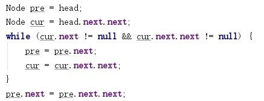
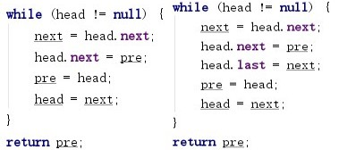
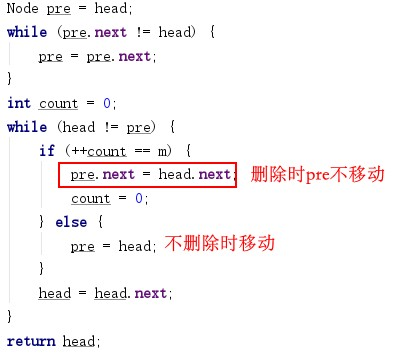
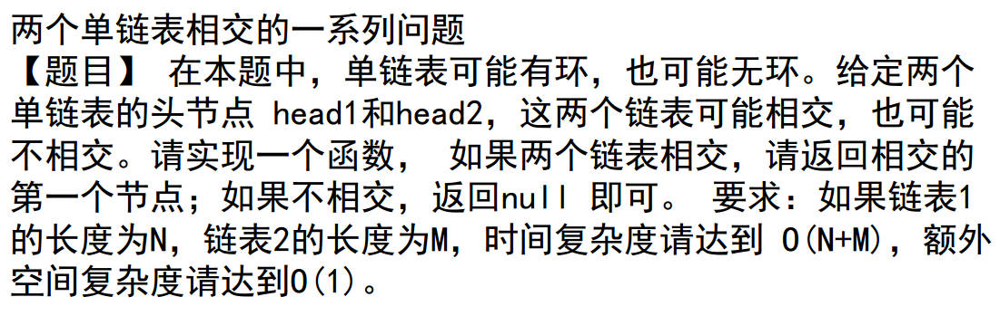
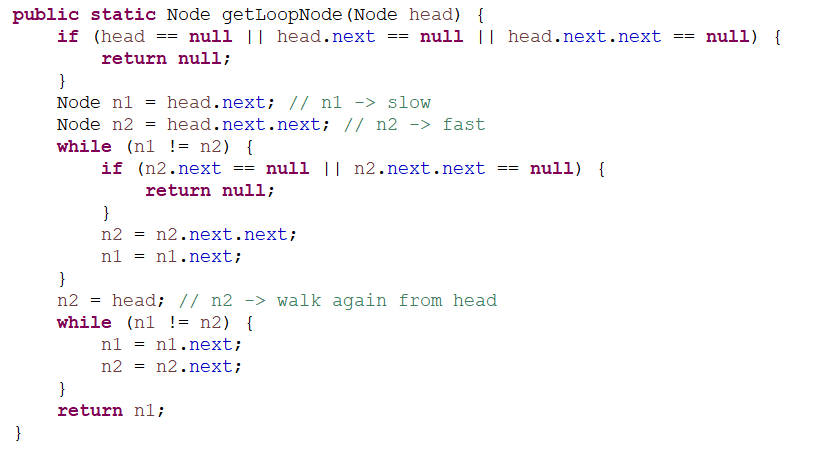
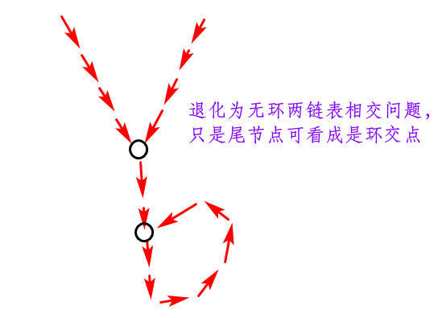
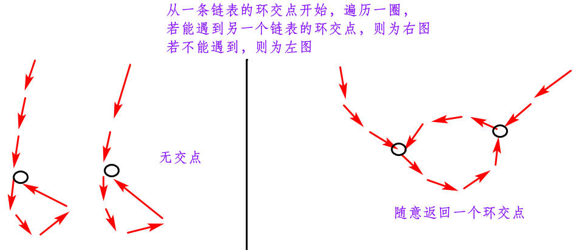
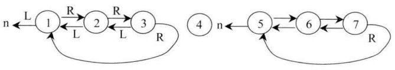
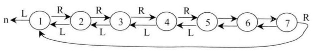

[TOC]

# 一. 两个有序链表的公共部分

两个指针，哪个小移哪个，相等就都移动，直到遇见null

# 二. 单链表双链表删除倒数第K节点

一个先走K步，另一个跟上，一起移动直到第一个到尾部，删除即可

# 三. 删除链表中间节点和a/b处的节点

- 中间节点，用一个慢指针，一个快指针

- a/b处的节点，先遍历链表求出总长度，根据a,b计算该删除节点的位置，然后遍历到前一个节点进行删除即可

# 四. 反转链表

- 反转单链表和双链表：

- 反转部分单链表：
  - 找到反转部分的前一个节点和后一个节点即可，做边界处理

# 五. <u>环形单链表约瑟夫问题</u>（待看）

- 简单解法：完全模拟约瑟夫过程，直到删到还有最后一个节点。时间复杂度O(N×M)

- 进阶解法：不模拟，直接确定最后留下来的节点是哪个。时间O(N)
  - 新环中节点编号和旧环节点的编号满足公式（待看）：old = (new + m -1)%N(链表长度) +1，递归即可直接求出最终原编号。直接遍历找到此节点返回即可

# 六. 判断链表是否回文

- 时间O(N)，空间O(N):
  - 直接遍历全部压栈，再出栈与原链表一一对比
  - 找到中点，中点之后节点压栈，再出栈与前半部分节点一一比较（只将中点右半段压栈可不考虑奇偶性）
- 时间O(N)，空间O(1)：
  - 找到中点，反转后半段链表，两边头指针一起移动一一对比。比较完之后，再反转回去

# 七. 单链表的荷兰国旗问题

- 简单方法。时间O(N),空间O(N)
  - 将节点都放在数组里，转换成数组荷兰国旗问题，再连接链表
- 进阶方法。时间O(N),空间O(1)
  - 三个头指针，分别代表小于等于大于三个链表，遍历，分类连接即可；主要注意对null的判断

# 八. 复制含随机节点的链表

- Map即可。需额外空间
- 把新节点放在原节点后面，根据相对位置获取类似于Map的信息（注意最后拆分的代码实现）

# 九. <u>两个单链表相交问题</u>

包含三个问题：

- 返回一个单链表的环交点，若无则返回Null
  - 哈希表，遍历过就加入，直到有重复，返回
  - 快慢指针，一定会相交，相交后，快节点回到头结点，快慢节点一起移动，最终一定相交于环节点
    
- 返回两个无环单链表的交点
  - 判断尾节点是否相等
    - 若不相等则一定不相交
    - 若相等，遍历两链表求各自长度，相减，长的链表先走此步数，再一起移动最后相交，返回
- 一个有环单链表和一个无环单链表一定不相交
- 返回两个有环单链表的第一个交点
  - 两链表环交点相等，只有一种情况					
    
  - 两链表环交点不相等，两种情况				
    

# 十. <u>单链表每K个节点逆序</u>（练代码）

每K个节点为一组进行逆序，最后一组不足K则不逆序。基础问题就是翻转部分链表（需写代码练熟）

# 十一. 删除无序单链表的重复节点

- 时间复杂度O(N)，空间复杂度O(N)
  - Map. 若出现过，则删除该节点（删除方法用模板即可）
- 时间复杂度O(N^2)，空间复杂度O(1)
  - 类似选择排序
  - 从头节点开始，删除后面所有与头结点相同的节点；然后再对第二个节点做此操作，直到尾部

# 十二. <u>搜索二叉树转双向链表</u>

- 中序遍历，时间O(N),空间O(N)

  - 利用队列收集遍历结果，然后依次出队连接成双链表

- 递归思想，时间O(N)，空间O(h)

  - 分治思想，把原问题分成左右两个问题，对左右子树做该操作，再合并

  - 合并有一个问题，需要左边链表的尾节点和右边链表的头结点，这就说明递归函数返回的值里面，既可以让我们很快定位尾节点，也可以很快定位头结点

  - 所以，启发我们，在递归函数处理后，链表的尾节点去指向头节点，再返回尾节点即可

    

  - 得到左右两边的结果，再进行合并

    

  - 递归完成后，将尾节点指向Null

# 十三. ~~单链表选择排序~~

略，简单，考代码实现

# 十四. 怪异的节点删除方式

int型值的节点，给定一个节点，O(1)删除它

将后面节点的值复制到本节点，把后一个节点删除：

- 不能删除最后一个节点
- 本质上并不是删除节点，只是换了值

# 十五. ~~有序环形链表插入节点~~

找到该插入的位置插入即可，考代码实现

# 十六. ~~合并有序单链表~~

思想简单，考代码实现

