[TOC]

# 4. 远程过程调用

### 4.1 RMI

RMI包封装rpc细节

典型模式如下：

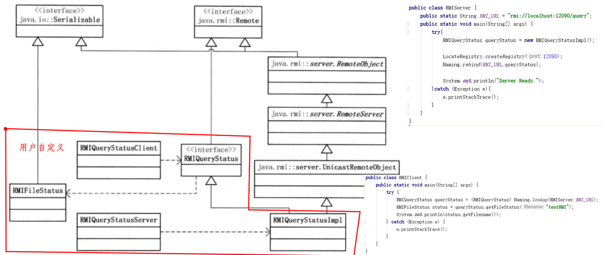

### 4.2 Java动态代理和NIO

略，具体见详细其它笔记

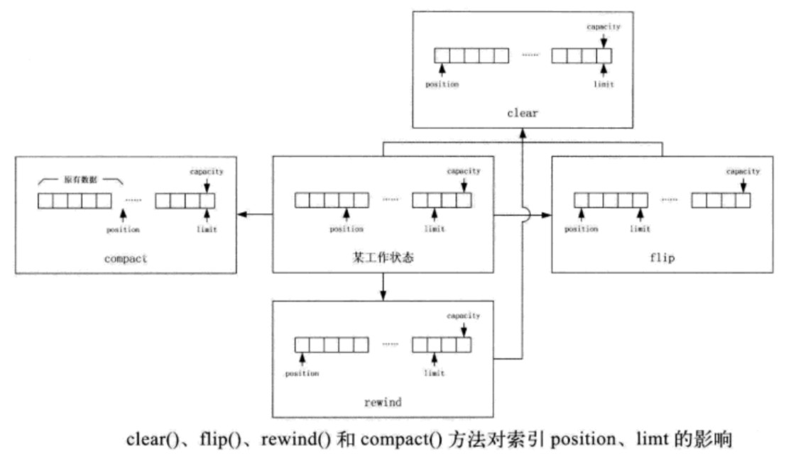

### 4.3 Hadoop中的远程过程调用

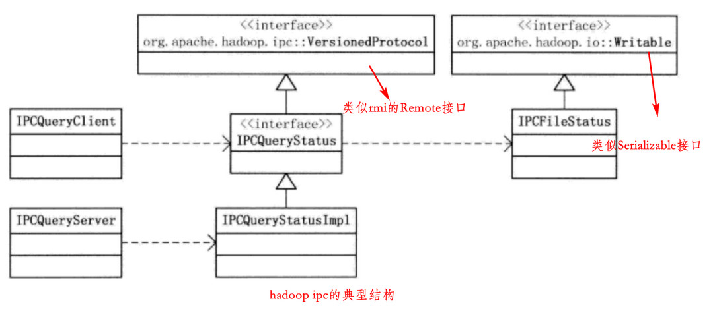

### 4.4 Hadoop IPC的代码结构(hadoop 1)

核心代码在三个文件中：`Client.java、Server.java、RPC.java`

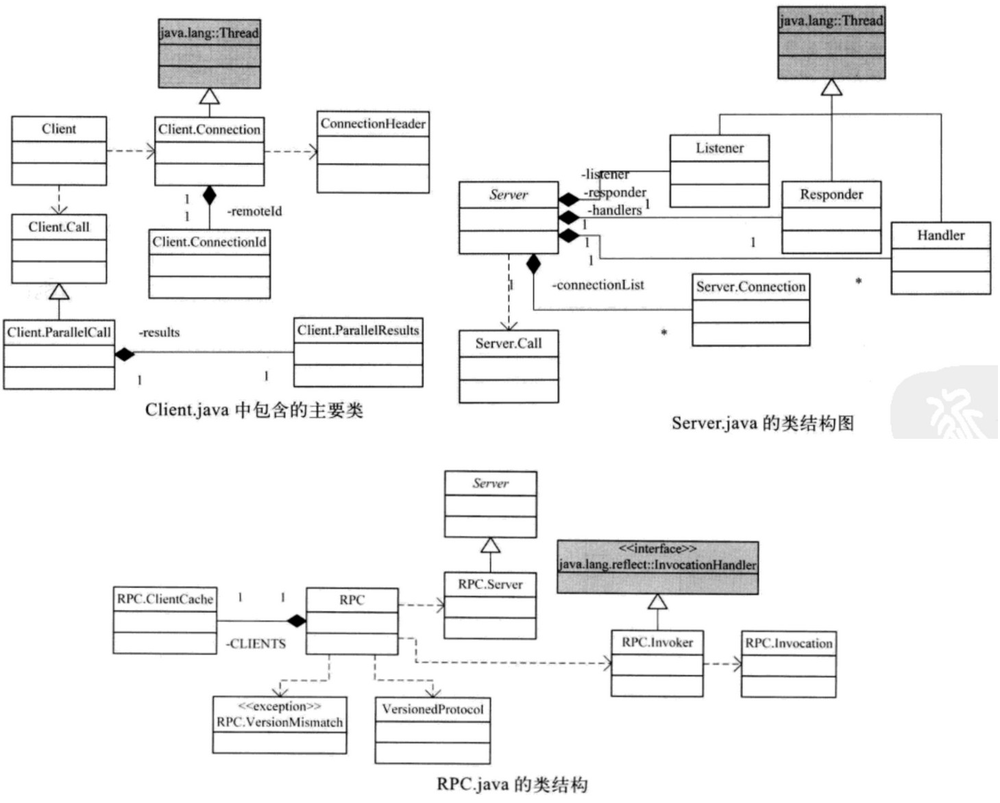

- Connection类
  - 客户端和服务端连接的一个抽象，分为Client.Connection和Server.Connection
  - ConnectionId，客户端复用到服务端的连接，通过此类来区分连接是否为同一个（包括了远端服务器地址、ticket、和远程接口protocol）
  - ConnectionHeader，两端建立连接后发送的第一条消息

- Call类
  - 对IPC接口方法调用的抽象，同样分为Client.Call和Server.Call

- Server处理器
  - 即Listener、Handler和Responder类，配合完成远程调用的处理

### 4.5 Hadoop IPC连接过程

Connection类包括连接建立、数据读写、连接维护、连接关闭

#### Connection类成员变量

- Client.Connection成员变量

  分为TCP相关、连接相关、远程调用相关三类

  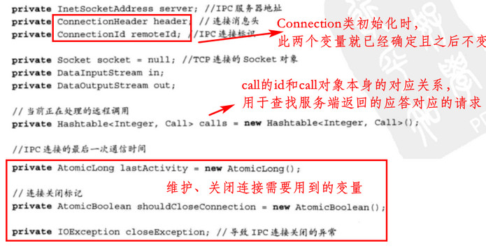

- Server.Connection成员变量

  同样分为TCP相关、连接相关、远程调用相关三类

  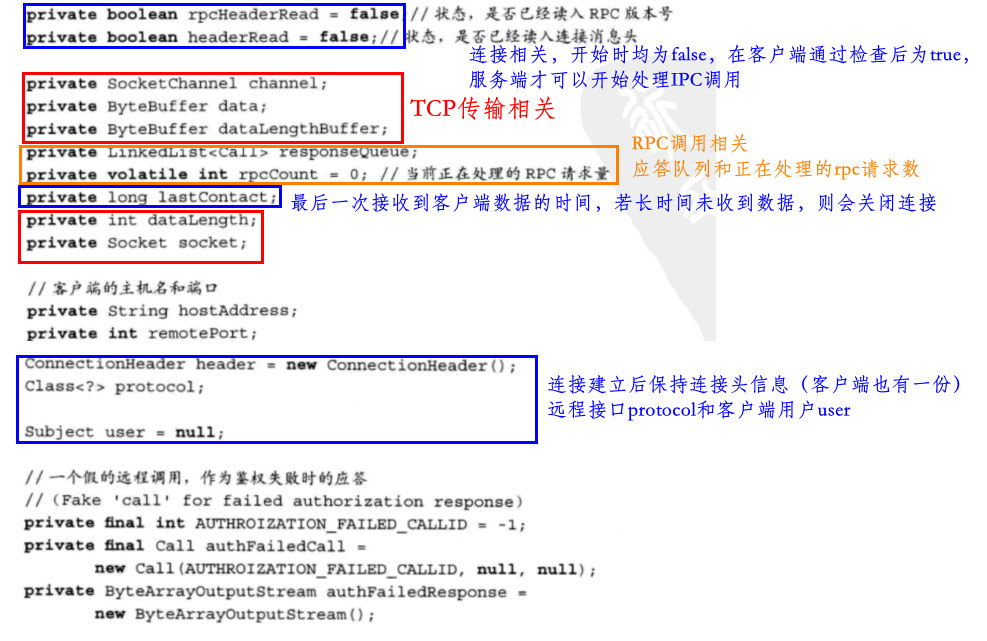

#### IPC连接的建立

- 客户端连接建立

  客户端需要连接时，都会调用getConnection()方法，但会有连接复用的情况出现

  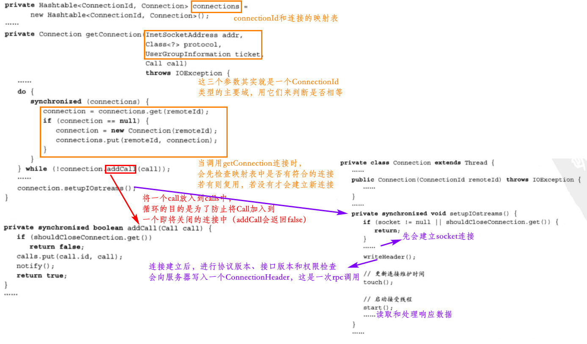

- 服务端连接建立

  服务端由Server.Listener来监听连接，主要代码如下：

  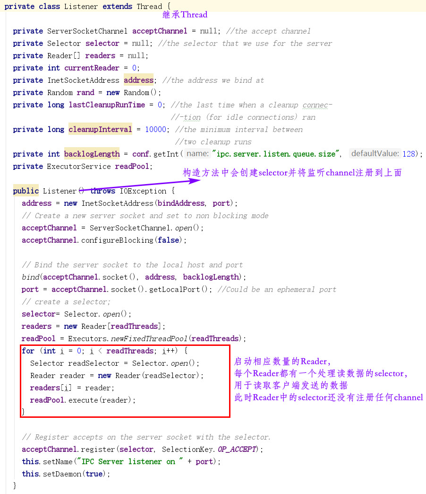

  Listener的run方法如下：

  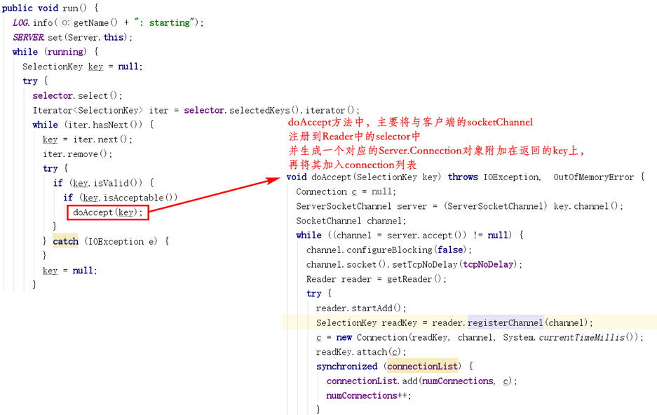

  Server.Listener.Reader类也是一个Runnable对象，并在Listener类初始化时已经启动其线程，其run方法如下：

  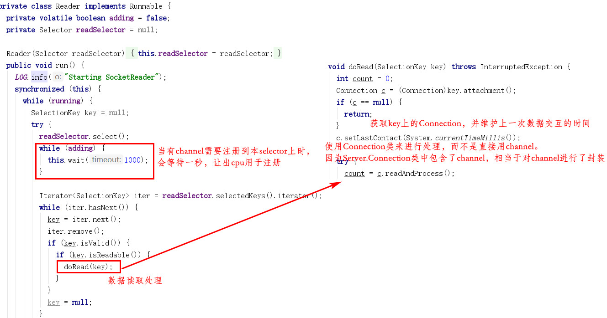

  readAndProcess()方法会先进行版本检查（包括读入ConnectionHeader），检查通过后设置相应的标志变量为true，然后才可以开始处理RPC请求。若检查和鉴权失败，连接会被关闭

#### 数据分帧和读写

TCP字节流无消息边界的概念，使通信的接受者能准确找到消息结束为止的方法：

- 定长消息。双方通信的消息长度已经协商并固定
- 定界符。定界符不能在业务数据中出现
- 显式长度。在消息前面加一个长度字段

客户端发送请求用的是“显式长度‘的方法，如在发送RPC调用的参数时：

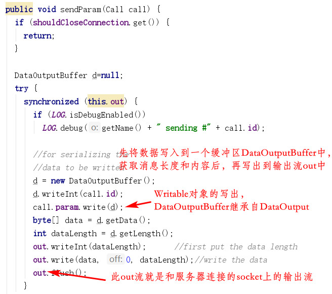

服务端接收数据也是“显式长度”的方法，分为读取长度和读取数据两个阶段，在readAndProcess()方法中：

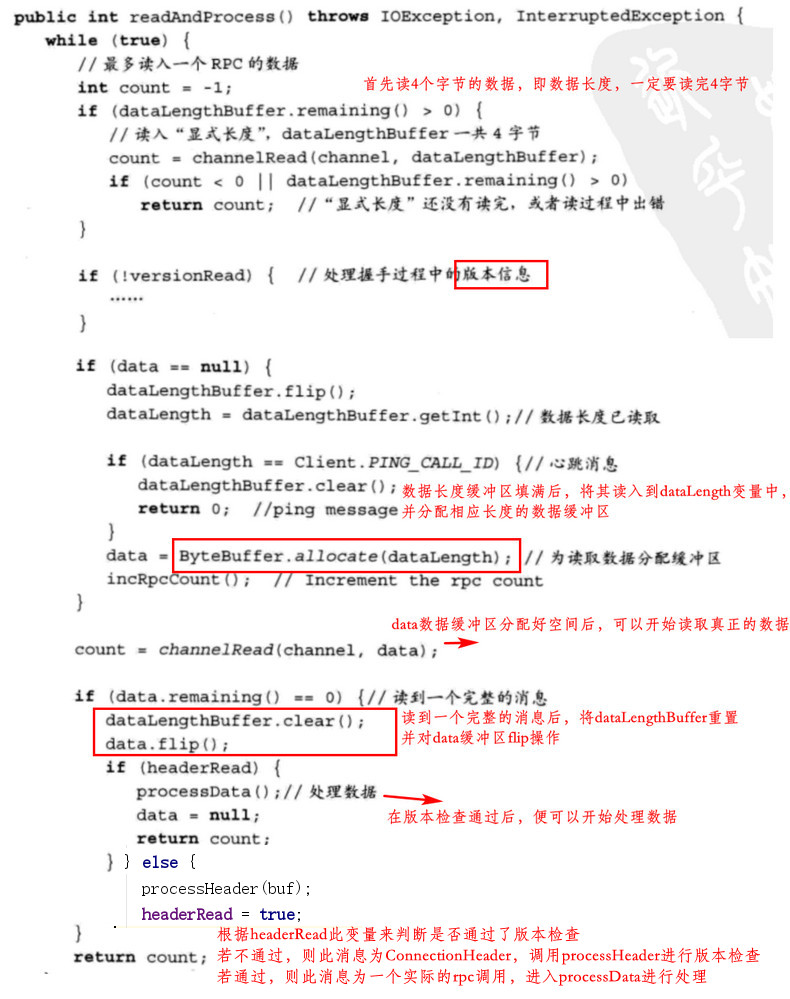

上述代码可以看出为什么客户端在发送ConnectionHeader对象时，要先写入它的长度，因为它被服务端当成是一个正常的rpc调用来处理，只是根据headerRead变量来进行不同的处理

服务端到客户端方向的数据传输采用的是“定长消息”模式（因为需要接受的只有一个返回值，而返回值对象的长度确定，可以通过其class类[在Client类中的valueClass变量]直接反序列化出来），因为其使用的是Writable机制，Writable来保证客户端能够读取服务端写入的所有数据。具体代码在`Server.setupResponse()`和`Client.Connection.receiveResponse()`中：

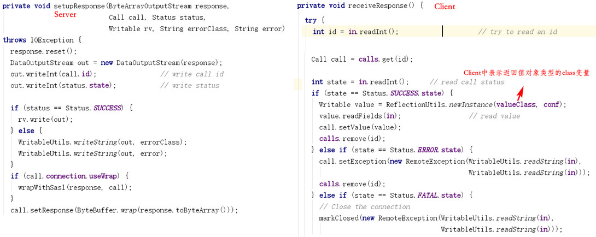

#### 维护IPC连接

IPC连接上长时间没有rpc传输时，客户端会发送一个心跳包用于保活，最后一次的通信时间保存在Connection类的lastActivity变量中

Client.Connection.touch()更新此值：

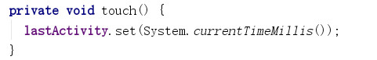

在setupIOstreams()和receiveResponse()中touch()方法都会被调用（即连接建立和收到服务端消息时）；如果当前时间和lastActivity差值超过某个值，则会发送心跳消息：

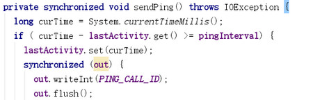

同理，服务端在接收到客户端的数据时，会在doRead()方法中将lastContact变量更新（见之前的图）。并且，在readAndProcess()方法中，服务端会对心跳消息(ping)做特殊处理，即dataLengthBuffer收到的数据是`PING_CALL_ID`（-1）

#### 关闭IPC连接

先略过，见书

### 4.6 Hadoop IPC方法调用相关过程

客户端是一个比较复杂的Java动态代理应用；服务端由Listener、Handler和Responder配合完成读取、处理和应答三个步骤服务端的应答中，必须考虑到正常返回和有异常发生的两种情况

#### IPC方法调用成员变量

涉及到三个类：

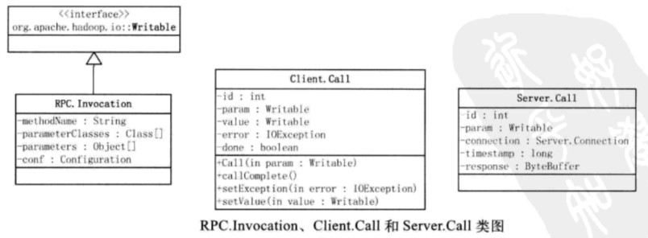

- RPC.Invocation
  
  - 当在IPC客户端远程接口实例上进行方法调用时，会生成一个RPC.Invocation实例，包含了RPC调用必须的方法相关信息，但不包含接口类信息。因为Client.Connection中包含了ConnectionHeader（ConnectionHeader又包含了protocol接口信息），在其连接上进行调用时自然可以获取到接口信息（一个连接对应一个接口）
  
- Client.Call

  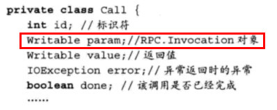

  - 由于连接复用，同一个连接上可能有多个IPC调用正在执行（且由于NIO的性质，请求和应答很可能顺序会被打乱），为了区别不同的调用，使用了成员变量id进行标识
  - param变量即上述的RPC.Invocation对象
  - value和error变量分别对应前面提到的正常返回和有异常发生的两种情况
  - done变量标识调用的结束，结束时，value和error对象必有一个不是null

- Server.Call

  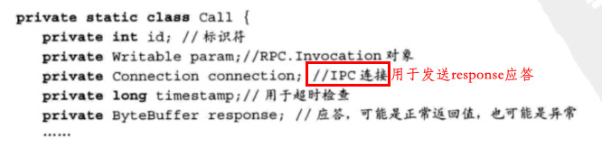

#### 客户端方法调用过程

一个典型的RPC使用如下：

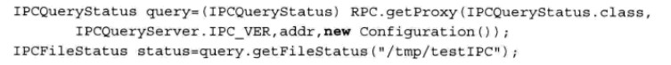

涉及一个重要的类RPC.Invoker，继承自InvocationHandler（动态代理），有Client类和ConnectionId类的成员变量，并会在Invoker构造函数中通过工厂方法构造一个Client实例和构造一个ConnectionId实例。

- 具体调用过程如下：

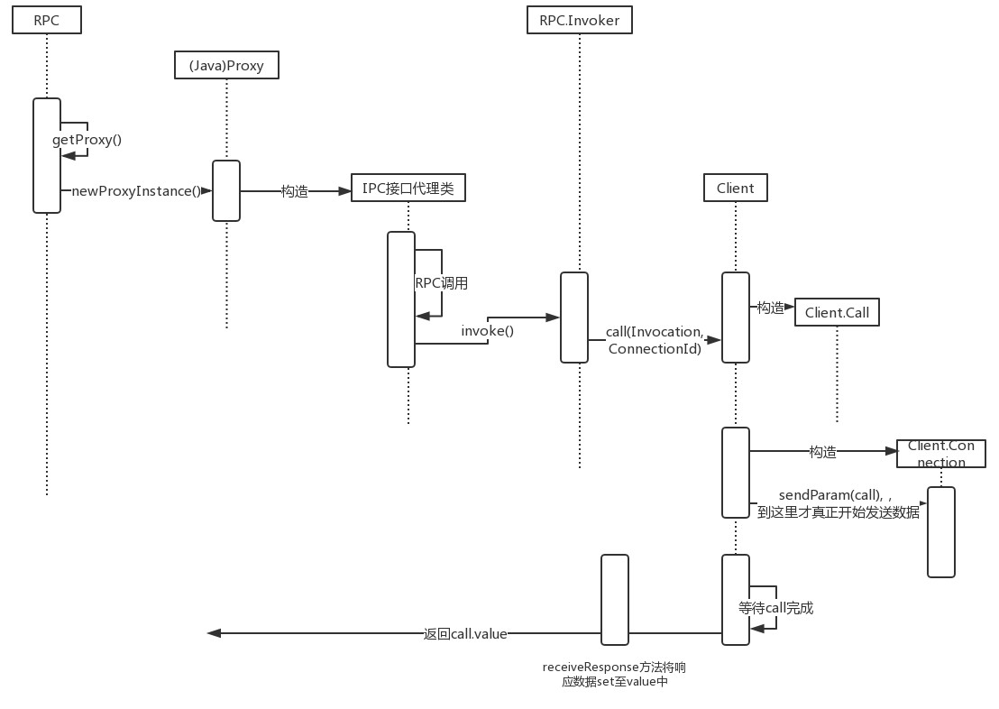

- RPC.getProxy()方法相关代码

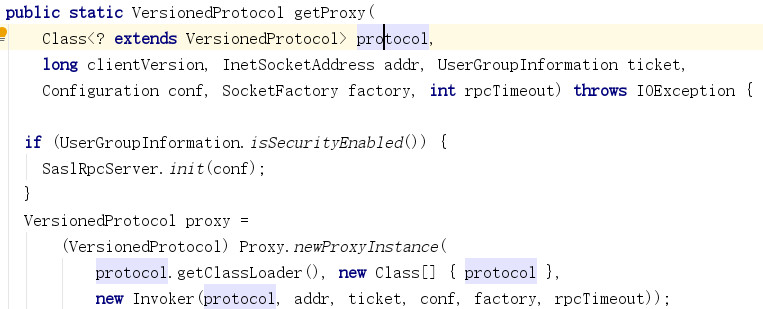

- RPC.Invoker.invoke()方法相关代码

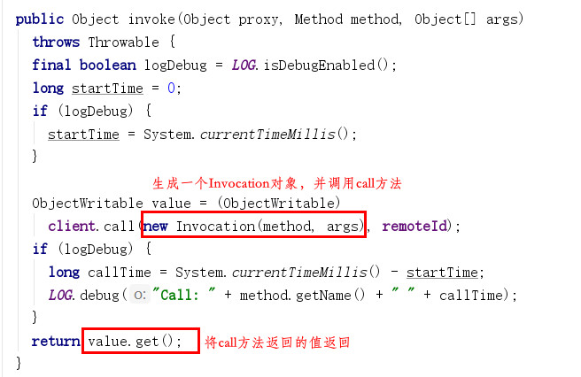

- Client.call()相关代码

