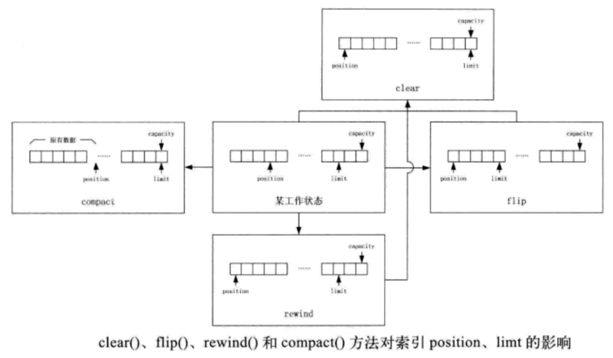
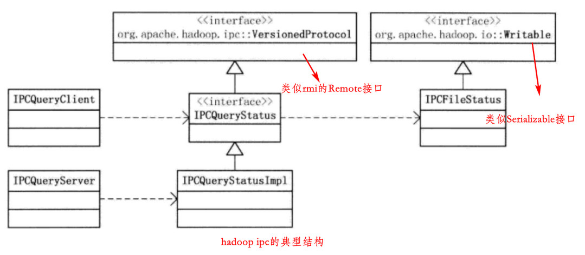
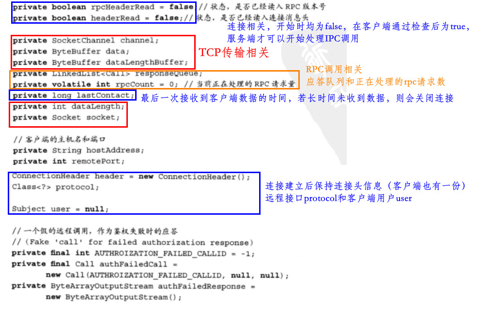
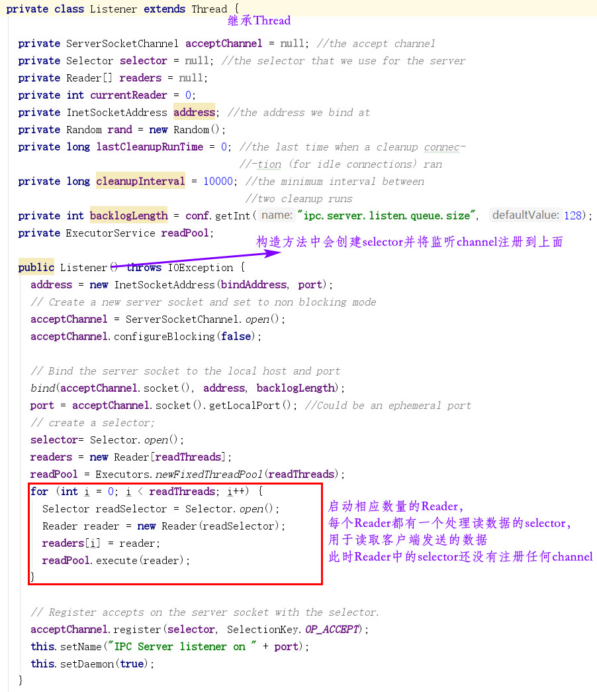
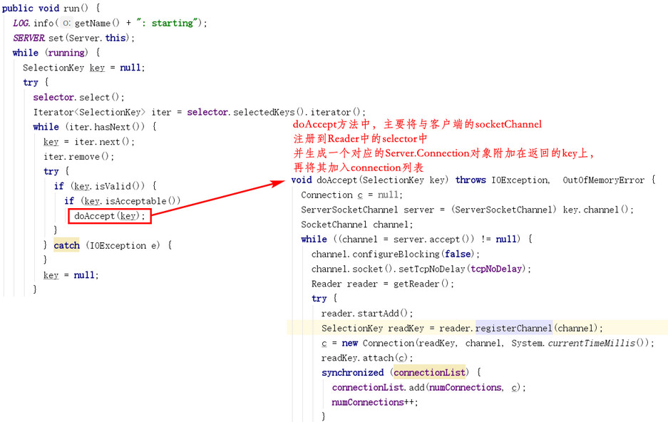
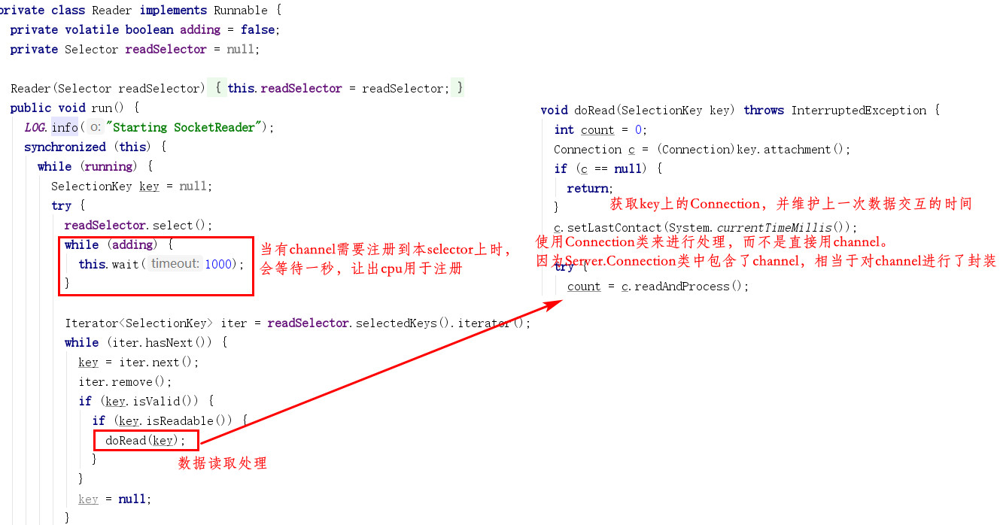

[TOC]

# 二、Common部分

# 2. 配置信息处理

xml配置规范

### 2.2 Configuration类

构造Configuration对象 -> addResource()加载资源 -> get/set方法访问配置项

#### 资源加载

- addResource()方法并不会立即加载资源，只是将资源的路径加入resource列表，并调用reloadConfiguration()方法清空properties和finalParameters变量；addDefaultResource()同理（资源加入defaultResource列表）
- properties中的数据只有在真正需要的时候才加载进来（延迟加载），如getProps()方法中，当发现properties为空时，才触发loadResources()对资源进行加载，采用DOM方式进行XML解析后将元素和属性设置至各资源变量
- 采用DOM方式进行XML解析：将XML一次性装入内存，并创建一个元素和属性的树形结构

### 2.3 Configurable接口

实现此接口意味着该类是可配置的

# 3. 序列化与压缩

### 3.1 序列化

#### Java内置序列化机制

Serializable接口，ObjectOutputStream()/ObjectInputStream()的writeObject()和readObject()方法来进行对象的读取和写入。缺点就是序列化出来的字节序列过于庞大，且不能复用对象

#### Hadoop Writable机制

write()方法和readFields()方法（同一个对象被多次反序列化时可被复用，而不会再创建出新对象）

- 紧凑。字节序列无过多冗余信息
- 快速。序列化和反序列化都很高效
- 可拓展
- 互操作。支持不同开发语言之间的通信

WritableComparable对Writable对象进行比较，RawComparator接口可直接比较未反序列化的流。

典型的Writable类：

- Java基本类型的封装

  

- ObjectWritable类

  

  - 将一般的对象序列化和反序列化
  - 变量declaredClass一定得是该类的实际类，而不是其父类

#### Hadoop序列化框架

其它框架如avro/thrift/protocol buffer

hadoop自带的框架Serialization实现

### 3.2 压缩

需要考虑压缩算法的压缩速率和可分割性。hadoop的编解码框架采用抽象工厂的设计模式

#### 编解码器

主要两个类如下：

#### 压缩器和解压器

压缩器和解压器可以插入对应的输出输入流中实现对应的功能

主要使用`setInput()、needsInput()、finish()、compress()和finished()`方法配合进行操作

#### 压缩流和解压缩流

装饰者模式

#### Java本地方法压缩解压

性能更高

#### 支持Snappy压缩

分析`setInput()、needsInput()、finish()、compress()和finished()`源码

.......。。。。。

# 4. 远程过程调用

### 4.1 RMI

RMI包封装rpc细节

典型模式如下：

### 4.2 Java动态代理和NIO

略，具体见详细其它笔记

### 4.3 Hadoop中的远程过程调用

### 4.4 Hadoop IPC的代码结构(hadoop 1)

核心代码在三个文件中：`Client.java、Server.java、RPC.java`

- Connection类
  - 客户端和服务端连接的一个抽象，分为Client.Connection和Server.Connection
  - ConnectionId，客户端复用到服务端的连接，通过此类来区分连接是否为同一个（包括了远端服务器地址、ticket、和远程接口protocol）
  - ConnectionHeader，两端建立连接后发送的第一条消息

- Call类
  - 对IPC接口方法调用的抽象，同样分为Client.Call和Server.Call

- Server处理器
  - 即Listener、Handler和Responder类，配合完成远程调用的处理

### 4.5 Hadoop IPC连接过程

Connection类包括连接建立、数据读写、连接维护、连接关闭

#### Connection类成员变量

- Client.Connection成员变量

  分为TCP相关、连接相关、远程调用相关三类

  

- Server.Connection成员变量

  同样分为TCP相关、连接相关、远程调用相关三类

  

#### IPC连接的建立

- 客户端连接建立

  客户端需要连接时，都会调用getConnection()方法，但会有连接复用的情况出现

  

- 服务端连接建立

  服务端由Server.Listener来监听连接，主要代码如下：

  

  Listener的run方法如下：

  

  Server.Listener.Reader类也是一个Runnable对象，并在Listener类初始化时已经启动其线程，其run方法如下：

  

