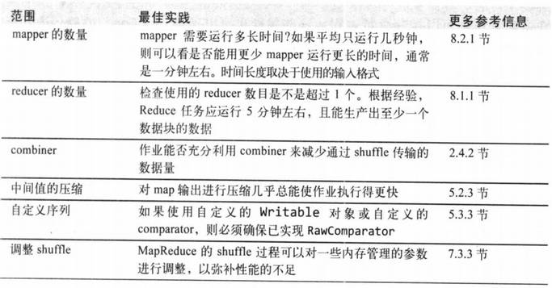
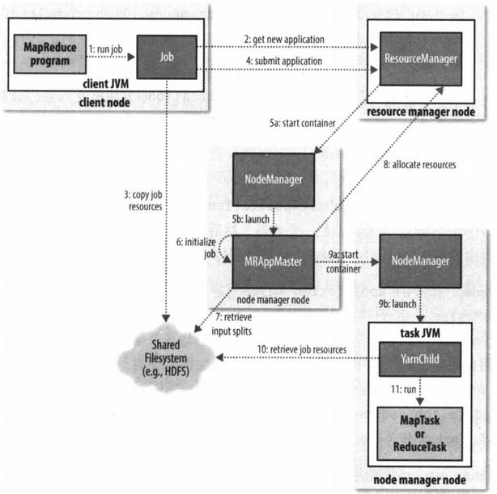
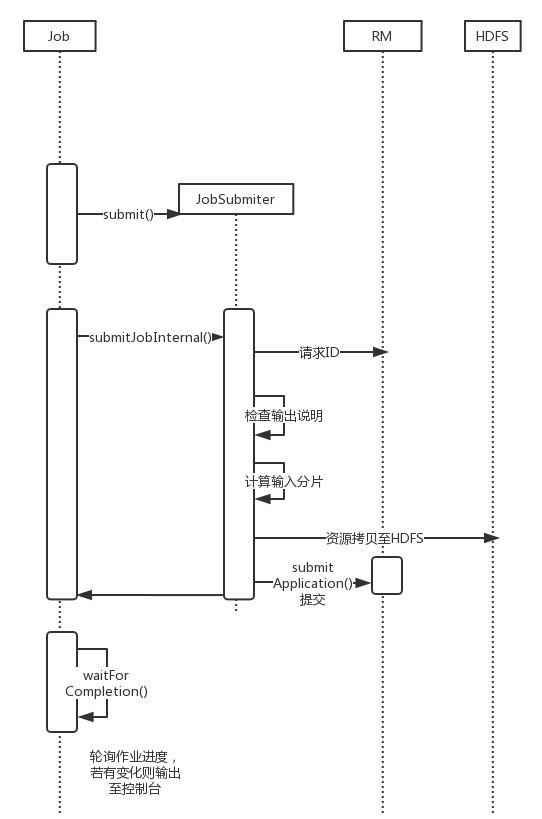

[TOC]

# 6. MapReduce应用开发

mrunit可用于本地测试mr程序

### 6.2 GenericOptionsParser，Tool，ToolRunner

用于解析hadoop命令行的一些参数，详细见书

### hadoop日志

Apache common logging api

### 远程调试

- 本地重跑对应的文件
- JVM堆分析
- 保存失败的任务尝试中间结果文件
- 检查任务尝试文件（如启动任务容器的JVM脚本）

### 6.6 作业调优

HPROF分析工具

### 6.7 MapReduce工作流

#### 书籍推荐《MapReduce数据密集型文本处理》

- mapper,reducer链
- JobControl类可以按照依赖顺序来执行有先后顺序的作业
- Apache Oozie工作流系统
  - XML定义Oozie工作流（DAG有向无环图）
  - 打包和配置Oozie工作流应用
  - 运行Oozie工作流作业

# 7. MapReduce工作机制

### 7.1 MR作业运行机制

Job对象的submit()或waitForCompletion()方法可运行作业

- 客户端，提交MR作业

  - 作业的提交（步骤1~4）

    

  - 作业的初始化

    - RM向调度器申请容器，NM控制容器并启动AM进程（步骤5a和5b）
    - AM初始化，创建多个簿记对象来跟踪作业的进度（步骤6）
    - AM接收HDFS的输入分片（步骤7），为每个分片启动一个map任务对象，以及配置的reduce任务对象（同时分配好任务ID）

- YARN的RM，集群上的资源分配

- YARN的NM，启动和监视集群节点的容器

- AM，协调运行MR作业的任务，和任务一样在容器中运行

- HDFS，共享作业文件