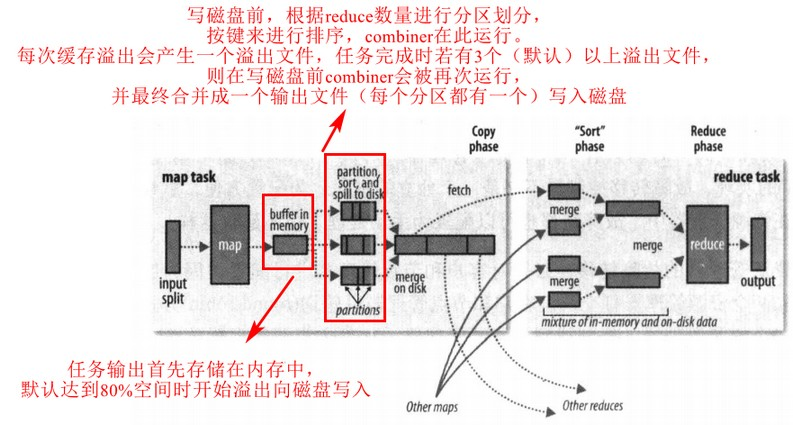

[TOC]

# 6. MapReduce应用开发

mrunit可用于本地测试mr程序

### 6.2 GenericOptionsParser，Tool，ToolRunner

用于解析hadoop命令行的一些参数，详细见书

### hadoop日志

Apache common logging api

### 远程调试

- 本地重跑对应的文件
- JVM堆分析
- 保存失败的任务尝试中间结果文件
- 检查任务尝试文件（如启动任务容器的JVM脚本）

### 6.6 作业调优

HPROF分析工具

### 6.7 MapReduce工作流

#### 书籍推荐《MapReduce数据密集型文本处理》

- mapper,reducer链
- JobControl类可以按照依赖顺序来执行有先后顺序的作业
- Apache Oozie工作流系统
  - XML定义Oozie工作流（DAG有向无环图）
  - 打包和配置Oozie工作流应用
  - 运行Oozie工作流作业

# 7. MapReduce工作机制

### 7.1 MR作业运行机制

Job对象的submit()或waitForCompletion()方法可运行作业

- 客户端，提交MR作业
- YARN的RM，集群上的资源分配
- YARN的NM，启动和监视集群节点的容器
- AM，协调运行MR作业的任务，和任务一样在容器中运行
- HDFS，共享作业文件

1. 作业的提交（步骤1~4）

   

2. 作业的初始化

   - RM向调度器申请容器，NM控制容器并启动AM进程（步骤5a和5b）
   - AM初始化，创建多个簿记对象来跟踪作业的进度（步骤6）
   - AM接收HDFS的输入分片（步骤7），为每个分片启动一个map任务对象，以及配置的reduce任务对象（同时分配好任务ID）
   - 小作业(uberized)会和AM在同一个JVM运行

3. 任务的分配

   - 若不适合作为uber任务，AM则会向RM请求容器（步骤8）
   - reduce任务可以在集群任意位置运行，map则本地化优先
   - 也为每个任务指定了内存需求和CPU数

4. 任务的执行

   - AM与NM通信来启动容器（步骤9a和9b），启动容器的工作由NM的YarnChild程序来执行
   - 容器在运行任务之前，需要将任务需要的资源本地化（步骤10）
   - 最后运行任务（步骤11）
   - 特殊：关于Streaming，见书

5. 进度和状态更新

   - 每个作业和任务都有状态、进度、作业计数器和状态描述

   - map的进度是处理输入的比例，reduce的进度则需要考虑全部的三个阶段

   - 任务每3秒钟将进度状态信息上报给AM，AM进行汇集，RM的界面可查看这些信息

   - 客户端里，每秒会轮询一次AM，进行状态跟踪

     

6. 作业完成

   - 在最后一个任务完成后，作业会将状态设为“成功”，Job的轮询状态便可感知到完成，waitForCompletion()方法返回
   - 作业完成时，AM和容器将会清理所有的工作状态（包括中间输出结果）

### 7.2 失败

- 任务运行失败
  - 任务的用户代码抛出异常导致的任务失败，JVM在退出前会将错误报告发送给AM，AM将其标记为失败，并释放容器
  - JVM突然退出，此时由NM发现并通知AM来进行标记
  - 任务在超时时间后若无进度更新，则会被认为失败，JVM被杀死
  - AM会重新调度失败的任务，尽量避免在原NM重新执行
- AM运行失败
  - AM在运行失败时会进行一定次数的重试
  - 恢复过程：AM会周期向RM发送心跳，一旦失败就会被RM检测出来，RM会在一个新的容器开启新的AM，新的AM会恢复失败的任务
- NM运行失败
  - 恢复机制同前
  - 对在失败的NM上运行成功的那些map任务，恢复后会安排重新运行，因为其中间输出可能会在之前的NM上
  - 某一NM的应用程序失败次数过高，该NM可能会被拉黑，即便它自身没有失败过
- RM运行失败
  - RM是单点故障，RM失败后果很严重，可以考虑HA（可使用ZK管理）

### 7.3 shuffle和排序

reducer的输入都是按键排序的，shuffle指的是将mapper输出传给reducer输入的过程

#### map端

#### reduce端

map输出文件位于map任务的本地磁盘，reduce任务需要若干个map任务的输出。在某个map任务完成时，reduce任务就开始复制其输出

- 此为reduce任务的**复制阶段**，多线程并行复制。若输出小，则复制到reduce任务的JVM内存，若比较大，则复制到磁盘
- 复制完所有map输出后，reduce进入**合并阶段**，并维持其稳定性进行排序。相关配置为合并因子，指定每次合并多少个map输出。合并多少次最终就有多少中间文件
- 最后进入**reduce阶段**，直接将数据输入reduce函数 。reduce对已排序输出数据的每个键调用reduce函数，最终结果写入HDFS

#### 配置调优

- map端

  

尽量避免多次溢出写磁盘，所以map的缓冲区应适当设置

- reduce端

  

reduce时，中间数据若全部在内存中（即上表中最后一个属性），则性能最佳（前提是reduce函数有足够的内存）

### 7.4 任务的执行

#### 任务执行环境

#### 推测执行

默认启用。在一个任务执行时间比预期慢时，会启动另一个相同的任务作为备份。两个相同的任务只要有其中任何一个先完成，另一个就会终止

在繁忙的集群中，推测执行会降低整体的吞吐量。可以在集群上关闭此功能，让用户根据个别作业而单独开启

关于非幂等任务，见书

#### OutputCommiters

源码级，见书

