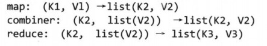
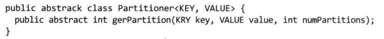

[TOC]

# 8. MapReduce的类型和格式

### 8.1 MapReduce类型

MR常规格式如下：

partition函数对map的输出键值对(K2,V2)进行处理，返回一个分区索引：

#### 默认的MR作业

map将文件以文本形式读入，键值对(LongWritable，Text)，再将其原封不动地写出

reduce将键值对(LongWritable，List(Text))遍历，并原封不动地写出（当然中间shuffle会经过排序），所以最后的结果是按键排序过的文本

#### <u>默认的Streaming作业</u>

见书

### 8.2 输入格式

