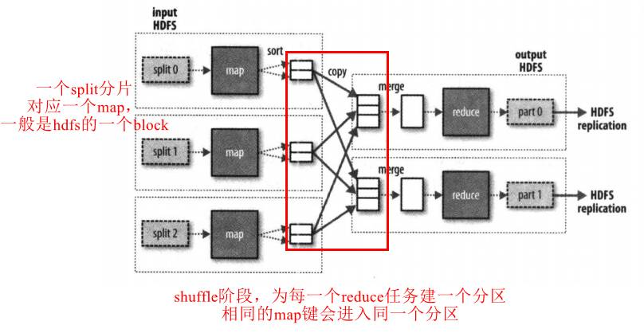
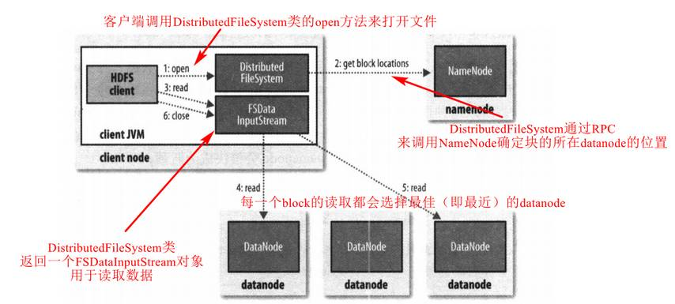
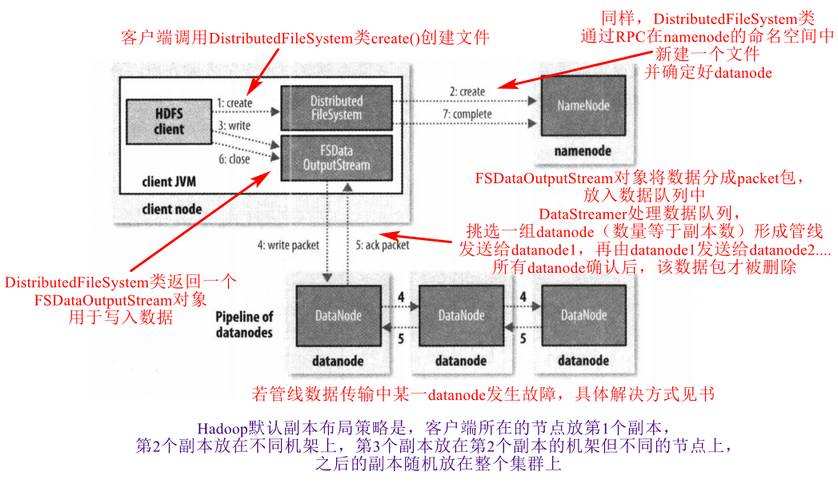
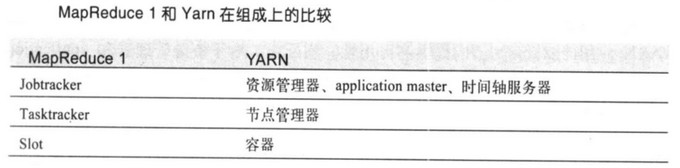
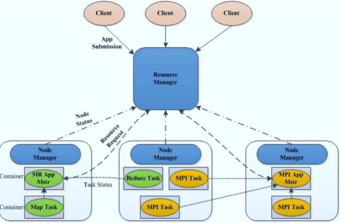
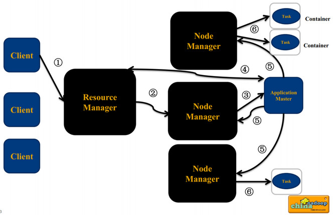
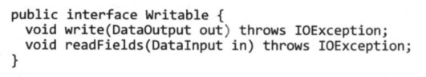
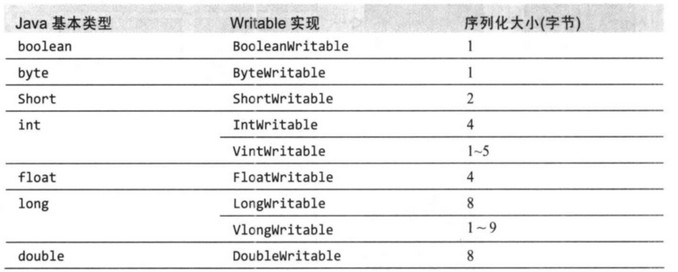

[TOC]

# 1. Hadoop概述

关系型数据库和MapReduce比较：

# 2. MapReduce

map和reduce阶段的输入输出均为键值对

# 3. HDFS

### 3.2 基本概念

- 数据块
  - HDFS的块设计得大是为了最小化寻址开销
- namenode和datanode
  - namenode维护文件系统树和所有文件和目录的信息，保存在**命名空间镜像文件和编辑日志文件**中
  - datanode存储和检索数据块，并定期向namenode发送自身存储块的列表

- 块缓存
  - 频繁被访问的数据块可能以堆外块缓存的形式存在于datanode的内存中
- 联邦HDFS
  - namenode拓展，每个namenode管理一部分目录
- HA
  - 见书

### 3.5 FileSystem类

可扩展的Java类，实现自定义的数据写入读取删除等

### 3.6 数据流

#### 文件读取

#### 文件写入

#### 一致模型

flush()和hflush()方法，数据写入对reader的可见性

#### distcp并行复制

# 4. YARN

详细剖析见《Hadoop技术内幕：深入解析YARN架构设计与实现原理》

### 4.1 YARN应用运行机制

- resource manager
  - 管理集群资源使用，整个集群只有一个
    - 处理客户端请求
    - 启动/监控ApplicationMaster 
    - 监控NodeManager 
    - 资源分配与调度 
- node manager
  - 运行在集群所有节点，启动和监控容器，单个节点上的资源管理和任务管理 
  - 容器都有资源限制，可以是一个unix进程
  - 处理来自ResourceManager的命令 
  - 处理来自ApplicationMaster的命令 
- ApplicationMaster 
  - 每个应用有一个，负责应用程序的管理 
    - 数据切分 
    - 为应用程序申请资源，并进一步分配给内部任务 
    - 任务监控与容错 
- 双层调度
  - RM将资源分配给AM 
  - AM将资源进一步分配给各个Task 

### 4.3 YARN中的调度

# 5. Hadoop IO操作

### 5.1 数据完整性

计算校验和

### 5.2 压缩

mapreduce中可以使用压缩

### 5.3 序列化

hadoop的序列化格式为Writable

#### Writable接口

将数据写入DataOutput二进制流，和从DataInput二进制流中读取数据

#### Writable实现类

- 基本类型

  

- Text
  - UTF-8的Writable类，一般认为和String等价
  - Text索引是根据编码后的字节序列的位置来确定的，而String则是以char的编码单元来确定
  - Text是可变的，和String不同；类似，其它的Writable实现类也是可变的，而Java中的对应包装类几乎都是不可变的

- BytesWritable
  - 对二进制数据数组的封装
- NullWritable
  - 不可变的单例对象，不读数据也不写数据，充当占位符
- ObjectWritable和GenericWritable
  - 对象的通用封装
- Writable集合类
- 可以实现自定义的Writable类

### 5.4 基于文件的数据结构

- SequenceFile
- MapFile