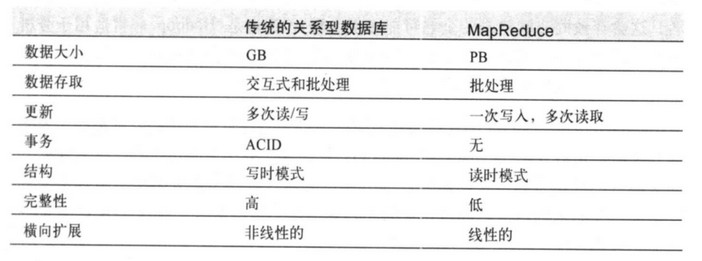

[TOC]

# 1. Hadoop概述

关系型数据库和MapReduce比较：

# 2. MapReduce

map和reduce阶段的输入输出均为键值对

# 3. HDFS

### 3.2 基本概念

- 数据块
  - HDFS的块设计得大是为了最小化寻址开销
- namenode和datanode
  - namenode维护文件系统树和所有文件和目录的信息，保存在**命名空间镜像文件和编辑日志文件**中
  - datanode存储和检索数据块，并定期向namenode发送自身存储块的列表

- 块缓存
  - 频繁被访问的数据块可能以堆外块缓存的形式存在于datanode的内存中
- 联邦HDFS
  - namenode拓展，每个namenode管理一部分目录
- HA
  - 见书

### 3.5 FileSystem类

可扩展的Java类，实现自定义的数据写入读取删除等

### 3.6 数据流

#### 文件读取

#### 文件写入

#### 一致模型

