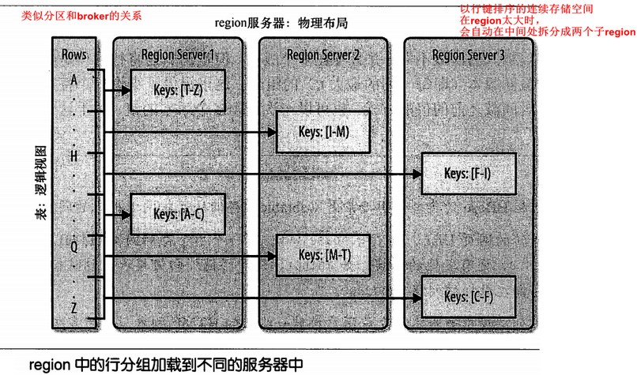
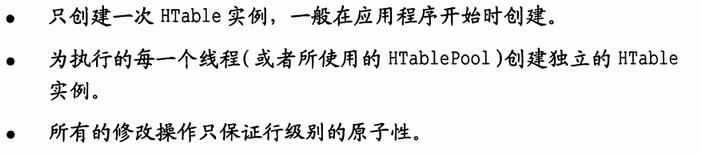
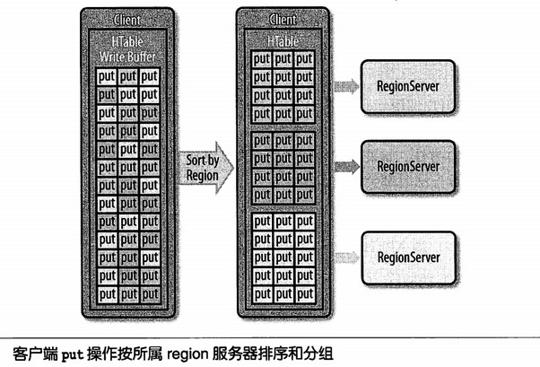

[TOC]

### 1.4 结构

（Table, RowKey, Family, Column, Timestamp）-> Value

#### 自动分区

hbase架构：

分布式、持久化、强一致性、索引、辅助索引、行事务、负载均衡自动和故障恢复自动

# 3. 基础API

put、get、

写缓冲区，类似pipeline

最新版的hbase的写缓冲区用BufferedMutator代替，其机制与书上有不同

