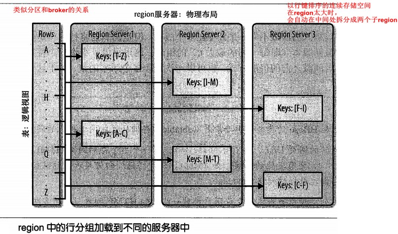
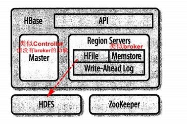
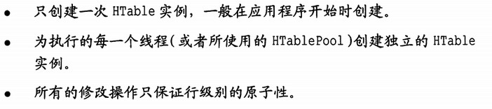

[TOC]

### 1.4 结构

（Table, RowKey, Family, Column, Timestamp）-> Value

#### 自动分区

hbase架构：

分布式、持久化、强一致性、索引、辅助索引、行事务、负载均衡自动和故障恢复自动

# 3. API

### 基础API

put、get、delete、batch、scan、RowLock

写缓冲区，类似pipeline

最新版的hbase的写缓冲区用BufferedMutator代替，其机制与书上有不同

### 高级

#### 过滤器

- 比较过滤器
  - 行、列族、列、值、参考列
- 专用过滤器
  - 单列值（排除）过滤器：用一列的值决定某一行是否被过滤
  - 前缀：前缀匹配的行被返回客户端
  - 分页：控制每页返回的行数
  - KeyOnly，只返回键没有值
  - FirstKeyOnly，只返回第一列，通常用于检查是否存在该行
  - InclusiveStop：包含尾行
  - 时间戳：根据版本过滤
  - 列计数、列分页、列前缀
- 附加，在其它过滤器的基础上，加上额外的限制
  - Skip：其它过滤器上，若不匹配，则过滤整行
  - WhileMatch：同skip，不匹配时，停止扫描
- FilterList
  - 多个过滤器协同，可选与/或
- 继承FilterBase自定义

#### 计数

行级的check-and-modify操作对整行加锁，竞争大。计数器则针对列

incr和get_counter命令

- 单计数器：一次只操作一个计数器

- 多计数器：increment()，类似put、get等，一次操作一行的多列计数器（不能操作多行）

#### 协处理器

在region服务器运行自定义代码，进一步减少通信量

### 管理

通常的数据库范式化不适合HBase，因此表较少；新版的API已经大变化，参考新版，但概念相似

HTableDescriptor描述表，HColumnDescriptor描述列族

HBaseAdmin，连接集群、建表、预分区建表、删除表（需要禁用表）、禁用表（刷新内存缓冲、关闭相关region）、检查表状态、修改表结构（删、加、改列族，需要禁用表）、集群管理

# 8. 架构

