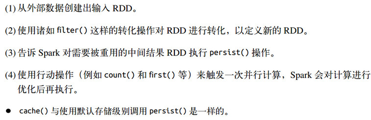
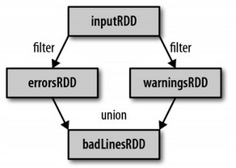
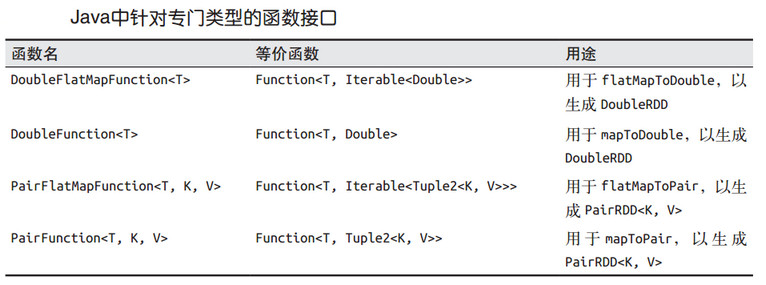
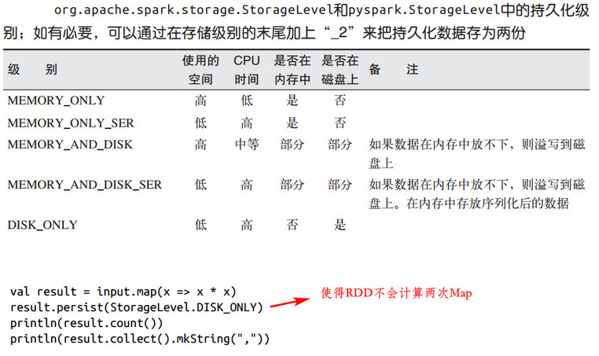

[TOC]

# 3. RDD

- RDD基础
  - 转化操作（transformation）和行动操作（action）, Spark只有第一次在一个行动操作中用到时，才会真正计算。 
  - 默认情况下，每次的行动操作都会重新计算，想在多个行动操作中重用同一个 RDD，可以使用 RDD.persist() 让 Spark 把这个 RDD 缓存至内存或磁盘

  

- 创建RDD
  - 读取外部数据集
  - 在驱动器程序中对一个集合进行并行化（把程序中一个已有的集合传给 SparkContext 的 parallelize() ） ，多用于开发测试

- RDD操作

  - 转化。返回一个全新的RDD，原RDD不会发生变化。转化出来的 RDD 是惰性求值的，只有在行动操作中用到这些 RDD 时才会被计算 
    - Spark用谱系图记录RDD之间的依赖关系，丢失RDD时依靠此谱系图来恢复

      

  - 行动。大多数情况下， RDD 不能通过 collect() 行动操作收集到本地进程中，因为它们一般都很大
  
  - 惰性求值 
  
    - 不应该把 RDD 看作存放着特定数据的数据集， 而最好把每个 RDD 当作我们通过转化操作构建出来的、记录如何计算数据的指令列表 
    - 把数据读取到 RDD 的操作也同样是惰性的 ，如sc.textFile() 

- 持久化

  

# 4. 键值对操作

pairRDD，专有的RDD

- 创建pairRDD
  - 