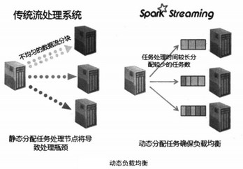

[TOC]

# 1.Spark

与MR比较：

- 中间数据在内存中而不是在磁盘上，迭代效率高
- RDD是弹性的，容错性高
- Spark更通用，支持很多类型的转换和行动操作，而不是只有Map和Reduce

生态系统：

- Spark Core

  - 资源调度管理
  - 内存计算、DAG机制
  - RDD抽象

- Spark Streaming

  - 动态负载均衡

    

  - 快速恢复机制：传统系统在某一节点故障时，把其上的任务转移到其它一个节点上重新执行，故该作业需要等待该节点的完成。而spark分成很多小任务，一个节点故障时，可以将这些任务平均的分配到剩下的节点上去，所以故障能够更快恢复

  - 批处理、流处理、交互式一体化

- Spark SQL的优化

  - 内存列存储
  - 动态字节码生成技术
  - scala代码优化

