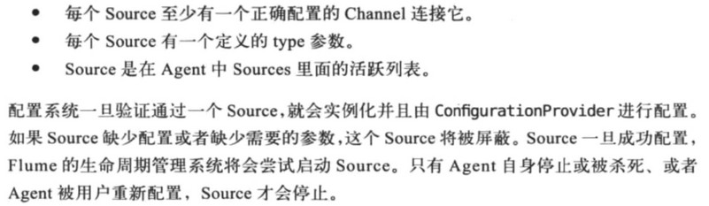
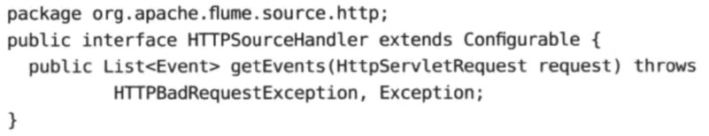
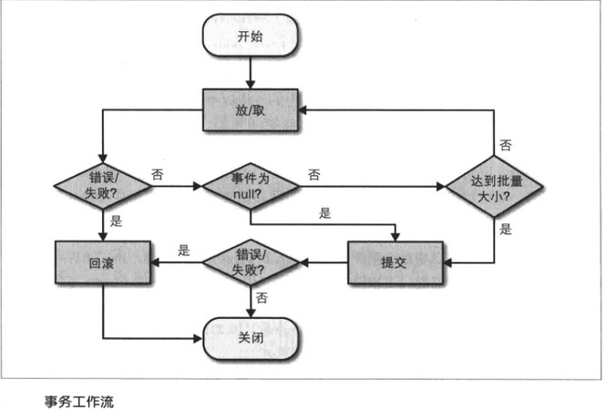

[TOC]

# 2. Flume处理流数据

### Flume存在的意义

若将生产者直接与Hadoop等系统接应写入数据，可能出现丢失数据、数据处理速度不匹配的问题

可拓展性强，通过简单地增加Agent就能拓展服务器的数量

### Flume Agent内部原理

### Flume Agent配置

见书

### 复杂的流

### 复制数据到不同的目的地

### 动态路由

### 关于事务

见书，看不明白。大概是每次写入或读取channel数据，都会由一个事务来封装，保证数据要么全部写入要么回滚？

### Agent失败和数据丢失

当某一层的数据传输失败时，数据将被缓冲直至Channel被填满。此时开始回退到前一层，直到所有层都被填满。此时的数据将会发生丢失

### 批量和重复

同kafka等，为减少额外的网络传输或系统调用的开销比例，一般会将多个事件一起组成一个批次再进行传输（存储）。类似redis的pipeline

在sink端，若RPC调用在超时时间内没有得到响应且实际的RPC并没有失败，就会引发重试，进而重复

# 3. Source

### Source生命周期

### 各种Source

- Sink-to-Source通信
  
  - 可以使用sink组和sink处理器，来发送数据给多个其他的Agent
  
- Avro Source
  - flume主要的RPC source
  - 配置示例见书
  
- Thrift Source
  
  - 跨语言的RPC source，解决Avro Source只支持java的问题
  
- RPC Source失败处理

- HTTP Source

  - 重写HTTPSourceHandler接口，来自定义handler处理程序

    

  - 将HttpServletRequest的数据处理，转换成一组Event事件返回

  - handler处理类可以在configure()方法中配置参数

  - 处理程序抛出的一些异常可以自动对应到一些HTTP状态码并返回给客户端（类似Springmvc）

  - 默认的处理程序处理特定格式的JSON数据

  - 可参考学习HTTPSourceXMLHandler类源码

- Spooling Directory Source
  
  - 监听目录中的文件
- 使用Deserializers读取自定义格式
  
- 反序列化器转化目录中文件的数据
  
- Syslog Source
- Exec Source
  
  - 执行用户配置的命令，基于命令的标准输出来生成事件
- JMS Source
  - 获取Java消息服务队列的数据，如ActiveMQ，Kafka
  - 转换JMS消息为Flume事件
- 自定义的Source
  
  - event-driven 和 pollable 两种类型的自定义source

# 4. Channel

### 事务工作流

channel是事务性的，即事务中的事件要么全部批量地存在要么全部都不存在，它能感知事件被写入或者被移除。比如sink从channel中读取事件但写入HDFS失败，此时事件会回滚至channel供其他sink读取

一个事务中包含批量的事件是很重要的，可以提高性能

source的事务由channel的处理器来处理，其处理方式与sink几乎相同。单个事务不能同时写入和读取事件

### Flume中的channel

两种channel都是完全线程安全的

- memory channel
  - 在堆上存储写入的事件，是一个内存上的队列，在尾部写入，在头部读取
  - 高吞吐量，线程安全，可以同时处理几个source和几个sink的操作
  - 每个事务有自己单独的队列，在source事务提交成功时，事件才会移入channel的主队列中，事件才对sink可用；在sink事务提交成功时，事件才会从事务和主队列中移除
  - 配置参数见书

- file channel
  - 将每个放入channel的事件写出到磁盘上，以文件形式存在。当且仅当文件中的事件被全部读取并且提交时，文件才会被删除。可以设置每个数据文件的最大大小，当某一个数据文件达到最大值时，就会创建一个新的文件
  - 如果写入磁盘失败，file channel可能会丢数据
  - file channel的数据恢复机制很类似于redis的AOF备份文件恢复机制

