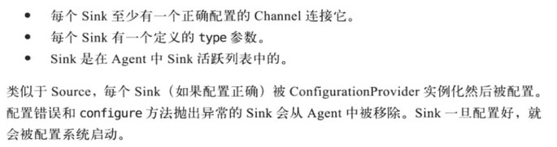
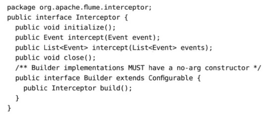

[TOC]

# 5. Sink

### Sink生命周期

一个SinkRunner负责运行一个Sink组，循环依次调用组内的某一sink的process方法。process方法从channel读取数据并写出到下一阶段。每个process调用必须处理整个事务（包括启动事务、读取事件、提交或回滚事务、关闭事务）。

一个没有配置sink组的sink可以看成只有自身的一个sink组

通常只有一个sink消费channel的时候，通常会出现等待IO的情况，线程的性能得不到充分利用，所以通常会配置多个sink来消费同一个channel，以提高性能

### 各种Sink

- HDFS Sink
  - 写到HDFS的bucket中（可以认为是HDFS的一个目录）
  - 关于bucket详细见书
  - 配置HDFS sink见书
  - 可使用自定义的序列化器（需实现EventSerializer接口）控制写入到HDFS的数据格式
- HBase Sink
  - 配置见书
  - 同样，可以使用自定义的序列化器（HbaseEventSerializer接口）
- RPC Sink
  - 发送到其他的Agent
  - Avro Sink
  - Thrift Sink
- Solr SinK
- ES Sink
    - 同样可以自定义写入到ES的数据格式（ElasticSearchEventSerializer）
- 其他Sink
    - Null Sink，用于测试，仅从Channel读取事件并删除
    - Rolling File Sink，写到本地文件系统中
    - Logger SinK，记录到log4j日志中
- 自定义的Sink
    - 实现Sink接口（一般继承AbstractSink类），flume调用sink的start方法来启动sink，启动后循环调用process方法处理事件。示例见书

# 6. 拦截器、选择器、Sink组和Sink处理器

### 拦截器

在Source和Source写入的Channel之间，用于删除或转换事件

- 时间戳拦截器：将时间戳插入到flume的事件报头中。可用于HDFS sink的分桶

- 主机拦截器：将ip地址或主机名插入到flume的事件报头中

- 静态拦截器：固定地将指定的键和值插入到每个事件中

- 正则过滤拦截器：根据正则来保留或删除事件

- solr拦截器

- uuid拦截器：为每个事件生成一个唯一标识符

- 自定义拦截器，实现Interceptor接口

  
  - 拦截器不允许返回比原来传递给它的更多的事件，但可以返回更少的（否则可能会导致写入channel的事件超过吞吐量）

### Channel选择器

决定Source接收的事件写入哪些channel，告知channel处理器，由处理器写入channel

- 复制选择器：默认的选择器。复制每个事件到channels参数指定的所有channel中
  - optioncal参数指定哪些channel的写入不是必须的，未成功写入这些channel不会抛出异常到source

- 多路复用选择器：根据事件的特定报头的值来决定写入哪些channel
- 自定义选择器，类似

### Sink组和Sink处理器

sink组中所有的sink不会同时工作的，因为runner只是一个线程。任何时候都只有一个sink在发送数据

sink处理器用于在sink组中选择拉取事件的sink。首先在sink组中选择一个sink开始处理数据，若此sink失败，则继续根据处理器来从组中选择下一个sink进行处理

- 负载均衡sink处理器：随机或轮询方式从sink组中选择sink
  - 可自定义负载均衡处理器的逻辑
- failover sink处理器：根据优先级来选择sink

