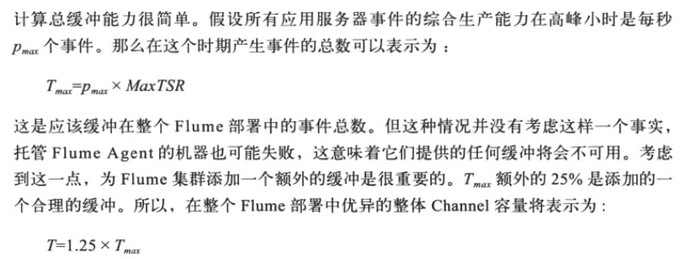
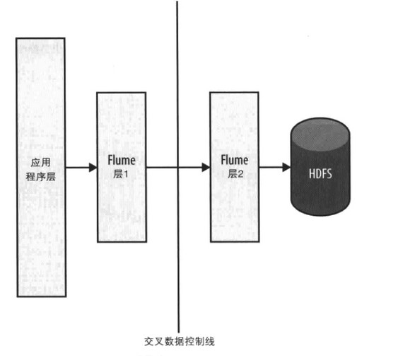
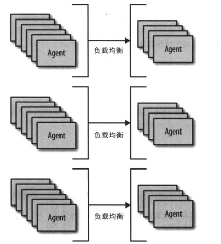

[TOC]

# 7. 发送数据到flume

看完rpc再补充

# 8. 规划、部署、监控

两个概念：存储最大故障时间（MTSR）；服务器最大故障时间（MaxTTR）

### channel容量

### 多少层

最后一层的agent数量不超过8个，之前的层满足：前一层的agent数量/后一层的agent数量小于32：1。需要满足日志中没有持续的异常且channel没有积压

若某一层的channel有积压，且日志中没有超时，则说明sink数量不够，需要添加agent

### 跨数据中心发送数据

当应用程序和目的层在不同的数据中心时，需要分别部署flume层。因为跨数据中心的连接更容易失败，应让flume来处理这些失败，并依靠flume来缓冲数据

### 层分片

减少连接数量，将所有数据分成若干个分片。如下图的三个分片：

### 部署监控

