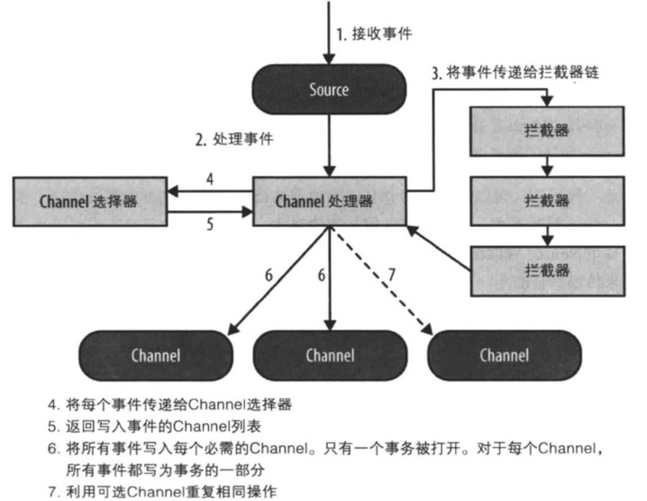
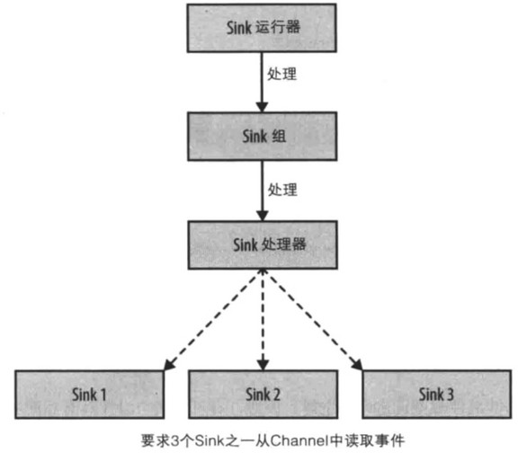
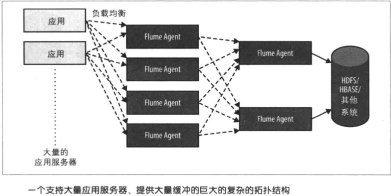
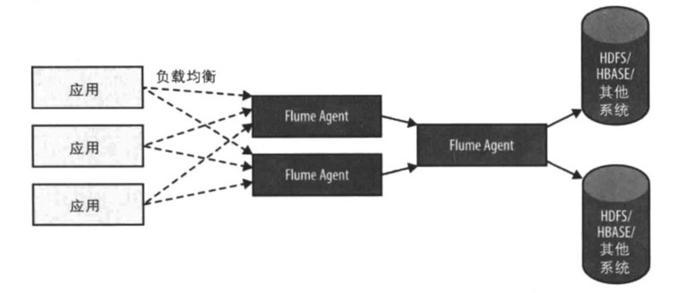
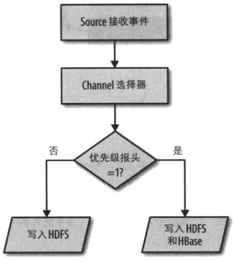
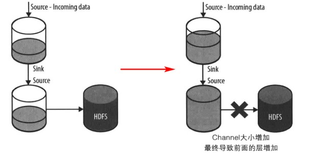

[TOC]

# 2. Flume处理流数据

### Flume存在的意义

若将生产者直接与Hadoop等系统接应写入数据，可能出现丢失数据、数据处理速度不匹配的问题

可拓展性强，通过简单地增加Agent就能拓展服务器的数量

### Flume Agent内部原理

### Flume Agent配置

见书

### 复杂的流

### 复制数据到不同的目的地

### 动态路由

### 关于事务

见书，看不明白。大概是每次写入或读取channel数据，都会由一个事务来封装，保证数据要么全部写入要么回滚？

### Agent失败和数据丢失

当某一层的数据传输失败时，数据将被缓冲直至Channel被填满。此时开始回退到前一层，直到所有层都被填满。此时的数据将会发生丢失

### 批量和重复

同kafka等，为减少额外的网络传输或系统调用的开销比例，一般会将多个事件一起组成一个批次再进行传输（存储）。类似redis的pipeline

在sink端，若RPC调用在超时时间内没有得到响应且实际的RPC并没有失败，就会引发重试，进而重复

