[TOC]

# 4. ZAB协议

### 4.1 协议核心

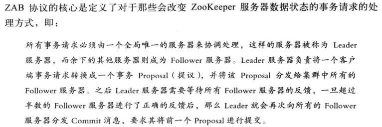

### 4.2 协议内容

分为消息广播和崩溃恢复

- 消息广播

    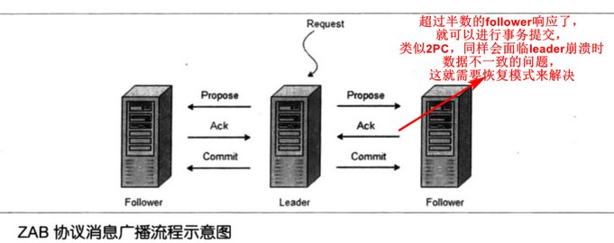

    - 全局事务ID保证事务处理的先后顺序
    - leader为每个follower维护一个队列，广播的消息就放在队列中发送出去

- 崩溃恢复

    - 基本特性

        - 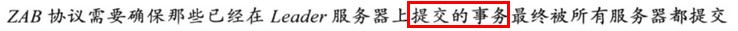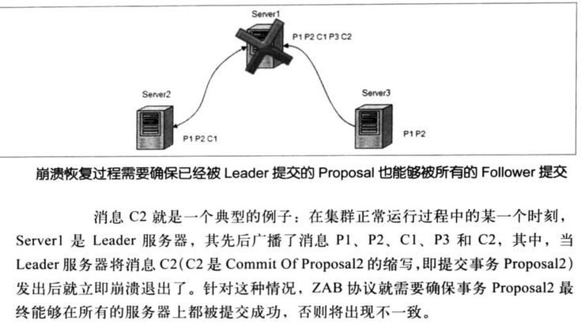

        - 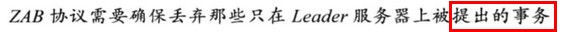

            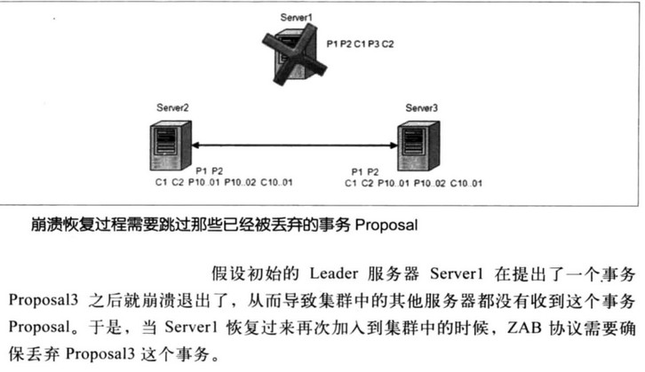
        所以，leader的重新选举选出来的是具有ZXID最大的那个机器，它拥有所有已经提交的事务（前提就是事务的严格顺序执行）
    
    - 数据同步
    
        - 特性一的恢复实现
    
            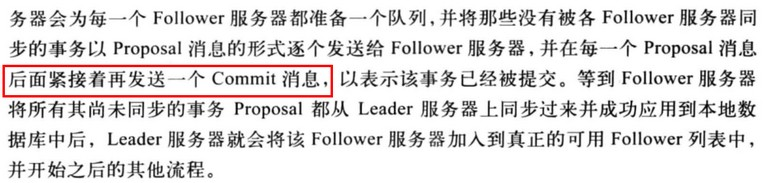
    
        - 特性二的恢复实现
    
            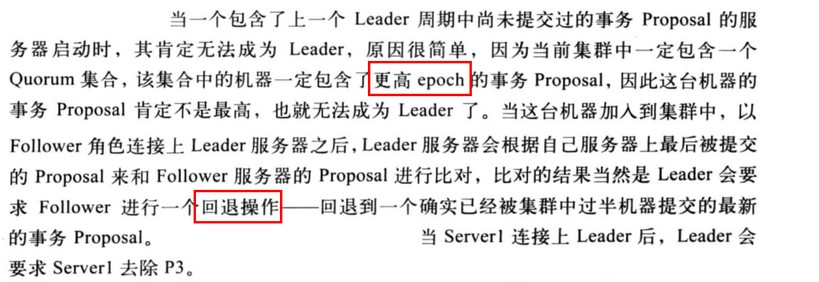

### 4.3 ZAB算法描述

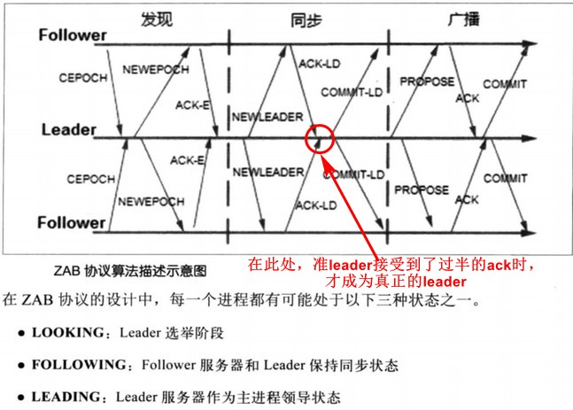

当leader在一定时间内收不到过半的follower的心跳检测时，就会触发重新选举

# 5. API

- 原生API。创建、删除、更新（带version版本的有CAS语义）、读取、检测存在、权限、添加Watcher

    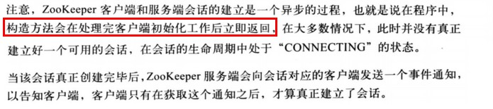

    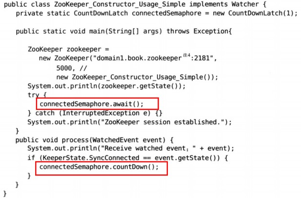

- ZKClient和Curator框架。见书

    - Curator框架典型应用场景

        - 事件监听

        - Master选举

            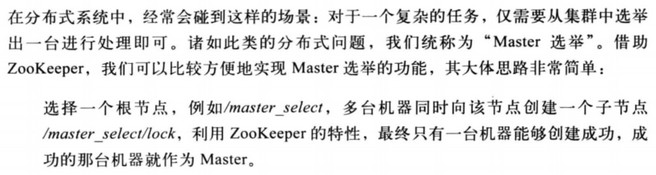

            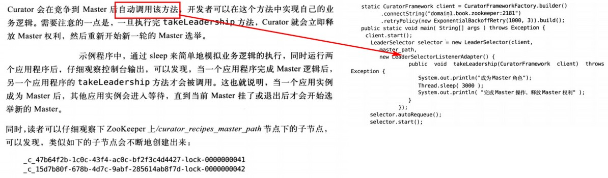

        - 分布式锁

            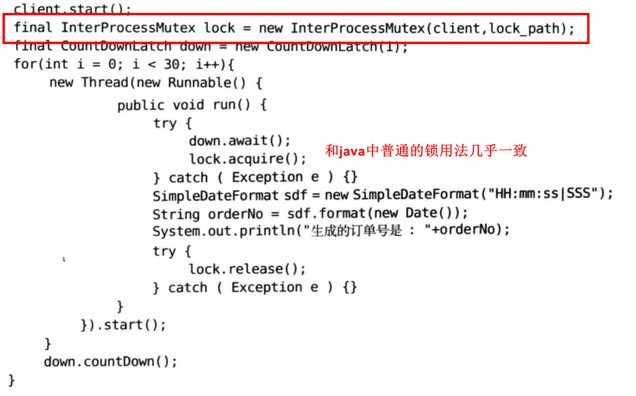

        - 分布式计数器。DistributedAtom类对应Java中的Atom类

        - 分布式Barrier。DistributedBarrier类对应Java中的CyclicBarrier

        - ZKPaths（更方便创建和删除节点）和EnsurePath（确保节点存在）工具类

