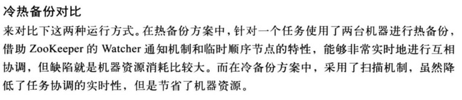
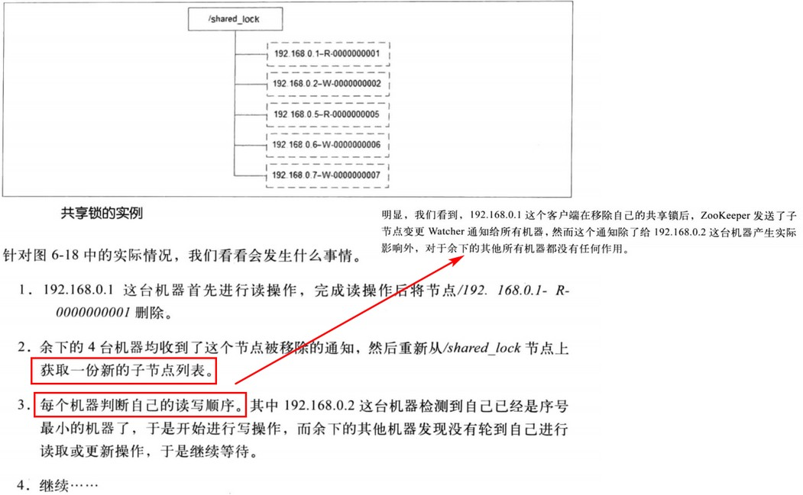
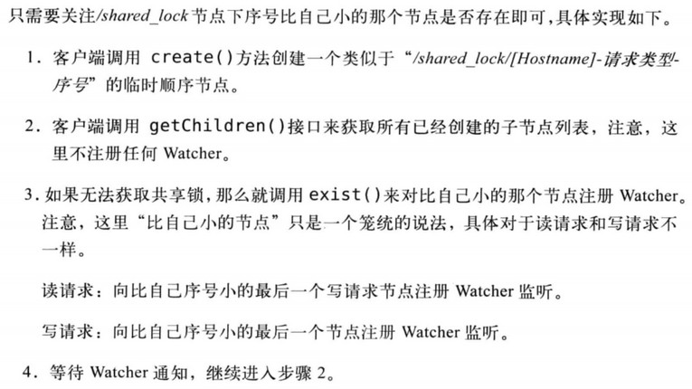
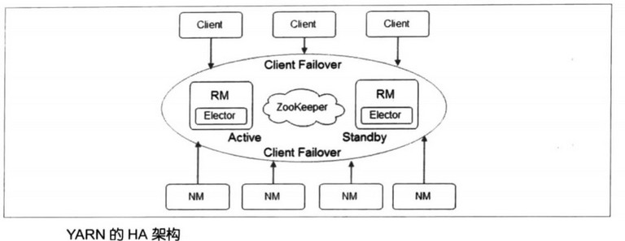
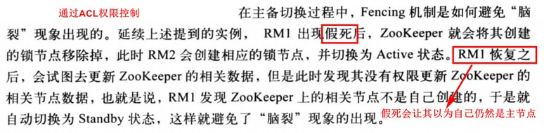
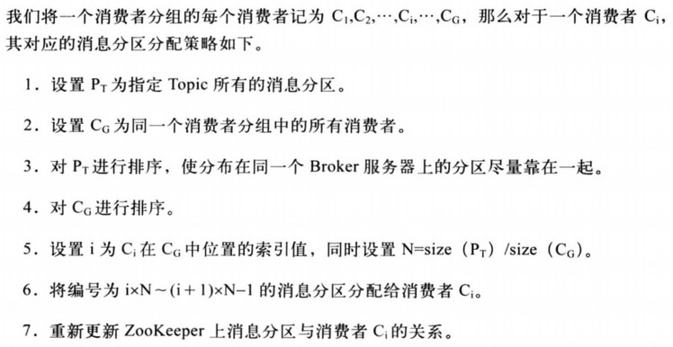

[TOC]

# 6. 应用场景

### 6.1 典型应用场景

#### 数据发布订阅

#### 负载均衡

动态DNS系统架构

#### 命名服务

全局唯一ID

#### 分布式协调通知

任务热备、热备切换（利用临时节点机制）、偏移量记录

- 通用的分布式机器间通信方式
    - 心跳检测
        - 直接在指定节点下创建临时节点，通过临时节点是否存在来判断机器是否存活
    - 工作进度汇报
        - 将任务执行进度写到临时节点上去

#### 集群管理

- 分布式日志收集系统。各种利用节点的特性做文章（机器注册、任务分发、状态汇报、动态重分配）

#### Master选举、分布式锁、分布式队列

羊群效应：

避免羊群效应改进的分布式锁：

### 6.2 开源项目中的应用

#### Hadoop

主要用于实现NN和RM的HA，实现在Common模块中。

- 主备切换。原理即典型的应用方法（争夺一个ZNode节点，未争夺到的机器对其监听，当该节点被删除时重新触发选举）

- Fencing（隔离）。避免脑裂（由于网络波动，出现多个主节点各司其职）

    

#### HBase

#### Kafka

- `/brokers/ids/`节点用于broker的注册，是临时节点，可用于监测broker的存活性

- `/brokers/topics/`保存分区信息，临时节点
- `/consumers`保存消费者的信息

- 偏移量记录在较高版本中已经移到了kafka本身的一个topic内

当监听到broker或者消费者发生变更时，就可能触发再均衡，算法如下：

