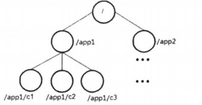
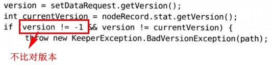
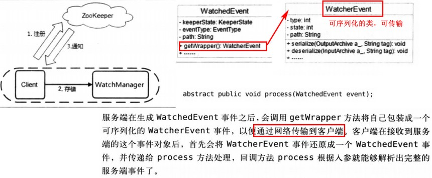
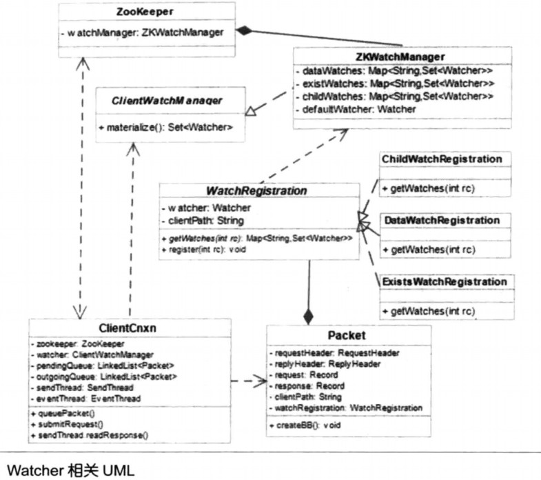
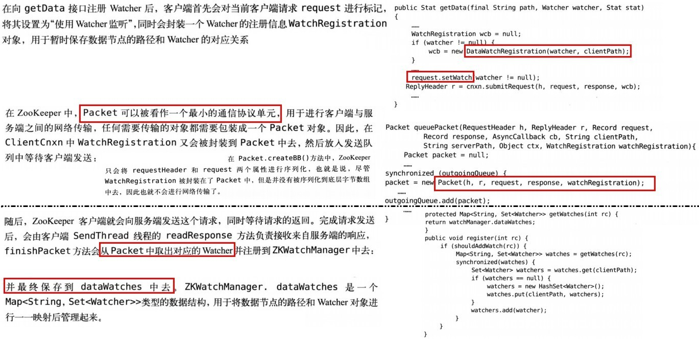
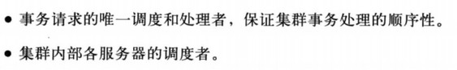
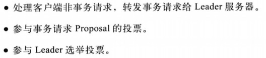

[TOC]

# 7. 技术内幕

### 7.1 系统模型

#### 数据模型

树形结构，类文件系统

事务ID：ZXID，每个改变ZK状态的操作都是事务

#### 节点特性

- 持久、顺序、临时

- 状态信息
    - get命令返回的结果中包含有状态信息，它是Stat类的一个格式化输出，每行都基本是Stat类的一个变量

#### 版本

主要用于锁的实现，更新操作的CAS比较的就是版本信息

#### Watcher工作机制

事件只包含事件本身的信息和发生事件的路径，不包含节点下的数据内容。客户端在收到通知后，需要再次请求服务端拿到具体的数据内容

Watcher工作机制分为三个过程：客户端注册、服务端处理、客户端回调。相关类图：

- 客户端注册原理：

    

- 服务端处理原理：

    

。。。。

### 7.6 Leader选举

leader选举：

1. 每个Server都将票投给所有机器，首次的票都是自己。形式为（myid, ZXID）
2. 接收各Server的投票。检查票的有效性
3. 处理投票。以ZXID优先、myid其次的规则更新自己的投票，并立即发送出去（给所有机器，同时此票的投票轮数+1）
4. 统计。若集群中有过半的机器发出了相同的投票，该票的机器就被选为leader；若还没，继续投票
5. 更新状态

具体源码实现见书

### 7.7 服务器角色

源码见书

- leader

    

- follower

    

- observer

    - 与follower相比，只是不参与投票
    - 主要用于分担非事务请求

。。。。