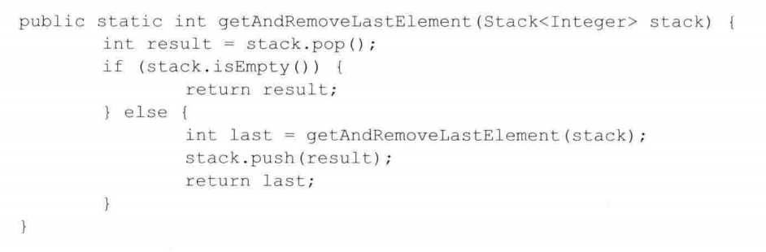
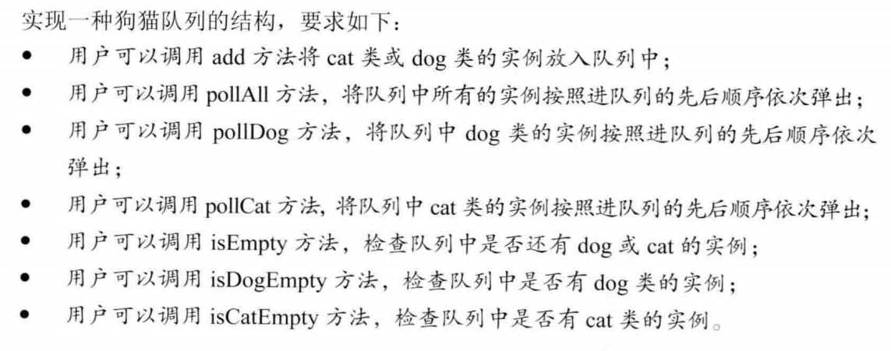
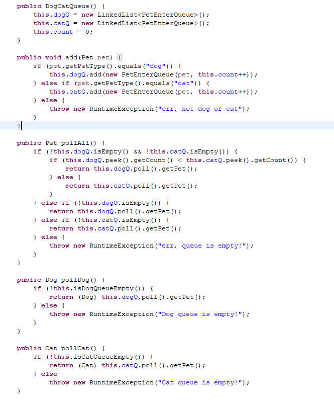
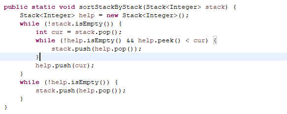
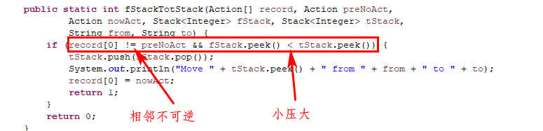
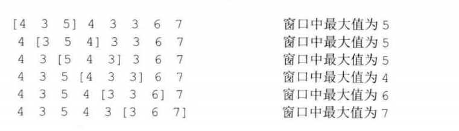
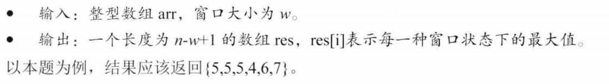
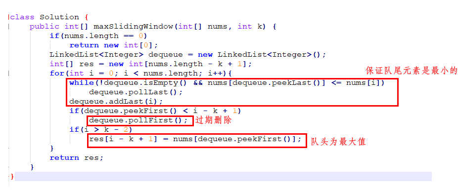

# 一. 设计一个有getMin功能的栈

- pop、push、getMin时间复杂度均为O(1)
- 可以使用现成的栈

同leetcode 155, leetcode方法还有更优

# 二. 由两个栈组成的队列

同leetcode 232, leetcode两种方法

# 三. 仅用递归和栈基本操作逆序一个栈

主要是两个递归函数：
1. 移除栈底的元素并返回				
	
2. 逆序一个栈，递归方法				
	

# 四. 猫狗队列

猫狗类继承于宠物类，要求：			
	

常见错误：				
	

主要思想：
- 用两个队列，一个保存猫一个保存狗
- 两个队列中的每个实例都加上一个计数项，用于判断不同队列中的队首元素到底是谁先入队

	

# 五. 用一个栈对另一个栈进行排序

仅用一个栈B完成对另一个栈A的栈顶至栈底的从大到小排序

主要思想：
- 重点在于想把栈A的数据弹出，先在栈B中形成从小到大的顺序，再逐一压回栈A即可
- 所以，维护栈B元素一直为从小到大的顺序，若从栈A中弹出的元素小于或等于栈B顶，直接压入B；若大于，则先将栈B的元素压回A，将此元素放到相应位置，再将栈A元素压回B

	

# 六. 栈解决汉诺塔问题

要求：
- 递归的方法
- 非递归的方法，用栈模拟三个塔

递归:
1. （递归终止条件）：当只有一个块时，直接移动
2. 当N个块需要移动，且只需移动一步，则为（从左到中举例）：
	1. 递归将第1~N-1从左到右
	2. 将第N从左到中
	3. 递归将第1~N-1从右到中
3. 当N个块需要移动，但需移动两步，则为（从左到右举例）：
	1. 递归将1~N-1从左到右
	2. 将第N从左到中
	3. 递归将1~N-1从右到左
	4. 将第N从中到右
	5. 递归将1~N-1从左到右

非递归:
1. 主要思想：
	1. 小压大原则
	2. 相邻不可逆原则（相邻步骤一定不是正好相逆的，否则不是最优）
	3. 每一个步骤，L->M，M->R，M->L, R->M的四个操作中，只有一个符合上述两个原则，故每次只有一个确定的移动方案，过程是完全确定的
	4. 左中右各一个栈，移动就是出栈入栈的过程

	

# 七. 生成窗口最大值数组

同**leetcode 239**

主要思想：
1. 双端队列，维持队头为窗口最大值（以下均保存下标）（若队头过期，则弹出）
2. 每新扫描一个数，则判断：
	1. 若比队尾数还小，则直接放入队尾
	2. 若比队尾数大，则从队尾弹出比其小（或等）的数，直到队尾数比其大，并加入队尾
3. 即队列保持队头到队尾从大至小的顺序排列 

# 八. 构造数组的MaxTree

