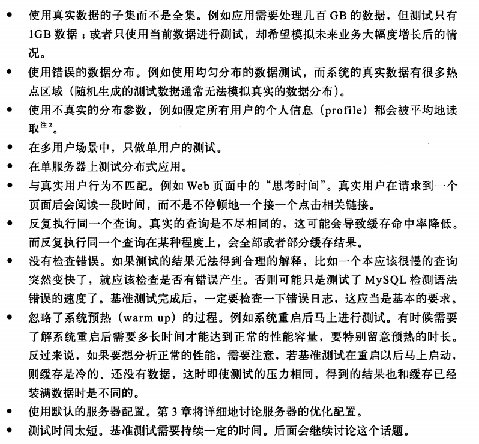

[TOC]

# 1. MySQL架构与历史

### 1.1 MySQL逻辑架构
- 第一层。 大多数工具都具有的，连接处理/授权认证/安全等
- 第二层。 核心层，查询解析/分析/优化/缓存/内置函数，存储过程/触发器/视图
- 第三层。 存储引擎，负责数据的存储和提取

### 1.2 并发控制
- 读写锁（共享锁/排他锁）。 防止数据冲突
- 锁粒度。 在锁的开销和数据安全性之间寻求平衡（锁策略）
	- 表锁。 MySQL最基本的锁策略，开销最小，锁定整张表
	- 行级锁。 开销最大，对行进行锁定

### 1.3 事务

	START TRANSACTION;
	UPDATE ...;
	UPDATE ...;
	COMMIT;

`START TRANSACTION`开始事务，`COMMIT`提交事务将修改持久保留，`ROLLBACK`撤销所有的修改

单纯的事务并不能保证数据安全性，必须经过严格的**ACID**测试：
- 原子性(atomicity)。 要么全成功，要么全失败
- 一致性(consistency)。 数据库总是从一个一致性的状态转换至另一个（如上面的代码，在两个UPDATE之间系统崩溃，也不会造成数据破坏，因为数据库最终的状态修改由COMMIT提交，确保状态一致性） 
- 隔离性(isolation)。 事务做的修改在提交前，对其它事务是不可见的
- 持久性(durability)。 一旦提交，事务做的修改就会永久保存至数据库

事务通常要求更高的CPU处理能力、内存和磁盘空间，对不需要事务的业务，可以选择非事务型存储引擎，提高性能

**1.3.1 隔离级别**  
未提交读、提交读、可重复读、可串行化，隔离级别从低到高

**1.3.2 死锁**  
多个事务在同一资源上相互占用，并相互请求对方占用的资源。 死锁发生后，只有部分或者完全回滚其中一个事务，才能打破死锁

**1.3.3 事务日志**  
存储引擎在修改表数据时把修改行为记录到硬盘上的事务日志中，不用每次将数据本身持久到磁盘。   
事务日志记录后，真正的数据修改可在后台慢慢地刷回到磁盘，这称为**预写式日志**，修改数据需要写两次磁盘（一次记录日志，一次真正修改磁盘数据，有点类似Redis的AOF持久化）

**1.3.4 MySQL中的事务**  
两种事务型的存储引擎：InnoDB和NDB Cluster  

- 自动提交
	- 默认为自动提交，如果不显示地开始一个事务，每个查询都被当成事务执行提交操作
	- `SET AUTOCOMMIT = 0/1;` 可修改此配置
	- 不自动提交时，所有查询都在一个事务中，直到显式进行了提交或回滚
	- `SET TRANSACTION ISOLATION LEVEL`设置隔离级别，并在下一个事务开始时生效

在同一事务中使用多种存储引擎是不可靠的  
显式和隐式锁定

### 1.4 多版本并发控制

保存数据在某个时间点的快照，不管执行多长时间，开始时间相同的每个事务看到的数据是一致的。 所以，即使在同一时刻，不同开始时间的事务看到的数据也可能是不一样的

### 1.5 MySQL的存储引擎

每个数据库都是数据目录下的一个子目录。 创建表时，会在数据库子目录下创建一个同名的.frm文件保存表定义

`SHOW TABLE STATUS`显式表的相关信息

- InnoDB存储引擎。 MySQL默认的事务型引擎
- MyISAM存储引擎。 默认的非事务型引擎
- 其它内建引擎。 Archive、Blackhole、CSV、Federated、Memory、Merge、NDB
- 第三方引擎。 OLTP类、面向列的存储引擎、社区存储引擎

**如何选择存储引擎**：
- 是否需要事务
- 备份的需求
- 系统崩溃恢复性能
- 其它特有特性

举例，根据实际应用场景选择存储引擎：如日志型应用、只读的表、订单处理、电子公告牌和主题论坛、CD-ROM应用、大数据量应用

转换表的引擎：  
- `ALTER TABLE` 直接修改原表，可能会丢失一些表的特性
- mysqldump工具将表导出，然后修改文件中的引擎选项
- `CREATE`和`SELECT`，创建一个相同结构的新表，修改其引擎，然后select将原数据复制过来

# 2. MySQL基准测试
基准测试是针对系统设计的一种压力测试，目标是为了掌握系统的行为

### 2.2 基准测试的策略
- 针对整个系统的整体测试（集成式基准测试）
	- 测试整个应用系统（包括web服务器、应用代码、网络和数据库）
	- MySQL并非总是瓶颈
	- 发现各组件部分之间的缓存的影响
	- 更揭示真实表现
- 单独测试MySQL（单组件式基准测试）
	- 只需比较不同schema或查询的性能
	- 针对某个具体问题测试
	- 避免漫长的基准测试，做短期的测试进行快速调整
- 测试指标
	- 吞吐量。 单位时间内的事务处理数
	- 响应时间或延迟。 测试任务所需的整体时间
	- 并发性
	- 可扩展性。 比如：给系统增加一倍的工作，能获得两倍的结果；或者给系统增加一倍的资源，能获得两倍的吞吐量

### 2.3 基准测试方法

一些错误的测试方法：  

基准测试方法:

（...........）

### 2.4 基准测试工具

- 集成式测试工具。 ab、http_load、JMeter
- 单组件式测试工具。 mysqlslap、MySQL Benchmark Suite、Super Smack、Database Test Suite、Percona's TPCC-MySQL Tool、sysbench

### 2.5 基准测试案例

详细介绍了http_load、MySQL Benchmark Suite、sysbench、Database Test Suite、Percona's TPCC-MySQL Tool

# 3. 服务器性能剖析

### 3.1 性能优化简介

对数据库服务器来说：  
- 数据库服务器的性能用查询的响应时间来度量，单位是每个查询花费的时间
- 无法测量就无法有效地优化，必须先测量
- 完成任务所需要的时间可分为执行时间和等待时间

**3.1.1 通过性能剖析进行优化**  
性能剖析：测量和分析时间花费在哪里；两个步骤：测量任务所花费的时间，然后对结果进行排序；工作方式基本是用结束时间减去开始时间得到响应时间

性能剖析报告：任务名，任务的执行时间，任务的消耗时间，任务的平均执行时间，及任务执行时间占全部时间的百分比等信息（MySQL中任务指的都是查询）

- 基于执行时间的分析，研究什么任务执行时间最长
- 基于等待的分析，判断任务在什么地方被阻塞的时间最长

**3.1.2 理解性能剖析**  
以下几点性能剖析报告是不会告诉我们的：
- 值得优化的查询
	- 占总响应时间比重很小的查询是不值得优化的
	- 优化花费金钱的成本大于收益时，就不值得优化
- 异常情况
	- 虽然响应时间占比少，但是会影响用户体验
- 未知的未知
	- 即“丢失的时间”。 比如CPU时间时10S，但剖析出来的总时间为9.7S，可能是某些任务没有测量到或者测量误差的问题，这部分丢失的时间需要引起重视 
- 被隐藏的细节
	- 剖析无法显式所有响应时间的分布，只相信平均值是不可靠的。比如有极少个响应时间长的任务，大部分都是时间短的，这时候平均值会把这个别任务稀释，只通过平均值是不能发现的 

### 3.2 对应用程序进行性能剖析

上述都是针对MySQL服务器的剖析，也有必要对整个应用程序进行性能剖析

### 3.3 剖析MySQL查询

- 剖析服务器负载
	- 可以定位和优化不好的查询
	- 如同Redis，MySQL也存在慢查询日志，也是当前开销最低精度最高的测量查询时间的方法
	- 还有方法是通过TCP抓包，根据MySQL的客户端/服务端的通信协议进行解析
	- 如何分析查询日志(.........)
- 剖析单条查询
	- `SET profiling = 1;`然后会记录之后的查询执行状态，再利用`SHOW PROFILES`, `SHOW PROFILE FOR QUERY [N]`查看（也可以查询INFORMATION_SCHEMA中的表查看）
	- `SHOW STATUS`返回一些计数器，记录已查询的次数
	- 分析慢查询日志
	- 使用'Performance Schema'
- 使用性能剖析
	- 得到分析报告后，需要精准定位问题所在，比如如何诊断间歇性问题

### 3.4 诊断间歇性问题
指的是系统偶尔停顿或者间歇性的慢查询，比如：
- 应用通过curl从运行很慢的外部服务来获取数据
- memcached缓存中数据过期，导致重新生成缓存
- DNS查询超时
- 互拆锁争用，内部删除查询缓存算法效率低
- 并发度超常

**3.4.1 单条查询问题还是服务器问题**  
- 使用`SHOW GLOBAL STATUS`, 显示某些计数器
- `SHOW PROCESSLIST`，观察是否有大量线程处于不正常的状态或有其他不正常的特征
- 分析查询日志，tcpdump等

**3.4.2 捕获诊断数据**  
（..........）

**3.4.3 一个诊断案例**  
（实际案例分析，重要，可学习..........）

### 3.5 其他剖析工具

- 使用`USER_STATISTICS`表
- 使用`strace`

### 3.6 总结

- 定义性能最有效的是响应时间
- 需要进行全方位测量
- 测量最佳开始点是应用程序，不是数据库
- 系统难免测量出错误的结果或无法进行完整的测量
- 需要利用剖析器
- 剖析器只是一个汇总信息，细节会有所丢失，不能完全依赖剖析器
- 两种消耗时间的操作：执行和等待
- 优化和提升是两回事，提升的成本超过收益时，应停止优化
- 决策应当尽量基于数据而不是感觉

# 4. Schema与数据类型优化

### 4.1 选择优化的数据类型

- 更小的通常更好
	- 一般情况下，应使用可以正常存储数据的最小数据类型
	- 前提一定是保证存储的值范围不会超过此范围，否则增加数据类型范围是非常痛苦的
- 尽量选择简单的类型
	- 例如整型比字符操作代价更低
	- 例如应使用内建的类型而不是字符串来存储日期和时间，应该用整型存储IP地址
- 尽量避免NULL
	- 通常最好指定列NOT NULL，除非真的需要存储NULL值
	- 包含NULL的列更难优化

**4.1.1 整数类型**  
- TINYINT, SMALLINT, MEDIUMINT, INT, BIGINT分别是8，16，24，32，64位，均可以用UNSIGNED无符号属性
- 有符号和无符号类型使用相同的存储空间，有相同的性能
- MySQL可以指定整型宽度，如INT(11)，这对存储和计算没有影响，只是会影响一些交互工具的显示字符的个数
- IPV4地址其实是32位无符号整数，而不是字符串

**4.1.2 实数类型**  
- FLOAT/DOUBLE类型为浮点运算，是近似计算；DECIMAL用于存储精确的小数
- CPU支持原生的浮点运算，不支持DECIMAL的直接计算，所以浮点运算明显更快
- 浮点和DECIMAL都能指定精度。DECIMAL可以指定小数点前后的最大位数
- 在相同范围时，浮点类型通常比DECIMAL更少空间
- 可以用BIGINT来代替DECIMAL，只需要乘以响应的倍数即可

**4.1.3 字符串类型**  
- VARCHAR
	- VARCHAR存储可变长字符串，比定长更节省空间，但需要1-2个字节来记录字符串长度。 如VARCHAR(10)需要11个字节，VARCHAR(1000)需要1002个字节
	- 节省空间，所以性能也更好。但是在更新时，更新后的长度可能比原来大，需要做额外的工作
	- 适用VARCAHR的场景:字符串列的最大长度比平均长度大很多；列的更新少；使用了如UTF-8的复杂字符集
- CHAR
	- CHAR是定长的，适合存储很短或者基本定长或经常变更的字符串。例如MD5值，单字节字符等
	- 存储CHAR值时，字符串的**末尾空格会被全部删除**
- BINARY和VARBINARY存储二进制字符串
- BLOB和TEXT
	- 存储很大的数据，BLOB为二进制类型，TEXT为字符类型。它们仅有的不同是二进制类型没有排序规则和字符集，字符类型则有
	- MySQL只对BLOB/TEXT前一部分的字节做排序，也不能将全部长度的字符串进行索引
- 枚举(ENUM)类型代替字符串类型
	- 实际存储的是整数，不是字符串。所以排序也是根据内部存储的整数排序的 
	- 在查询时，采用整数主键而避免采用基于字符串的值进行关联(join)

**4.1.4 日期和时间类型**  
- DATETIME
	- 保存大范围的值，从1001年到9999年，精度为秒
- TIMESTAMP
	- 和UNIX时间戳相同，只能表示1970到2038年，精度为秒
	- 与时区有关系
	- 应尽量使用TIMESTAMP，效率更高

**4.1.5 位数据类型**  
BIT/SET

**4.1.6 选择标识符**  
即id列
- 一般整数是最好的选择
- ENUM/SET一般是糟糕的选择
- 尽量避免使用字符串类型作为标识列，很消耗空间，性能低下

### 4.2 MySQL schema设计中的陷阱
