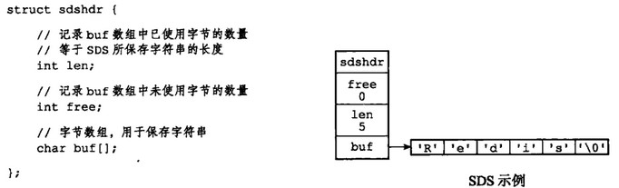
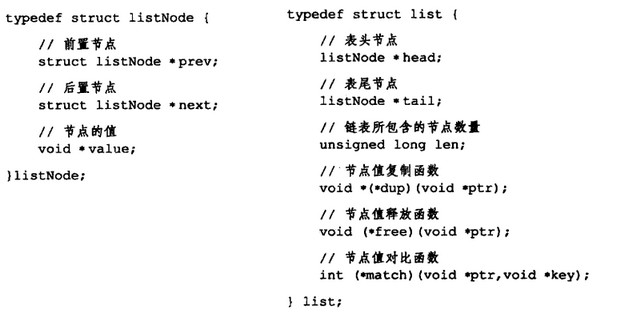
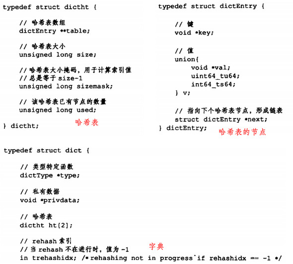
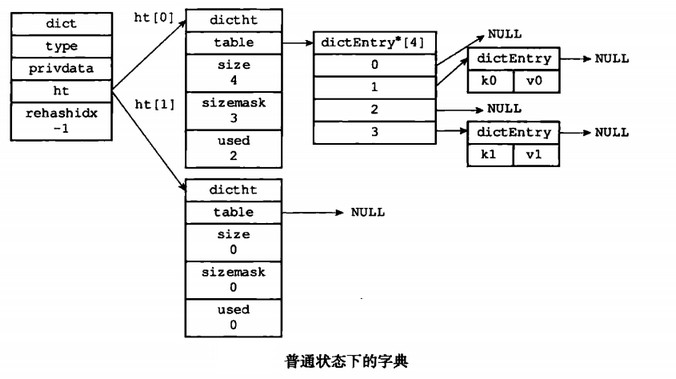
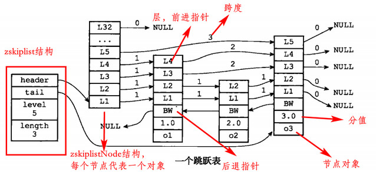
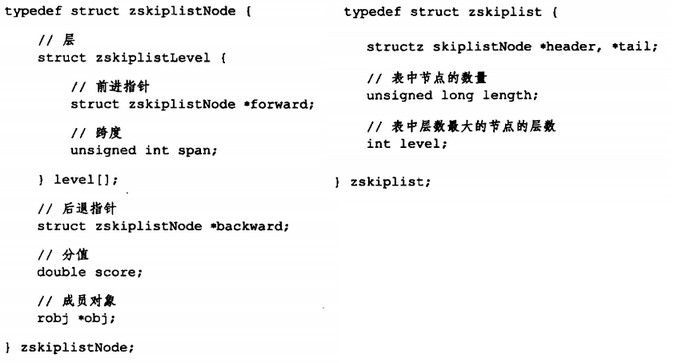

[TOC]

# 一、数据结构与对象

# 2. 简单动态字符串

使用SDS(simple dynamic string)作为字符串类型，而不是C中的字符串。如：`SET msg "hello"`， 会创建一个键(msg)和值(hello)都是SDS对象的键值对

除保存数据库的字符串值外，还用作缓冲区

### SDS定义

相比C字符串：

- 常数复杂度获取字符串长度。对性能改善明显
- 防止缓冲区溢出。SDS在拼接时会检查空间是否则足够，不够则扩容
- 减少内存重分配
  - 空间预分配。每次修改会预分配出一些空间，以后添加时直接使用
  - 惰性空间释放。字符删除时，不会立即回收多出来的空间，而是记录在free变量中，空间可以用于以后添加字符操作使用
- 二进制安全。内容中含有0时，不会视为结束，因为有len变量指示
- 兼容C字符串函数

# 3. 链表

列表类型、发布订阅、慢查询、监视器都用到了链表

实现了链表和链表节点：

# 4. 字典

和Java中的HashMap实现原理非常类似

### 4.1 定义和实现

字典的大致结构图如下：

哈希算法类似HashMap，利用一个hash函数来确定索引值

解决键冲突的方法也类似HashMap，用链表来解决

rehash过程也类似HashMap，有根据负载因子进行双倍扩容的操作

渐进式rehash：

- 若需要rehash的节点对的数量过于庞大，则rehash的动作可能非常耗时
- 引出了渐进式rehash的思想，即不立即把所有节点进行rehash，而是在某个节点有对其增删改查的操作时，顺带将此节点进行rehash，这样就防止所有的rehash操作挤在一起

# 5. 跳跃表

大部分情况下跳跃表效率可以媲美平衡树，而实现更简单。redis中有序集合底层使用跳跃表

跨度用于判断节点在集合中的排位，距头节点跨度越大的节点，其排位则越靠后

# 6. 整数集合

当集合只包含整数值元素并且数量不多时，底层就是整数集合

关于升级和降级

# 7. 压缩列表

对于数量小、值小、字符串长度比较短的列表和哈希，底层实现用压缩列表

# 8. 对象