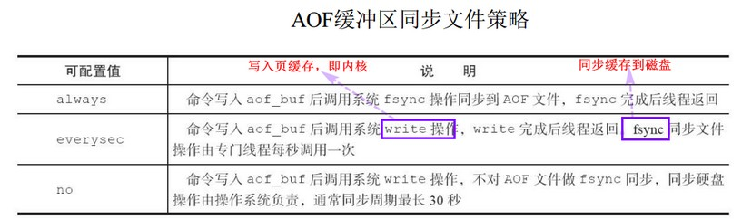
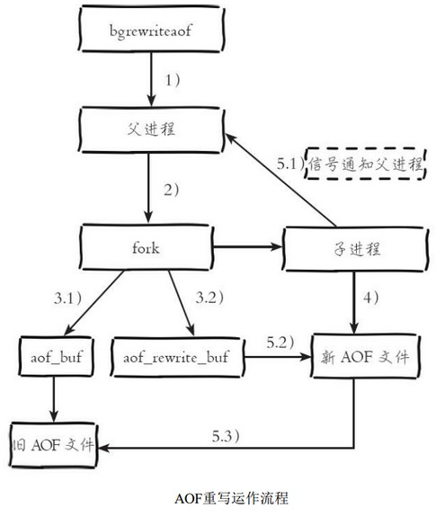
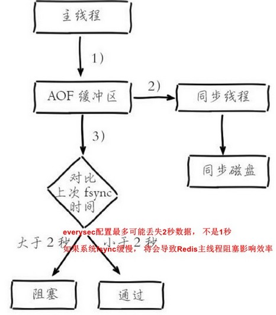
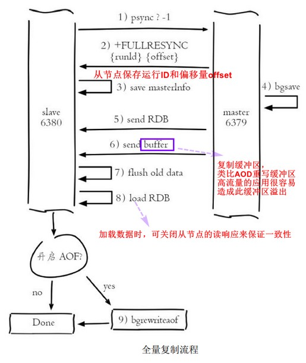

[TOC]

# 5. 持久化
### 5.1 RDB  
`bgsave`：Redis进程执行fork创建子进程，负责完成持久化。默认采用LZF压缩算法。  

#### 触发bgsave

1. save m n, m秒内n次修改  
2. 从节点全量复制，则主节点会bgsave并生成rdb发给从节点  
3. `debug reload`  
4. `shutdown`  

#### 流程

父进程->fork->子进程->生成rdb->通知父进程 

#### 优缺点

- 优：适用于备份，恢复时加载速度远快于AOF 
- 缺：无法实时持久化，频繁执行成本高；老版本二进制文件可能不兼容  

### 5.2 AOF
以日志的方式将每次写命令记录下来，恢复时重新执行AOF文件中的命令达到恢复数据的目的，有实时性。
默认不开启，开启需要配置`appendonly yes`.  

#### 流程和原理

1. 命令写入(到缓冲区)

2. 文件同步(到硬盘)

    

3. 文件重写(定期或手动,达到压缩的目的)

    - 超时数据可以删除

    - 无效命令可以删除

    - 命令合并

        

4. 重启加载(较rdb,加载aof文件更优先)  

### 5.3 问题定位与优化  
1. fork耗时问题，需要复制父进程空间内存页表，与父进程内存占用成正比。  

2. 备份子进程开销监控和优化：
    redis属CPU密集型
    内存消耗分析P341： **如有多个实例，保证同一时刻只有一个子进程工作；避免在大量数据写入时做备份，会导致父进程维护大量页副本** （AOF重写时，除了页副本，还多了AOF重写缓冲区的内存）
    硬盘开销分析。**重写时避免有其他高硬盘负载的服务；AOF的硬盘同步会直接影响redis的性能**

3. AOF追加阻塞 

    

### 5.4 多实例部署  
利用`info Persistence`通过外部程序轮询控制持久化操作，保证每个实例持久化串行执行

（当文件增长率超过特定阈值（比如100%），程序执行bgrewriteaof命令触发当前实例的AOF重写 ）

# 6. 复制
### 6.1 配置
1. 配置文件 slaveof [host] [port]  
2. redis-server --slaveof [host] [port]  
3. 运行期 动态 slaveof [host] [port]   
均为异步命令, `info replicaiton`查看复制相关状态  

- `slaveof no one`断开复制关系，将从节点晋升为主节点。不会抛弃原有数据，只是不再复制数据。
- `slaveof`还可用于切主，流程：断开原主->与新主建立关系->删除原主数据->复制新主数据 
- 传输延迟：同机房，关闭`repl-disable-tcp-nodelay`；跨机房，则打开。（控制主从节点间的数据同步延迟）  

### 6.2 拓扑  
一主一从、一主多从、树状主从  

### 6.3 原理  
#### 复制过程

1. 保存主节点信息(异步，保存后直接返回)
2. 主从建立socket连接
3. 发送ping命令(等待pong回复)
4. 权限验证
5. 同步数据集
6. 命令持续复制

#### 数据同步(psync)

全量复制，部分复制 （一般是连接断开，主节点补发给从节点的数据）

- 复制偏移量：判断主从节点数据是否一致，差值可判定当前复制的健康度 （**类比kafka中的LEO**）
- 复制积压缓冲区(定长队列)。用于部分复制和复制命令丢失的数据补救 
- 主节点运行ID(Redis节点标识，`info server`查看)  
- psync命令：`psync [runid]（主节点ID） [offset]（从节点当前LEO）`  全量复制就是`psync [runid] -1`  

#### 全量复制

最主要的耗时步骤：

**心跳**： 主从节点复制后，维护着长连接并发送心跳命令(ping命令、replconf ack命令)  ，并在心跳里发送复制偏移量

**异步复制** ：从节点的实时复制是异步的，主节点将实时命令异步发给从节点

### 6.4 开发与运维中的问题  

#### 读写分离

- 复制数据延迟
    - 监控程序定期检查主从偏移量差（字节为单位），相差太大时做切主操作
- 读到过期数据
    - 从节点不会主动执行del命令删除键
    - 3.2版本后，从节点读取数据之前会检查键的过期时间来决定是否返回数据  
- 从节点故障  

#### 主从配置不一致

maxmemory、hash-max-ziplist-entries等内存配置需要一致；但可以主节点关闭AOF而在从节点开启  

#### 规避全量复制

- 第一次建立复制关系
- 主节点重启，运行ID不匹配，也触发全量复制
- 复制积压缓冲区不足。即部分复制请求的偏移量找不到

#### 规避复制风暴

- 单节点复制风暴
    - 主节点重启，有多个从节点，此时触发多个全量复制。（可将拓扑改成树状结构）
- 单机器复制风暴
    - 一台机器上多个主节点实例

# 7. 阻塞
客户端抛出超时异常——JedisConnectionException 
redis监控系统——CacheCloud：命令耗时、慢查询、持久化阻塞、连接拒绝、CPU/内存/网络/磁盘 
**内在原因** 
API、数据结构使用不合理：慢查询(如hgetall)——slowlog get [n]查看 
CPU饱和：redis-cli -h -p --stat查看redis状态(可看到OPS)，过度追求内存优化从而导致了CPU消耗大，bgsave持久化占用大量CPU 
持久化阻塞：fork阻塞、AOF刷盘阻塞、HugePage写操作阻塞  

**外在原因** 
CPU竞争：进程竞争(bgsave竞争，其他进程竞争)，绑定CPU(为减小多实例redisCPU切换开销做绑定，在做持久化时父子进程共享CPU，造成阻塞) 
内存交换：`cat /proc/[process_id]/smaps |grep Swap`查看进程内存交换 
网络问题：连接拒绝、网络延迟(--latency可做测试)、网卡软中断

# 8. 理解内存（重要）
### 8.1 内存消耗
`info memory`获取内存相关指标，关注used_memory_rss和used_memory  
1. 自身内存：一般自身内存消耗非常小  
2. 对象内存：内存占用最大的一块，存储所有数据  
3. 缓冲内存：客户端缓冲（输入输出）、复制积压缓冲区、AOF缓冲区（重写期间的写入命令）  
4. 内存碎片：频繁做更新操作、大量过期键删除——解决：数据对齐、安全重启  
5. 子进程内存消耗：**当父进程处理写请求时会对需要修改的页复制出一份副本完成写操作，而子进程依然读取fork时整个父进程的内存快照（THP优化，建议关闭）**  

### 8.2 内存管理
1. 设置内存上限(maxmemory)  
2. 动态调整内存上限  
3. 内存溢出控制策咯（noeviction、volatile-lru、allkeys-lru、allkeys-random、volatile-random、volatile-ttl）  

### 8.3 内存优化
redisObject优化、缩减键值对象、共享对象池、字符串优化、编码优化、控制键的数量
