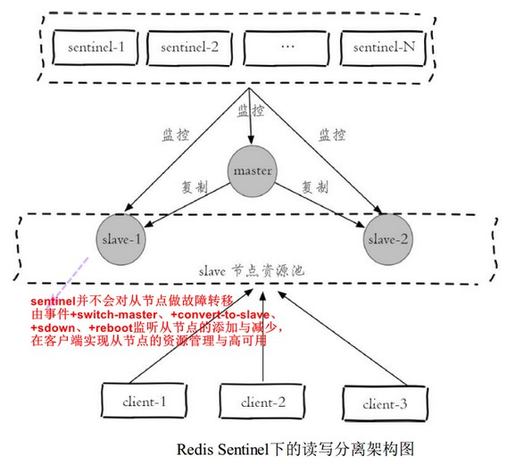
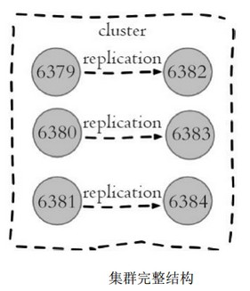
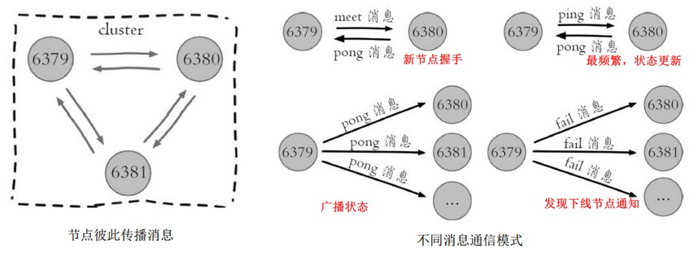
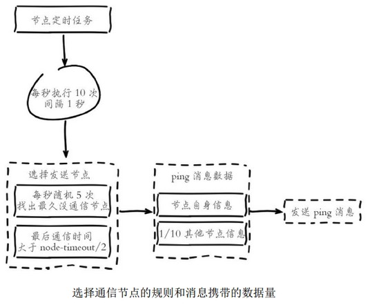
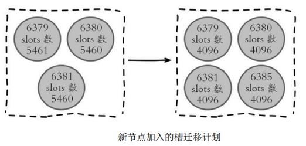
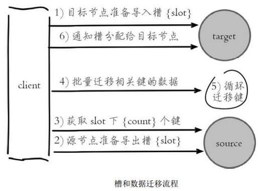
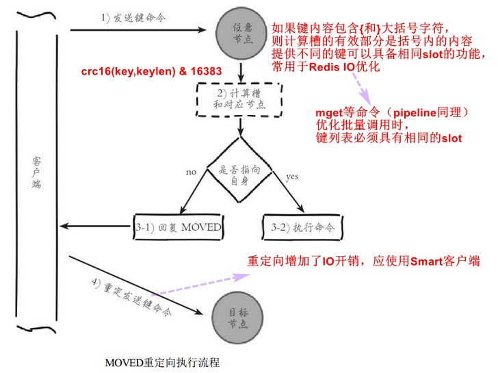

[TOC]

# 9. 哨兵

和主从复制模式相比，只是多了一些sentinel监控节点，对主从复制数据节点进行监控，完成自动故障转移的功能，形成了Redis Sentinel架构

# 10. 集群

### 10.1 数据分布

#### 数据分布理论

分区规则一般有哈希分区（kafka生产者默认规则）和顺序分区（kafka消费者默认规则）：

- 哈希分区
    - 节点取余：简单，但节点数变化时，数据映射改变；预分区，翻倍扩容
    - 一致性哈希
    - 虚拟槽，redis采用

#### Redis数据分区 

- 解耦数据和节点之间的关系 
- 节点自身维护槽的映射关系  
- 节点、 槽、 键之间的映射查询  

集群启动过程：准备节点、节点握手（`cluster meet`，连通分量原理）、分配槽（如：`redis-cli -p 6379 cluster addslots {0...5461}`）

`redis-trib.rb`  脚本简化搭建、`cluster replicate` 指定主从关系 ，如：

### 10.3 节点通信  

元数据管理的常见方式：集中式（如kafka的zk）和P2P方式 （redis，节点间不断地互相交换信息，最终达到每个节点都包含集群全部信息的状态）

### 10.4 集群伸缩

原理可抽象为槽和对应数据在不同节点之间灵活移动

#### 迁移槽和数据

1. 确定迁移计划。尽量使重分配后每个节点的槽相近

    

2. 数据迁移

    

    `redis-trib.rb`  脚本可自动执行此过程，指定需要迁移的槽数量、源节点（多个）、目标节点（一个）即可，最终会达到槽数量基本相近

集群收缩的槽迁移过程类似集群扩容，需要把下线节点的槽迁移到其它主节点，并最终忘记此节点。

### 10.5 请求路由

### 10.6 故障转移

可看，集群故障处理通用思想

# 13. 监控平台CacheCloud

### 13.1 部署

(自己构建)maven3, redis3.0, mysql 5, jdk7, cachecloud  

1. mysql创建cache_cloud库, 表结构cachecloud/script/cachecloud.sql  
2. cachecloud-open-web/src/main/swap目录下，配置  
3. mvn clean compile install [-Ponline][-Plocal] 构建，再启动  
4. 登录界面  

(直接使用二进制版本)  

- cachecloud-open-web-1.0-SNAPSHOT.war: cachecloud war包
- cachecloud.sql: 数据库schema，默认数据名为cache_cloud，可以自行修改
- jdbc.properties：jdbc数据库配置，自行配置
- start.sh：启动脚本
- stop.sh： 停止脚本
- logs：存放日志的目录  
    默认端口是8585，可以修改start.sh中的server.port进行重置