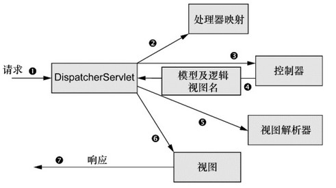
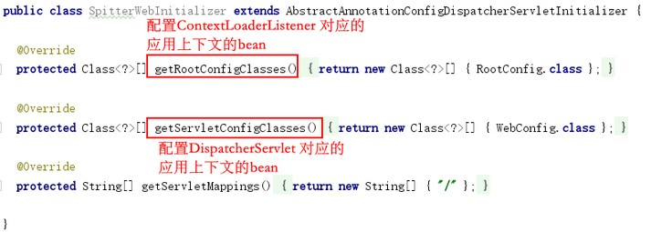

[TOC]

# 5. 构建Spring Web应用程序

### 5.1 Spring MVC

- 请求过程

  

  - DispatcherServlet 是Spring MVC的前端控制器
  - handler mapping 负责将请求分派给各个控制器
  - 控制器处理完成后，获取到一些信息（模型），不能直接返回给用户，需要将模型和逻辑视图名发送给DispatcherServlet 进行进一步处理

- 配置DispatcherServlet ：
  
  - 可在web.xml文件中进行Servlet配置

  - 也可通过扩展AbstractAnnotationConfigDispatcherServletInitializer类来进行配置（同时创建DispatcherServlet 和ContextLoaderListener ，分别对应两个不同的应用上下文）

    

- 启用MVC
  - 可在XML中使用`<mvc:annotationdriven>`启用注解驱动的Spring MVC
  - 可创建一个带有`@EnableWebMvc`注解的配置类 
    - 需要视图解析器ViewResolver 的bean
    - 需要启动`@ComponentScan`扫描`@Controller`
    - 转发静态资源请求到DefaultServlet

### 5.2 基本的控制器

- `@Controller` 和`@RequestMapping` 注解
- `mockMvc`类可对控制器进行测试