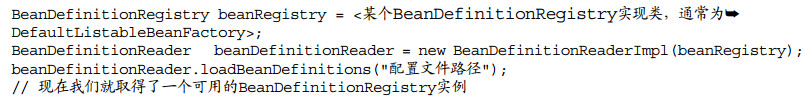
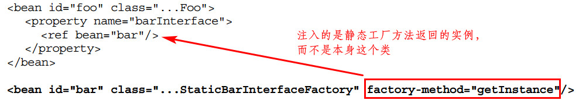
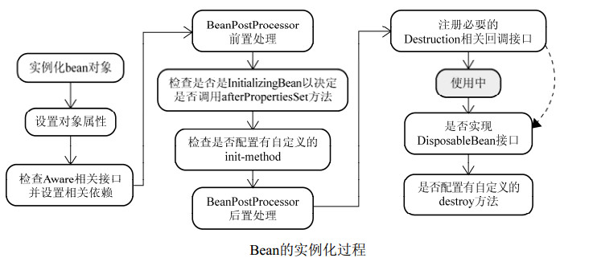

[TOC]

# 2. IoC的基本概念

所有的被注入对象和依赖对象由IoC Service Provider（可看做是Ioc容器） 统一管理，从被注入对象的角度看，与之前直接寻求依赖对象相比，依赖对象的取得方式发生了反转，控制也从被注入对象转到了IoC Service Provider（Spring中是IoC 容器）

IoC使得对象具有更好的可测试性、可重用性和可拓展性

# 3. IoC Service Provider

可以是一段代码，也可以是一组相关的类，可以是比较通用的IoC框架或者IoC容器实现 

### 3.1 IoC Service Provider 的职责 

- 业务对象的构建管理 
  - 无需关心对象实际是如何取得的，将构建逻辑从客户端剥离
- 业务对象间的依赖绑定 

### 3.2 IoC Service Provider 如何管理依赖关系

流行的IoC Service Provider产品管理信息的方式主要有：

- 直接编码方式（Spring也支持, getBean()方法）
- 配置文件方式 （Spring的XML文件配置）
- 元数据方式 （即注解方式）
  - 注解最终也要通过代码处理来确定最终的注入关系 

# 4. Spring IoC容器之BeanFactory 

Spring提供两种容器：

- BeanFactory
  - 默认懒汉式初始化（访问某个受管对象时，才对其初始化及依赖注入）
  - 基础类型的容器，但对象的注册和依赖注入基本功能都有，容器启动快
  - 基本使用如getBean()方法
- ApplicationContext 
  - 在BeanFactory基础上构建，高级的容器实现
  - 管理的对象在容器启动后就全部初始化及注入完成
  - 启动时间长，需要更多系统资源，但功能强大

### 4.1 拥有BeanFactory之后 

注册和依赖关系配置在其它地方，代码可直接获取对应的bean，如：

### 4.2 BeanFactory的对象注册与依赖绑定方式 

- 直接编码方式（不推荐使用）

  

  

  - 在容器中都会有一个BeanDefinition的实例与受管对象对应，保存对象的所有必要信息，BeanFactory会通过这些信息返回对象实例

- 外部配置文件方式

  - 对所有配置文件都有统一的处理方式，通常需要给出相应的BeanDefinitionReader实现类 ，负责将相应的配置文件内容读取并映射到BeanDefinition ，然后将其注册到BeanDefinitionRegistry 

    

  - Properties配置格式的加载 

    - PropertiesBeanDefinitionReader ，详细见书

  - XML配置格式的加载 

    - XmlBeanDefinitionReader ，如：

    

- 注解方式 

### 4.3 BeanFactory的XML 

- `<beans>`
  - `<beans>`标签下可以有`<description> 、<bean> 、<import> 、<alias>` 
  - 有属性，可以对所有的bean做统一管理，如default-lazy-init 、default-autowire 等
  - `<description>` 指定一些描述性的信息
  - `<import resource="B.xml"/>` 引入其他xml
  - `<alias>` 为bean设定别名，如`<alias name="dataSourceForMasterDatabase" alias="masterDataSource"/>` 
- `<bean>`
  - id指定唯一标识符，name指定别名，class指定类

- 注入
  - 构造注入
    - type指定参数类型
    - index指定参数的位置
    - 如`<constructor-arg type="int" index="1" ref="xxx"/>` ，防止混淆
  - setter注入（属性注入）
    - `<property>` 
  - constructor-arg和property标签属性
    - 包括bean、 ref、 idref、 value、 null、 list、 set、 map、props 
  - bean标签`depends-on`属性 
    - 非显示依赖，只是某些类在运行前需要保证另外的一些类完成初始化
  - bean标签`autowire` 属性，指定域的自动注入方式，默认为no，包括no、 byName、 byType、 constructor和autodetect 
  - bean标签`dependency-check`属性 
    - 检查每个对象某种类型的所有依赖是否全部已经注入完成 
  - `lazy-init` 属性

- bean标签的parent和abstract属性
  - bean依赖关系的继承
- scope
  - singleton ：单例，与IoC容器“几乎”拥有相同的“寿命” 
  - 和单例模式的区别：singleton的bean是由容器来保证这种类型的bean在同一个容器中只存在一个共享实例； Singleton模式则是保证在同一个Classloader中只存在一个这种类型的实例 
  - prototype、request、 session（购物车例子）和global session 
  - 自定义scope 

- 工厂方法与 FactoryBean 
  - 静态工厂方法 

    

  - 非静态工厂方法 

    

  - FactoryBean 

    - 可以扩展容器对象实例化逻辑的接口 

    - 接口定义如下：

      

      如：

      

- 关于作用域

  - prototype类型的bean指的是每次注入都会是不同的实例对象，但一个对象注入后，不论怎么访问该实例，都是同一个
  - `lookup-method`标签 、BeanFactoryAware接口、`replaced-method`标签，见书

### 4.4 容器背后原理

#### 两个阶段

- 容器启动阶段（根据图纸装配生产线 ）
  - 容器依赖工具类BeanDefinitionReader 对配置信息进行解析，然后将其编组为BeanDefinition ，在注册到相应的BeanDefinitionRegistry 
- Bean实例化阶段（生产具体的产品 ）
  - 先检查请求的对象是否被初始化。若没有，则根据BeanDefinition 实例化并注入依赖
  - 若实现了回调接口，则会根据回调接口的要求来装配
  - 装配完后，会立即返回给请求方使用

#### 干涉容器启动阶段

BeanFactoryPostProcessor 允许在容器实例化相应对象之前，对注册到容器的BeanDefinition所保存的信息做相应的修改 （比如修改其中bean定义的某些属性，为bean定义增加其他信息等）

通过实现 BeanFactoryPostProcessor 和 Ordered 接口，来实现此功能。Spring中常用的此类有PropertyPlaceholderConfigurer 、PropertyOverrideConfigurer 、CustomEditorConfigurer 

BeanFactory 中使用需要手动编码装配：

ApplicationContext 中只需要配置在配置文件，会自动识别：

BeanFactoryPostProcessor 实现类：

- PropertyPlaceholderConfigurer （应用在如数据库连接信息等外部数据配置文件）

  - 允许我们在XML配置文件中使用占位符 （PlaceHolder ）

    

  - 当BeanFactory在完成第一阶段时，BeanFactory保存的BeanDefinition对象属性信息还是占位符，当PropertyPlaceholderConfigurer 被应用时，会将其替换；所以在进入第二阶段时，属性已经是替换完成的

  - PropertyPlaceholderConfigurer 还会同时检查Java的System类中的Properties，默认是`SYSTEM_PROPERTIES_ MODE_FALLBACK`（如果properties文件中找不到配置项，就在System的Properties中查找 ）

- PropertyOverrideConfigurer 

  - 不通过占位符，直接将bean的属性根据properties文件覆盖掉，对于bean定义来说是透明的（即在xml文件中看不到哪个属性会被替换） 
  - 多个PropertyOverrideConfigurer有冲突时，最后一个为最终值

- CustomEditorConfigurer 

  - 只是辅助性地将后期会用到的信息注册到容器，对BeanDefinition没有做任何变动 

  - PropertyEditor 

    

#### bean的生命周期

Bean实例化阶段之前，容器仅仅拥有所有对象的BeanDefinition来保存实例化阶段将要用的必要信息。只有当显式或隐式调用getBean()才可能触发实例化阶段，隐式调用包括：

- 对BeanFactory ，对象默认是延迟实例化的。当显式调用getBean获取某个bean时，若其依赖的bean还没有被实例化，则会隐式调用getBean()
- ApplicationContext 在启动阶段完成后，就紧接着隐式调用了所有注册到容器的Bean的getBean()

getBean()方法只有在第一次被调用时，才会触发实例化阶段，第二次被调用则会直接返回容器缓存的第一次实例化完的对象实例（singleton类型），createBean()是真正实例化对象的方法，过程如下：

bean的生命周期全部由Spring管理，不再是“new完后被使用，脱离作用域后即被回收” 

- Bean的实例化与BeanWrapper  

  - 采用策略模式来决定以何种方式初始化bean实例

    - 策略接口为InstantiationStrategy 

    - 一个策略类为SimpleInstantiationStrategy ，通过反射来生成对象实例

    - 另一个策略类为CglibSubclassingInstantiationStrategy（默认采用） ，继承了SimpleInstantiationStrategy 反射实例化的功能，并通过CGLIB的动态字节码生成，可以动态生成某个类的子类 ，所以满足方法注入的需求

      

  - 容器根据BeanDefintion ，结合InstantiationStrategy 来构造实例，但会将实例放在BeanWrapper 类中，再返回相应的BeanWrapper实例，第一步结束。BeanWrapper可以设置、访问bean的属性值，返回BeanWrapper 就是为了第二步

    

- 各色的Aware接口 