[TOC]

# 7. AOP

静态AOP：代表为AspectJ，将Aspect编译并织入到系统的静态类中；灵活性不够，横切关注点改变时需要重新编译织入

动态AOP：利用语言的动态特性，以普通的类的形式存在，织入过程在运行后进行

### 7.3 Java的AOP实现

- 动态代理。需要模块类实现接口
- 动态字节码增强。CGLIB等工具库在程序运行期间，动态构建字节码的class文件，生成相应的子类，不要求模块类实现接口
- Java代码生成，过时
- 自定义类加载器。在类加载期间将横切逻辑织入

### 7.4 术语概念

- 连接点
  - 方法调用（在调用对象上的执行点）；方法执行（在被调用对象上的执行点），对同一对象，后于方法调用
  - 构造方法调用；构造方法执行
  - 字段设置；字段获取
  - 异常处理执行
  - 类初始化（静态类型或静态代码块的开始执行点）

- 切点

  - 连接点的表述方式，如正则表达式或者特定的切点表述语言

- 通知

  - 横切关注点逻辑的载体

    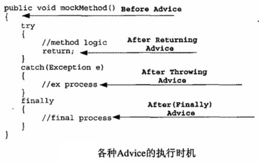

  - 环绕通知

- 切面

  - AOP概念实体，一般包含多个切点及对应的通知定义，如

    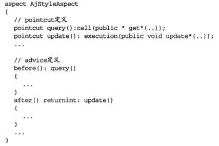

- 织入和织入器，Spring AOP的ProxyFactory就是最通用的织入器

  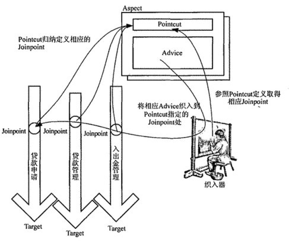

# 8. Spring AOP实现机制

### 8.2 实现机制

采用动态代理和字节码生成技术实现

#### 静态代理

- 静态代理的问题在于当需要对不同类型的目标对象的同一名称的方法做增强时，需要为每一个种类型的目标对象都提供代理对象

#### 动态代理

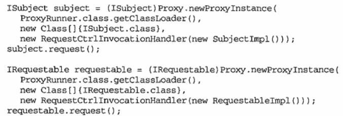
- 一个通知类就可以对不同类型的目标对象做代理
- 动态代理的问题在于要求目标对象实现特定的接口

#### 动态字节码生成

- 继承目标对象，进行覆写，将横切逻辑放在子类中

  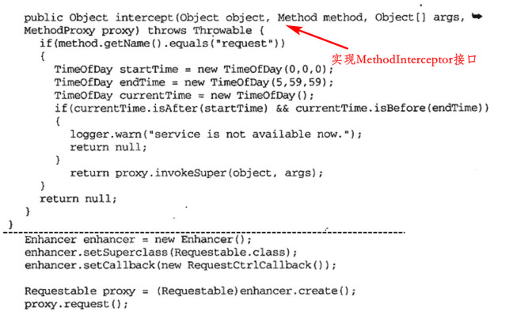

- 目标对象不需要实现特定接口，唯一限制是无法对final方法进行覆写

# 9. Spring AOP一世

### 9.1 Spring AOP中的Joinpoint

只支持方法级别的Joinpoint，原因：

- 方法级别的连接点可以满足大部分需求
- 对属性级别的连接点，可以使用setter/getter方法转换成方法级别
- 可以使用AspectJ来实现构造方法和属性级别的Joinpoint

### 9.2 Spring AOP中的Pointcut

#### Pointcut接口

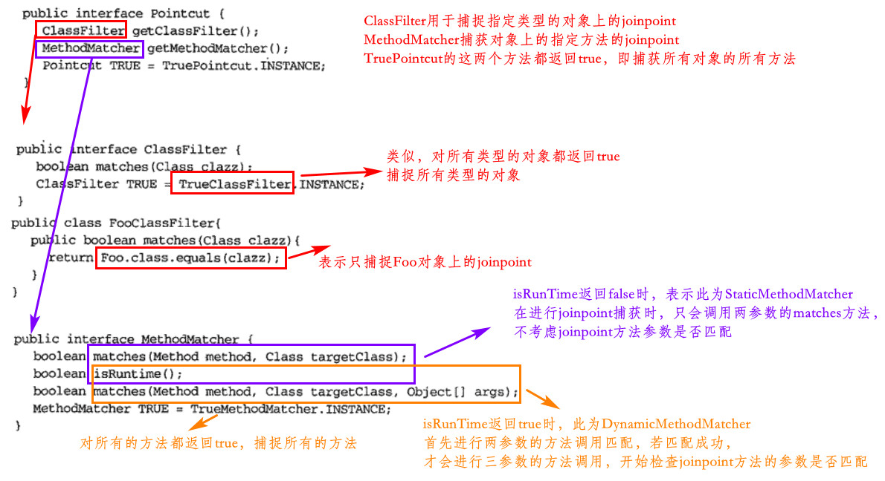
- StaticMethodMatcher不需要每次都检查参数，可以在框架内缓存提高性能；DynamicMethodMatcher相对效率更低，应尽量避免使用

- 在MethodMatcher类型的基础上，Pointcut分为StaticMethodMatcherPointcut和DynamicMethodMatcherPointcut

  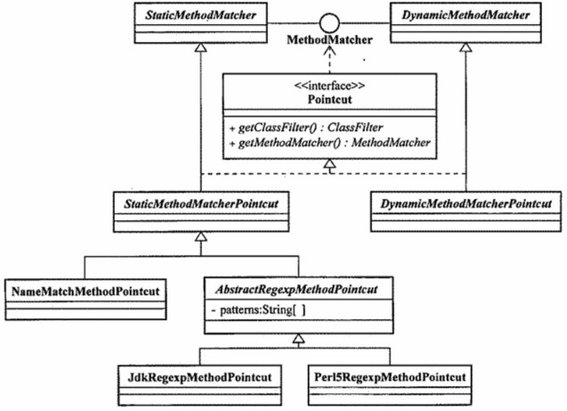

#### 常见的Pointcut

- NameMatchMethodPointcut：简单的StaticMethodMatcherPointcut实现，仅对joinpoint的方法名进行匹配（方法的简单名）
- JdkRegexpMethodPointcut和Perl5RegexMethodPointcut：StaticMethodMatcherPointcut子类，对joinpoint的方法名进行正则表达式匹配（方法的全限定名）
- AnnotationMatchingPointcut：检查目标对象是否存在相应的注解来匹配Pointcut。当匹配上`@ClassLevelAnnotation`注解时，该对象的所有方法都会加入Pointcut；当只匹配`@MethodLevelAnnotation`注解时，只有`@ClassLevelAnnotation`类中的`@MethodLevelAnnotation`方法才会被加入Pointcut

- ComposablePointcut：支持逻辑运算的实现类，Pointcuts工具类也支持直接进行计算
- ControlFlowPointcut：对一般的Pointcut来说，无论调用者是谁，都会被织入横切逻辑；而ControlFlowPointcut可以指定只有在被某一个类型的调用者调用时，才织入横切逻辑

#### 自定义Pointcut

在StaticMethodMatcherPointcut和DynamicMethodMatcherPointcut基础上通过继承自定义即可，无需实现原Pointcut接口

- 自定义StaticMethodMatcherPointcut
  - setClassFilter指定ClassFilter，实现两参数的matches方法
- 自定义DynamicMethodMatcherPointcut
  - 重写getClassFilter方法和matches方法

IoC容器中的Pointcut：

都是普通的Java对象，可以将其当成bean一样使用

### 9.3 Spring AOP中的 Advice

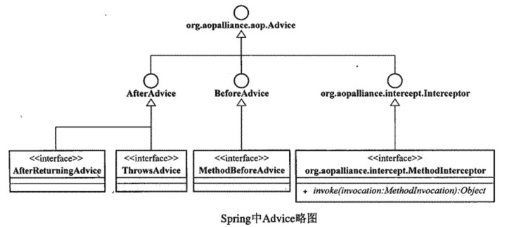

遵循 AOP Alliance规定的接口，分为两大类：per-class类型和per-instance类型

#### per-class类型的Advice

该类型的Advice实例可以目标对象类的所有实例之间共享（即一个目标对象类只有一个），通常这种用来提供拦截逻辑，不会保存任何状态和添加新的特性，除Introduction类型的Advice不属于此类，其它Advice均是per-class类型的Advice

- BeforeAdvice

  - 在连接点之前执行，定义一个Before Advice通常需要实现MethodBeforeAdvice（继承自BeforeAdvice接口）接口

    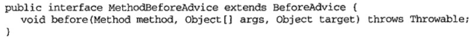

  - 参数分别对应连接点的方法、参数及所在的目标对象

- AfterAdvice

  - ThrowsAdvice

  - AfterReturningAdvice

    - 继承自AfterAdvice

      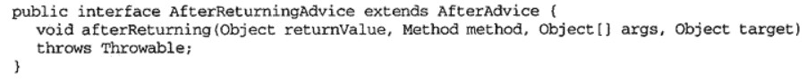

    - 参数分别对应连接点的方法返回值、方法、参数及所在的目标对象，AfterReturningAdvice不能对连接点方法的返回值进行修改

- Around Advice

  - MethodInterceptor即Around Advice

    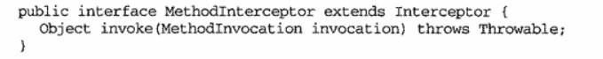

  - 在invoke方法内实现环绕通知的横切逻辑，invoaction.proceed()方法使程序继续执行，并且会返回原方法的返回值，使得MethodInterceptor可以对连接点的返回值进行修改

    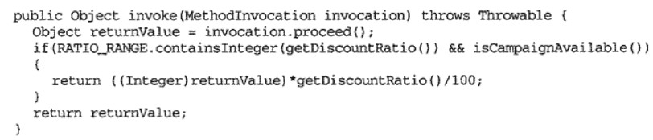

#### per-instance类型的Advice

每一个目标对象都对应一个Advice对象，为不同的实例保存了状态

- Introduction是Spring AOP唯一的per-instance Advice
  - 可以在不改动目标类定义的情况下，为目标类添加新属性和行为