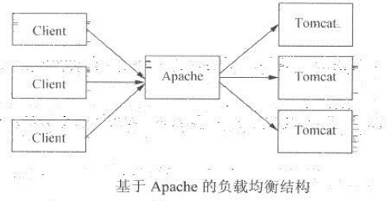
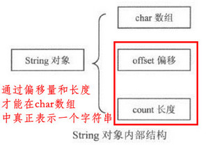
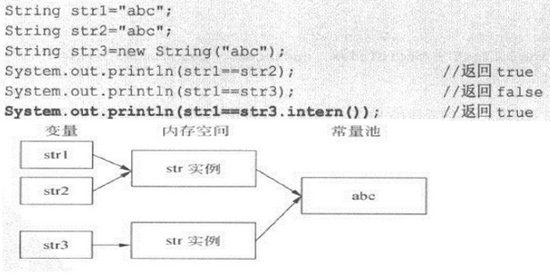
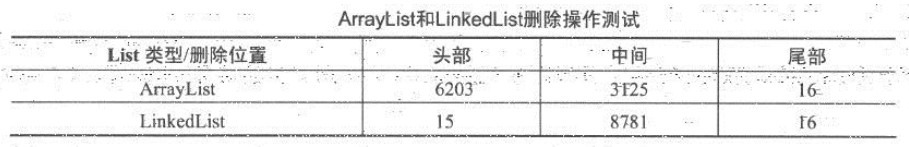
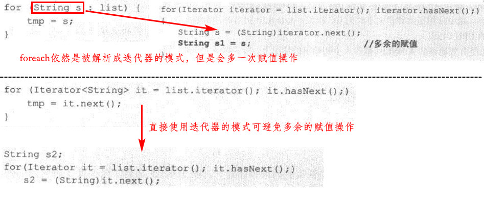
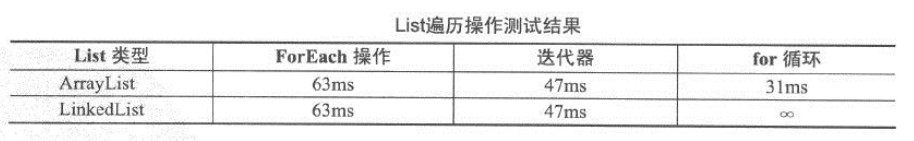

[TOC]

# 1. Java性能调优概述

### 1.1 性能概述

影响性能的因素：磁盘、网络、CPU、异常捕获、数据库、锁、内存

#### Amdahl定律

假设系统内必须串行化的程序比重为F，CPU处理器数量为N，则有
$$
加速比 <= 1/(F+(1-F)/N)
$$

### 1.2 性能调优的层次

- 设计调优。体现在整体系统设计方面
- 代码调优。数据结构、算法
- JVM调优
- 数据库调优。SQL语句优化、数据库本身优化、范式设计、分库分表、索引
- 操作系统调优。共享内存、信号量、最大文件句柄数、虚拟内存

# 2. 设计优化

### 2.1 设计模式

单例、代理、享元、装饰者、观察者、Value Object模式、业务代理模式

### 2.2 常用优化组件和方法

#### 缓冲

```java
Writer writer = new BufferedWriter(new FileWriter(new File("file.txt")));
```

一般比

```java
Writer writer = new FileWriter(new File("file.txt"));
```

要快，BufferedWriter就充当了缓冲区的角色；除此外，生产者消费者模式也是一种缓冲的应用

#### 缓存

#### 对象复用——池

如线程池和数据库连接池，相关的类库有Apache的Commons Pool

对轻量级的对象使用对象池，可能反而使性能降低

#### 负载均衡

如Tomcat集群，Apache服务器作为负载均衡器，将请求转向各个Tomcat服务器



Tomcat集群两种Session共享模式：黏性模式（类似standalone的多个redis节点，不具高可用性）和复制模式（类似redis哨兵和集群，有高可用性）

分布式缓存框架——Terracotta

#### 时间换空间，空间换时间

# 3. Java程序优化

### 3.1 字符串优化处理

- String对象特点

  
  
  - 不可变性
  
  - 针对常量池的优化
  
    
  
  - 类的final定义
  
    - 包括String、StringBuffer、StringBuilder等，都是final类型的

- subString()方法的内存泄漏
  - 某个jdk版本之前存在subString()内存泄漏，其subString()方法会将原String的所有内容拷贝至一个新String中作为返回，而实际只需要截取的那一部分；若保持对subString()返回结果的强引用，则不需要的那部分字符数据也不会被回收，发生内存泄漏
  - 而如今的jdk1.8已经不存在此问题，subString()方法返回的字符串只是原字符串的一个截取片段，即使直接保持其返回结果的强引用，也只是有效的那部分字符数据不会被回收

- 字符串分割和查找
  - split()效率最低，几乎应该用StringTokenizer代替
  - 可考虑使用indexOf(char)及charAt(int)函数自构造算法来实现，效率更高
- StringBuffer和StringBuilder
  - 常量累加操作
    - 在编译期会对常量字符串的累加操作做优化（会在编译期就直接拼接成一个字符串），并不会生成大量的String实例
    - 反而使用StringBuffer或StringBuilder效率更低
  - 变量累加操作
    - java对变量的累加操作也做了优化，相当于用一个StringBuilder不断地进行append()操作
    - 但当累加操作在循环内时，每一次循环都会创建一个StringBuilder对象；此时还是统一用一个StringBuilder对象进行循环，效率会大大提高
  - StringBuffer和StringBuilder的选择
    - 同继承于AbstractStringBuilder，几乎拥有相同的接口
    - StringBuffer对几乎所有方法做了同步，StringBuilder没有；故多线程用StringBuffer，单线程用StringBuilder
  - 容量
    - 初始默认容量都是16，可以构造参数指定大小。达到容量后自动翻倍扩容，并将原内容复制到新数组中，故为了避免大量复制操作，应估计大概的容量

### 3.2 核心数据结构

#### List接口

ArrayList（数组，不同步）、Vector（数组，同步）、LinkedList（链表，不同步）

- ArrayList、Vector的add()操作在容量不够时，进行扩容，包含数组复制操作

- LinkedList的add()操作每次会创建一个Entry对象，有一定开销

- LinkedList在删除指定位置的元素时，若元素靠两边，都会很快的查找到要删除的节点，效率高；若指定的位置靠中间，效率则最低

  

遍历列表：





#### Map接口

