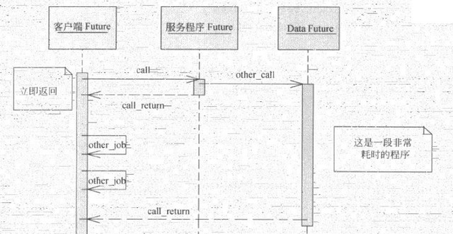
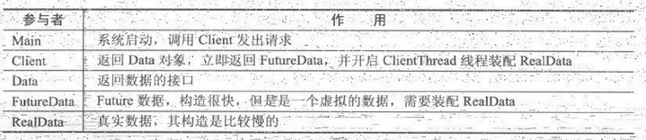
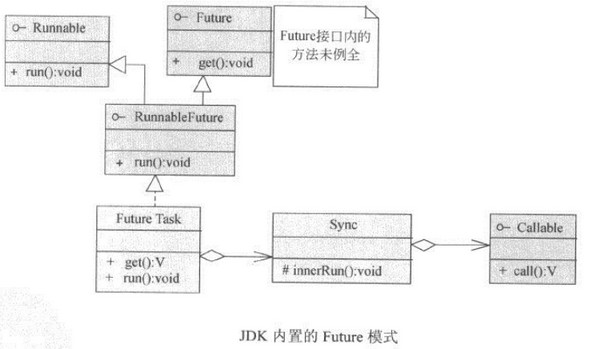
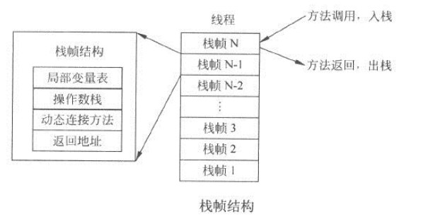

[TOC]

# 4. 并行优化

### 4.1 并行设计模式

#### Future模式

JDK的FutureTask：

#### Master-Worker模式

Master负责接收和分配任务，Worker进程负责处理子任务，最终的结果由Master汇总

#### Guarded Suspension模式

将请求放在队列中，服务端从队列中取任务执行，队列相当于一个缓存。原理类似线程池

#### 不变模式

即不可变，适用于：

- 对象创建后，其内部状态和数据不再变化
- 对象需要被频繁共享

String和所有基本类型的包装类型都是不可变的

#### 生产者消费者模式

一般涉及blockingqueue，再加上生产者线程和消费者线程

#### 扩展ThreadPoolExecutor

可继承ThreadPoolExecutor类，覆写其afterExecute()、beforeExecute()、terminated()方法，可为任务执行加上通知

### 4.3 JDK并发数据结构

- 并发List
  - Collections.synchronizedList(List list)返回线程安全的List
  - Vector对写和读的操作都做了同步
  - CopyOnWriteArrayList只对写操作做了同步，并且在有写操作时会将原对象复制一份，在副本中做写操作，写完后再写回原对象；所以读操作不需要同步

- 并发Set
  - CopyOnWriteArraySet。对CopyOnWriteArrayList的包装，原理一致

- 并发Map
  - Collections.synchronizedMap
  - ConcurrentHashMap、HashTable

- 并发Queue
  - ConcurrentLinkedQueue
  - BlockingQueue

### 4.5 锁的性能和优化

- 死锁四个条件：
  - 互斥。资源只能被一个线程使用
  - 请求与保持。线程对请求到资源保持不释放
  - 不剥夺。已获得的资源不会被强行剥夺
  - 循环等待。若干线程形成循环等待关系

- 破坏其中任意一个条件，都能避免死锁
- 尽量减少锁持有时间
- 尽量减小锁粒度
- 读写分离锁代替独占锁
- 锁粗化
- 自旋锁
- 锁消除
- 锁偏jvm

### 4.6 无锁并行计算

Amino框架

### 4.7 协程

Kilim框架

# 5. JVM调优

