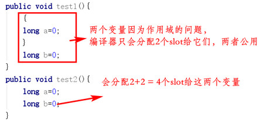
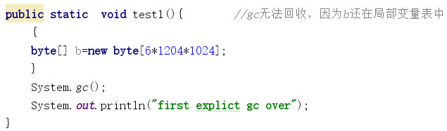
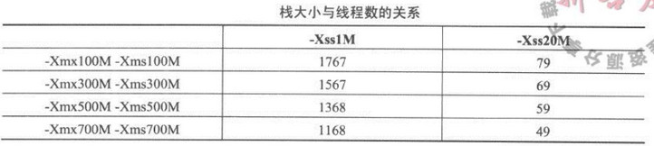
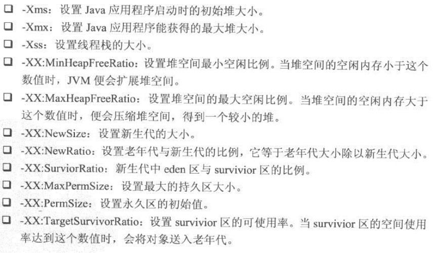
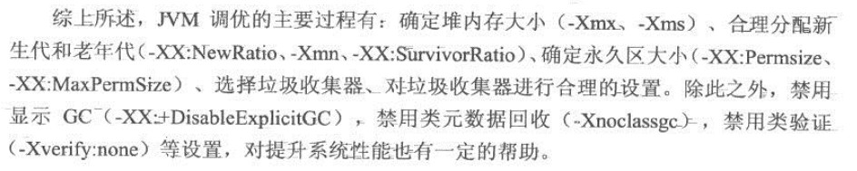

[TOC]

# 4. 并行优化

### 4.1 并行设计模式

#### Future模式

JDK的FutureTask：

#### Master-Worker模式

Master负责接收和分配任务，Worker进程负责处理子任务，最终的结果由Master汇总

#### Guarded Suspension模式

将请求放在队列中，服务端从队列中取任务执行，队列相当于一个缓存。原理类似线程池

#### 不变模式

即不可变，适用于：

- 对象创建后，其内部状态和数据不再变化
- 对象需要被频繁共享

String和所有基本类型的包装类型都是不可变的

#### 生产者消费者模式

一般涉及blockingqueue，再加上生产者线程和消费者线程

#### 扩展ThreadPoolExecutor

可继承ThreadPoolExecutor类，覆写其afterExecute()、beforeExecute()、terminated()方法，可为任务执行加上通知

### 4.3 JDK并发数据结构

- 并发List
  - Collections.synchronizedList(List list)返回线程安全的List
  - Vector对写和读的操作都做了同步
  - CopyOnWriteArrayList只对写操作做了同步，并且在有写操作时会将原对象复制一份，在副本中做写操作，写完后再写回原对象；所以读操作不需要同步

- 并发Set
  - CopyOnWriteArraySet。对CopyOnWriteArrayList的包装，原理一致

- 并发Map
  - Collections.synchronizedMap
  - ConcurrentHashMap、HashTable

- 并发Queue
  - ConcurrentLinkedQueue
  - BlockingQueue

### 4.5 锁的性能和优化

- 死锁四个条件：
  - 互斥。资源只能被一个线程使用
  - 请求与保持。线程对请求到资源保持不释放
  - 不剥夺。已获得的资源不会被强行剥夺
  - 循环等待。若干线程形成循环等待关系

- 破坏其中任意一个条件，都能避免死锁
- 尽量减少锁持有时间
- 尽量减小锁粒度
- 读写分离锁代替独占锁
- 锁粗化
- 自旋锁
- 锁消除
- 锁偏向

### 4.6 无锁并行计算

Amino框架

### 4.7 协程

Kilim框架

# 5. JVM调优

#### 虚拟机栈

局部变量表槽复用：

如果一个局部变量被保存在局部变量表中，那GC时就无法回收该变量指向的内存空间（可以通过手动将变量指向null，或者通过其他变量复用槽来避免），如：

### 5.2 JVM内存分配参数

- 堆内存最大值。`-Xmx`，超过此值就产生堆溢出

- 堆内存最小值。`-xms`，初始分配的堆大小，JVM尽量在此内存范围内运行程序（直到实在没有空间，才会向最大值拓展），若此值太小，会增加GC的次数，影响性能（思想类似HashMap扩容，应该估计一个大概的初始值）

- 新生代的大小。`-Xmn`，相当于同时设置了相同的`-XX:NewSize`（新生代初始大小）和 `-XX:MaxNewSize`（新生代最大大小），一般为堆的1/4到1/3，太小会增加GC频率

- 永久代大小。`-XX:PermSize` 和 `-XX:MaxPermSize`

- 线程栈大小。`-Xss`，过小时，函数调用深度会减小；过大时，开设一个线程需要更多的内存（堆越大，线程栈可用的内存就越小）

  

- 堆的比例分配。`-XX:SurvivorRatio`（eden/survivor），`-XX:NewRatio`(老年代/新生代)

  

### 5.3 垃圾收集器

补

### 5.4 调优案例和方法

#### 将新对象预留在新生代

合理分配新生代空间，避免新对象直接进入老年代（新生代GC比老年代GC快）；一般说，当survivor区空间不够或者占用到一定比例时，对象会直接进入老年代

可以`-XX:TargetSurvivorRatio`提高survivor利用率阈值，或者增大survivor区的空间

#### 大对象直接进入老年代

大对象如果分配在新生代可能对新生代GC非常不利（占用空间大，相当于减小了新生代的空间），一般都会将其直接在老年代分配

#### 对象进入老年代的年龄

`-XX:MaxTenuringThreshold`设置

#### 稳定与震荡的堆大小

堆越小，单次GC的速度越快。当`-Xms -Xmx`相等时，堆空间是恒定的；当不等时，`-XX:MinHeapFreeRatio -XX:MaxHeapFreeRatio`可调整堆空间调整的阈值，震荡的堆大小可动态调整单次GC的时间，但可能增加GC的次数，具体优化得根据线上环境；一般使用恒定的堆空间

#### 三个案例

吞吐量优先案例、大页案例、降低停顿案例

### 5.5 实用JVM参数

#### JIT编译参数

一个函数被频繁调用时，可考虑将其用JIT编译成本地代码，`-XX:CompileThreshold`可设置此被调用次数的阈值

#### 堆快照

`-XX:+HeapDumpOnOutOfMemoryError -XX:HeapDumpPath=path`设置堆溢出时将内存信息导出成文件

#### 错误处理

`-XX:OnOutOfMemoryError`出现OOM错误时，运行指定的脚本

#### 打印GC相关信息

见书

#### 类和对象跟踪

跟踪类加载、卸载情况，相关的系统内实例统计信息

#### 控制GC

`-XX:DisableExplicitGC`禁止程序中System.gc()生效

禁止回收类、开启增量式GC等

其它类型的JVM参数还有：选择类校验器、线程控制、使用大页、压缩指针等

### 5.6 实战JVM调优

#### Tomcat启动加速

1. 打印GC日志
2. 调整各内存空间的大小，减少GC次数
3. 考虑并行收集器，加快GC速度
4. 实际中得根据具体的web应用进行调整

#### 压力测试工具JMeter

可添加线程组模拟用户线程访问Tomcat服务器，模拟HTTP请求等，最后生成测试报告

# 6. Java性能调优工具

- Linux
  - top。各个进程资源占用状况，系统统计信息
  - sar。系统IO信息、内存信息、CPU使用
  - vmstat。系统内存、交换区、磁盘IO、上下文切换、时钟中断、CPU
  - iostat。详尽的磁盘IO信息
  - pidstat工具。不仅可以监视进程，也可以监测线程的性能
    - CPU使用率监控
    - 磁盘IO使用监控
    - 内存监控
- Windows
- JDK命令行工具
  - jps
  - jstat
  - jinfo。查看运行程序的jvm参数
  - jmap
  - jhat。分析堆快照
  - jstack。线程信息，死锁检查
- JConsole工具
  - 可视化程序运行概况，包括堆、永久区、类加载、线程
- Visual VM
  - 可代替jstat、jmap、jhat、jstack、JConsole，功能强大
- Visual VM的OQL（对象查询语言）
  - 在堆内存快照分析时快速定位所需内容

