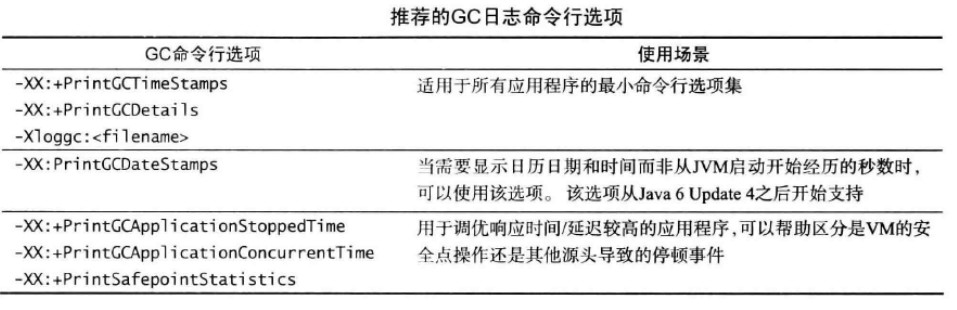

[TOC]

# 7. JVM性能调优

### 7.2 应用程序的系统需求

- 可用性
  - 当应用程序某一组件发生故障时， 在多大程度上能够继续工作

- 可管理性
  - 配置、运行和监控应用程序的难易
- 吞吐量
  - 单位时间内处理的工作量。如每秒完成2500次事务
- 延迟和响应时间
- 内存占用
- 启动时间

### 7.5 JVM运行模式

#### Client和Server模式

- Client。启动最快，占用内存少
- Server。启动较慢，JIT编译优化也需要消耗额外时间，但生成码更优
- Tiered Server。启动快，生成码更优，折中

一般可先选用Server，达不到启动和内存要求时再逐渐向下选择

#### 32位/64位

#### 垃圾收集器

优先使用Throughput收集器，-XX:+UseParallelOldGC会同时启动新生代和老年代的并行垃圾收集器，基本能满足一般应用程序的需求；确实有必要时才去考虑CMS收集器

### 7.6 垃圾收集调优基础

三个基本原则：

- 每次Minor GC都尽可能多地收集垃圾对象。这可以减少FULL GC发生的频率
- Java堆空间越大，垃圾收集的效果越好，应用程序也越流畅
- 在吞吐量、延迟、内存占用之间选两个进行调优

### 7.7 确定内存占用

FULL GC 不管是由老年代还是永久代引起，都会对老年代和永久代都进行垃圾回收

#### 计算活跃数据大小

主要收集，在应用程序稳定态时：老年代和永久代的大小；一般都是在多次Full GC后达到稳定状态再观察堆的占用情况（VisualVM、JConsole和jmap都可手动触发Full GC）

#### 确定堆空间大小

- 整个堆一般设置为老年代活跃数据大小的3~4倍
- 永久代一般设置为永久代活跃数据大小的1.2~1.5倍
- 新生代一般设置为老年代活跃数据的1~1.5倍

#### 其它因素

除堆外，程序其它内存区域也需要关注，如栈、直接内存等，可top查看总体情况

### 7.8 调优延迟和响应时间

- 除优化JVM本身外，两个方法降低延迟：
  - 优化程序，减少对象内存分配
  - 多JVM部署，减少单个JVM的负荷

- 调优延迟需要估计以下指标：
  - Minor GC的平均持续时间
    - 持续时间过长时，减小新生代的大小
  - Minor GC的平均频率
    - 频率过高时，增大新生代的大小
  - Full GC最长一次的时间
  - Full GC最频繁的频率
    - 同理，调整老年代大小时需要保证新生代大小不变

- 调整新生代大小时：
  - 老代年大小需满足7.7中的要求（不小于活跃数据的1.5倍）
  - 新生代至少占堆的10%，否则GC会过于频繁

- 老年代的空间无法接纳从新生代中提升的对象时，会被退还到新生代中
- 当并行收集器无法满足性能需求时，可考虑使用并发的CMS，`-XX:+UseConcMarkSweepGC`
  - 补(...........)

