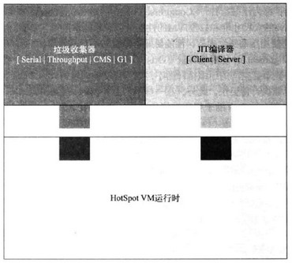
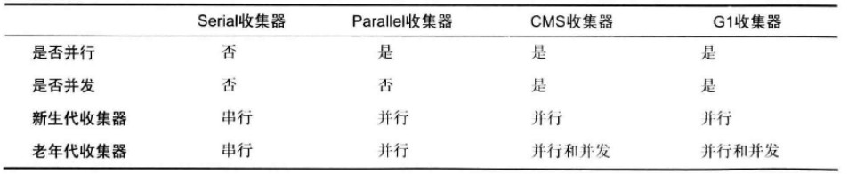
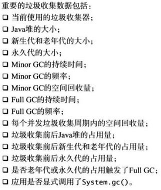

[TOC]

# 2. 操作系统性能监控

### 2.2 CPU使用率

分为：

- 用户态CPU使用率：应用程序代码的时间占总CPU时间的百分比
- 系统态CPU使用率：执行操作系统调用的时间占总CPU时间的百分比

提高性能的一个目标是尽可能降低系统态CPU使用率

#### Linux命令行监控CPU使用率

- vmstat。
  - 应有us+sy+id=100
- top
- pidstat可精确到线程

监控线程的CPU使用率需另查资料

### 2.3 CPU调度程序运行队列

如果运行队列的长度一直超过虚拟处理器个数的1倍，就需要关注；达到3~4倍时，需要立即处理（增加CPU，或者优化程序）

#### Linux命令行监控运行队列

- vmstat。
  - 第一列r就是运行队列的长度（线程数），不包括阻塞的线程，只计算Runnable的线程

### 2.4 内存使用率

系统发生页面交换时（运行所需的内存超出可用物理内存），会极大影响性能

#### Linux监控内存使用率

- vmstat。
  - si和so表示内存页面换入和换出的量，没有页面交换时均为0

#### Linux监控锁竞争

- `pidstat -w`可查看某一进程的上下文切换速度（包括让步式和抢占式）
  - 每次上下文切换一般可算作是80000的时钟周期
  - 可算出每秒有多少时钟周期用在上下文切换上
  - 再对比CPU的性能GHz,可算出有多少CPU用在上下文切换上
  - 一般上下文切换的CPU占了3%~5%或更多，可认为遇到了锁竞争（锁竞争一般只看让步式上下文切换，需要减去抢占式上下文切换）

### 2.5 网络IO使用率

netstat很难得到网络IO的使用率，因为它只能查看包的发送接收速率，并不知道具体收发多少数据

#### Linux网络IO使用率监控

- `sar -n DEV`可查看
- 使用nicstat工具

应用在调用系统调用读写网络数据时，每次应尽量多读写数据，可减少系统态CPU

### 2.6 磁盘IO使用率

- sar -b
- pidstat -d
- iostat

# 3. JVM

### 3.1 HotSpot VM基本架构

### 3.2 HotSpot VM运行时

一个简单的java程序可能有多个线程，包括：VM线程、周期任务线程、垃圾收集线程、JIT编译器线程、信号分发线程，这些线程和普通的Java线程都一样，是虚拟机内部的一个C++线程实例

### 3.3 HotSpot VM垃圾收集器

Minor GC过程中，Survivor可能不足以容纳Eden和另一个Survivor的存活对象，溢出的对象会被移到老年代。称为过早提升（即没有到年龄就进入老年代）。老年代满时，Minor GC后会进行FULL GC，导致遍历整个java堆

#### 垃圾收集器

详情见《Java程序性能优化》

### 3.4 HotSpot VM JIT编译器

略

# 4. JVM性能监控

### 4.2 垃圾收集

- 垃圾收集报告
  - `-XX:+PrintGCDetails / -verbose:gc`中，PS，Par前缀表示并行的收集器，Def前缀表示串行的收集器
  - 老年代或者永久代占用接近容量时，都会触发FULL GC（永久代不在java堆中）。由于永久代空间不足引发的FULL GC（在日志中可观察到有类被卸载），说明需要扩大永久代的容量
  - `-XX:+PrintGCTimeStamps`显示时间戳
  - `-Xloggc:<filename>`将GC日志输出到文件
  - 可输出由于垃圾收集而导致的应用停止的时间`-XX:+PrintGCApplicationStoppedTime`
- 图形化监控工具
  - Visual VM、JConsole

### 4.3 JIT编译器

`-XX:+PrintCompilation`为每一行JIT编译都生成日志，详细见书

### 4.5 Java应用监控

#### 监控锁竞争

jstack命令，获取到锁的线程可观察到正在运行(Runnable)，且日志中包含`locked <锁的地址> ...`；阻塞在锁上的线程可观察到被阻塞，且日志中含`waiting to lock <锁的地址> ...`，其中”锁的地址“相同时，说明竞争的是同一个锁

# 5. Java应用性能分析工具

Performance Analyzer和NetBeans Profiler工具。Performance Analyzer能进行系统调用级的、线程级的等性能分析；NetBeans Profiler分析内存，定位内存泄漏

# 6. Java应用性能分析技巧

