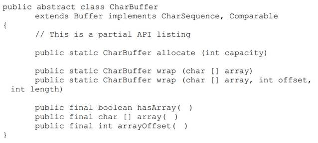
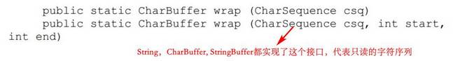
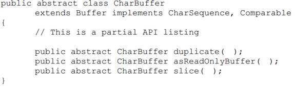
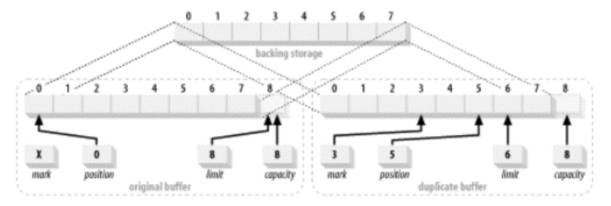
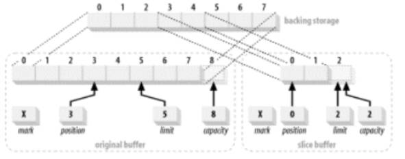
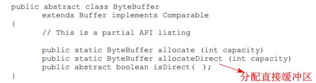
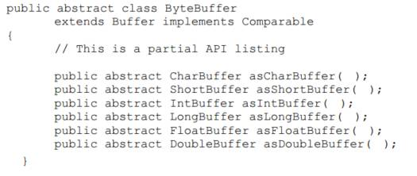

# 1. NIO简介

I/O往往比CPU耗时更值得优化

### 1.4 IO基本概念

- 缓冲区操作									
	
	- 内核试图对数据进行高速缓存或预读取，因此进程所需数据可能已经在内核空间里了。如果是这样，该数据只需简单地拷贝出来即可。如果数据不在内核空间，则**进程被挂起**，内核着手把数据读进内存
	- 内核空间作用
		- 磁盘一般是固定大小的数据块，用户进程请求的数据一般是非对齐的，则在数据往来于用户空间与存储设备的过程中，内核负责数据的分解、再组合工作
		- 硬件通常不能直接访问用户空间
	- 当用户进程需要对若干个缓冲区进行几次读操作的时候，可能内核只会进行一次系统调用，再发散给用户空间的不同缓冲区。降低消耗
- 虚拟内存
	- 不同的虚拟地址可指向同一个物理内存地址
	- 虚拟内存空间可大于实际可用的硬件内存				
	
- 内存页面调度
- 文件IO
	- 文件系统是更高层次的抽象，是安排、解释磁盘（或其他随机存取块设备）数据的一种方式
	- 代码都是和文件系统打交道，而不是直接和磁盘打交道
	- 分页操作系统进行IO的全过程：
		- 确定请求的数据分布在文件系统的哪些页
		- 在内核空间分配足够数量的内存页
		- 在内存页与磁盘上的文件系统页之间建立映射
		- 为每一个内存页产生页错误
		- 虚拟内存系统俘获页错误，安排页面调入，从磁盘上读取页内容，使页有效
		- 一旦页面调入操作完成，文件系统即对原始数据进行解析，取得所需文件内容或属性信息
	- 内存映射文件
	- 文件锁定 
- 流IO
	- 不像磁盘一样是面向块的，TTY（控制台）设备、打印机端口和网络连接等

# 2. 缓冲区

Buffer类图：										
	

### 2.1 缓冲区基础

缓冲区可看成是包在Buffer对象内的基本数据元素数组，Buffer对象提供了数组的信息和一些方便的操作

- 所有Buffer类都包含一些基本域，即在父类Buffer中定义的域：
	- 容量：能够容纳的数据元素的最大数量，在缓冲区创建时被设定，并且永远不能被改变（数组的特性）
	- 上界：缓冲区中现存元素的计数
	- 位置：下一个要被读或写的元素的索引
	- 标记：备忘位置
	- 0 <= 标记 <= 位置 <= 上界 <= 容量
- 共有的API：								
	  
- 存取：										
	
	- Java内部使用Unicode编码，占16位
- 翻转：
	- 在写好数据后，要更新“上界”域为当前的“位置”，并将“位置”置0，方便之后重头开始读取
	- 即`buffer.limit(buffer.position()).position(0)`
	- 上面的代码与`buffer.flip()`等效
	- `rewind()`与`flip()`差别只在于不更新“上界”的值
	- 两次`buffer.flip()`操作会把缓冲区“上界”变为0，相当于清空缓冲区
- 释放：
	- 循环调用get读取数据
- 压缩
- 缓冲区的标记在mark( )函数被调用之前是未定义的，调用时标记被设为当前位置的值。 reset( )函数将位置设为当前的标记值
- 比较（只要有效内容相等即相等）
- 批量读写
	- 将一个缓冲区传递给它自己，会引发java.lang.IllegalArgumentException 异常

### 2.2 创建缓冲区

Buffer共有的工厂方法：						

CharBuffer特有的方法：					

### 2.3 复制缓冲区

以CharBuffer为例：						

- Duplicate(). 会创建一个新的Buffer对象，但两个缓冲区**共享数据元素**，拥有同样的容量，但每个缓冲区拥有各自的位置，上界和标记属性（视图的概念）。对一个缓冲区内的数据元素所做的改变会反映在另外一个缓冲区上
	
- asReadOnlyBuffer(). 与复制一样，只是不能写
- slice(). 创建一个从原始缓冲区的当前位置开始的新缓冲区，其容量是原始缓冲区的剩余元素数量（limit-position）			
	

### 2.4 字节缓冲区
与其他基本类型Buffer不同，ByteBuffer有独特之处

- 字节序
	- 大端：高字节先保存在内存中（网络字节序）。ByteBuffer类和Java默认的字节序都是大端字节序
	- 小端：低字节先保存在内存中
- 直接缓冲区
	- 直接和操作系统对接，进行IO操作
	- 若向一个通道中传递一个非直接ByteBuffer对象用于写入，可能会隐式进行：
		- 创建一个临时的直接 ByteBuffer 对象
		- 将非直接缓冲区的内容复制到临时缓冲中
		- 使用临时缓冲区执行低层次 I/O 操作
		- 临时缓冲区对象离开作用域，并最终成为被回收的无用数据				
		
- 视图缓冲区
	- ByteBuffer类允许创建视图来将byte型缓冲区字节数据映射为其它的原始数据类型
	- 维护它自己的属性，容量，位置，上界和标记，但是和原来的缓冲区共享数据元素
	- 视图缓冲区的第一个元素从创建它的ByteBuffer 对象的“位置”值开始
	- 当一个视图缓冲区被创建时，也继承了ByteBuffer对象的字节顺序设定，且视图的字节序不能再被修改
	
- 数据元素视图						
	
	- 如：`buffer.order (ByteOrder.BIG_ENDIAN).getInt( );`以大端字节序，包装4个字节并返回int值
- 存取无符号数据
	- java默认都是有符号的（除Char类型），读写无符号类型需要自行编写程序
- 内存映射缓冲区
	- 见3.4

