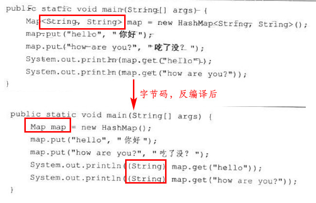
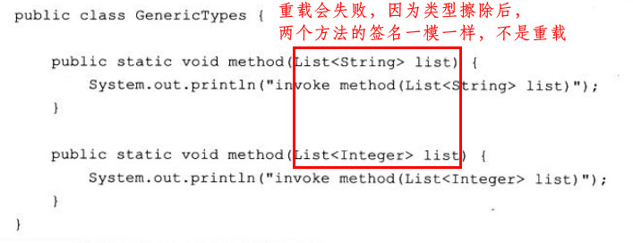
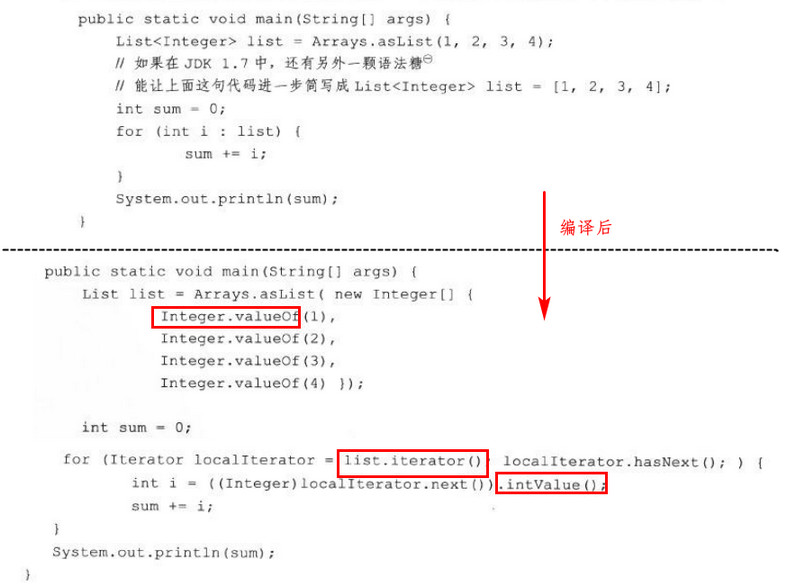
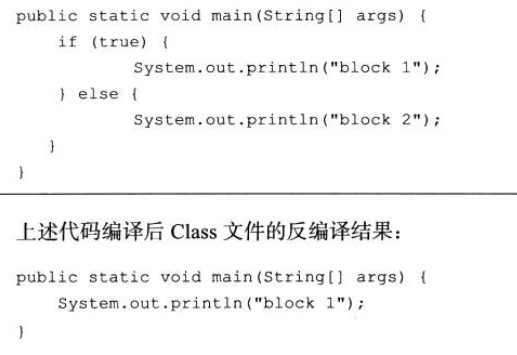

[TOC]

# 10. 编译期优化

此章指的是前端编译，即把java文件转换成class文件的过程

### 10.2 javac编译器

词法、语法、语义、填充符号表、注解与字节码生成

略

### 10.3 java语法糖

#### 泛型与类型擦除

java的泛型只是在源码中存在，编译后的字节码中，已经在相应的地方插入了强制转型代码，所以，运行期间，`List<Integer>`和`List<String>`就是同一个类，其实现方法就是类型擦除，称之伪泛型

如：

再如：

#### 自动装箱、拆箱与遍历循环

“==”运算在没有遇到算数运算时不会自动拆箱，equals()方法不会处理数据转型的关系

#### 条件编译

### 10.4 插入式注解处理器

略

# 11. 运行期优化

java字节码最初是通过解释器进行解释执行的，但发现“热点代码“时，会将其编译成机本地平台的机器码（由即时编译器完成，JIT）

### 11.2 HotSpot内的即时编译器

(...............不太重要，先略过，以后补)

### 11.3 编译优化技术

(...............先略过，以后补)