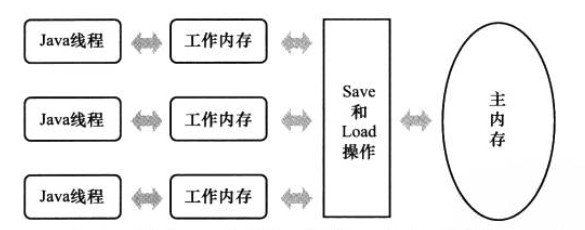
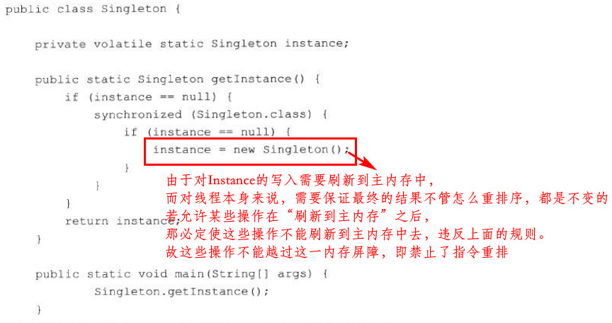
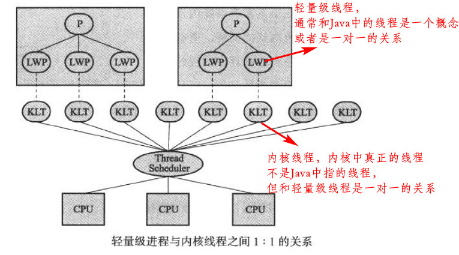
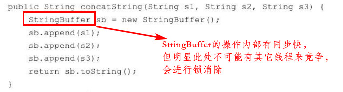
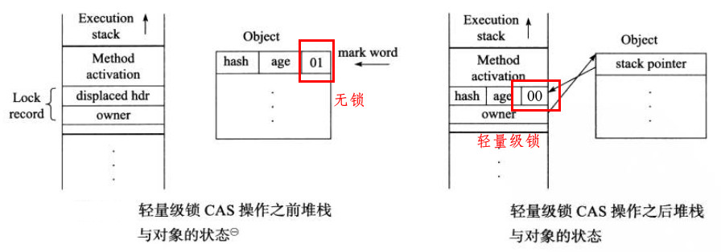
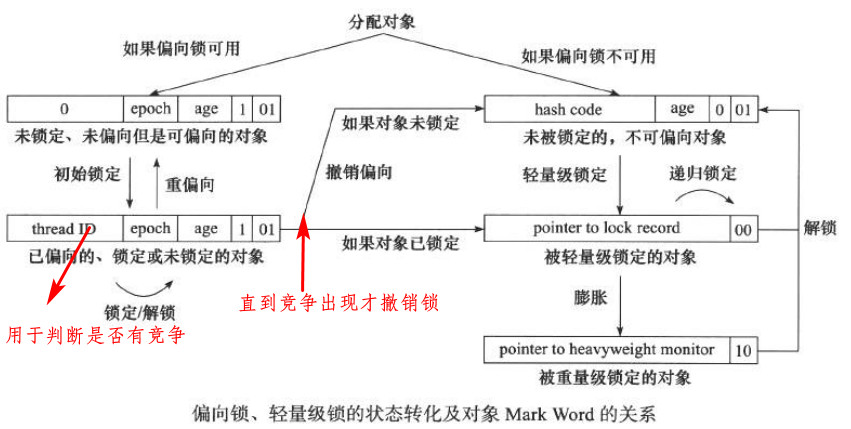

[TOC]

# 12. Java内存模型与线程

volatile禁止指令重排序的实质：

### Java与线程

- 协同式线程调度：线程任务完成后主动通知调度者，一般不使用
- 抢占式线程调度：分配时间片来控制运行，Java线程的调度就是抢占式的

# 13. 线程安全与锁优化

### 13.2 线程安全

#### Java的线程安全

- 不可变
  - 不可变对象一旦被正确构建出来（不发生this引用逃逸），那其对外的可见状态永远不会变（String和Integer等包装类型都是不可变的）
- 绝对线程安全
  - 一个绝对线程安全的类是需要付出很大的代价的，即不管怎么调用都不会出现线程同步问题。几乎没有类可以做到，因为和调用者的逻辑会有关系
- 相对线程安全
  - 指的就是平常说的线程安全，即保证对这个对象单独的操作是线程安全的
  - 典型的如Vector、HashTable、ConcurrentHashMap类等
- 线程兼容
  - 类本身线程不安全，但是可以通过同步手段达到线程安全
- 线程对立
  - 无论如何也不能达到线程安全，在Java中几乎没有

#### 线程安全的实现方法

- 互斥同步
- 非阻塞同步，即CAS
- 无同步方案
  - 可重入代码，天生线程安全不需要同步（一般特征为：运行结果不依赖公共资源与数据）
  - 线程本地存储（把共享的数据限制在一个线程内，如生产者消费者模式，ThreadLocal类等）

### 13.3 锁优化

- 自旋锁和自适应自旋

  - 自适应自旋即根据上一次的自旋时间来确定本次自旋的最大循环次数

- 锁消除

  - 编译时对不可能存在竞争的锁进行消除，如：

    

- 锁粗化

  - 将不必要的作用域过小的锁进行粗化，减少锁被获取的次数

- 轻量级锁

  
  - 若更新操作失败，则检查“Mark Word”是否指向当前线程的栈帧，若是，则说明当前线程已经拥有此锁，直接执行即可；否则说明存在竞争，膨胀为重量级锁
  - 在有竞争的情况下，轻量级锁除了互斥的开销外，还多了CAS操作的消耗，其性能比重量级锁还要低

- 偏向锁

  - 轻量级锁时在无竞争的条件下使用CAS操作，消除了互斥同步的开销；偏向锁则是在无竞争的条件下把所有同步操作的消除掉，包括CAS（第一次需要CAS）

  - 等到竞争出现才释放锁

    

