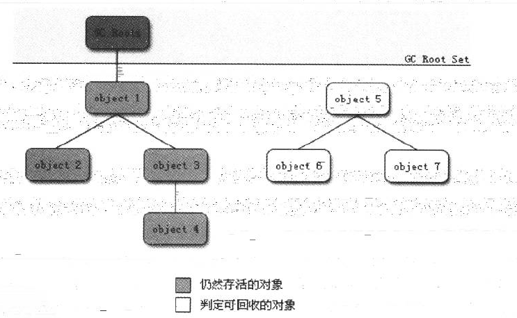

[TOC]

# 1. 走近Java

jdk: java语言、java虚拟机、java API类库  
jre: java SE API子集，java虚拟机  

4个平台：
- Java Card. java小程序运行在小内存设备的平台
- Java ME. java程序运行在移动终端的平台
- Java SE. 面向桌面级应用的平台
- Java EE. 使用多层架构的企业应用平台 

可考虑看jdk源码（C语言）

# 2. Java内存区域与内存溢出异常

### 2.2 运行时数据区域

- 程序计数器
	- 每个线程独自拥有一个（**线程私有**），可以看作是当前线程所执行的字节码的行号指示器。 字节码解释器通过改变此计数器的值，来选择下一条指令
	- 唯一一个没有规定OutOfMemoryError的内存区域
- Java虚拟机栈 
	- **线程私有**，每个方法在执行时创建一个栈帧，这些栈帧就在虚拟机栈中，所需内存大小在编译期已确定
	- 局部（本地）变量表：存放编译期可知的各种基本数据类型、对象引用、returnAddress, long/double型占两个slot，其它占一个
	- 栈帧局部变量表所需的内存空间在编译时已确定，分配时按照此值分配，运行期间不变
	- 线程请求的栈深度大于所允许的深度，则StackOverflowError
	- 虚拟机栈在动态拓展时没有足够内存，则OutOfMemoryError
- 本地方法栈
	- **线程私有**，与虚拟机栈类似，虚拟机栈为java方法服务，本地方法栈为Native方法服务
- Java堆
	- **线程公有**，在虚拟机启动时创建
	- 唯一目的：存放对象实例及数组
	- 垃圾收集器管理的主要区域，故又称'GC堆'
	- Java堆的内存是逻辑连续的
	- 内存不足以分配实例时，则OutOfMemoryError
	- 分新生代和老年代两个区域。老年代存放生命周期长的对象
- 方法区（又叫永久代）
	- **线程公有**，存储类信息、常量、静态变量等
	- 内存不足以分配时，则OutOfMemoryError
	- 运行时常量池：方法区的一部分，存放编译期生成的字面量和符号引用

**直接内存**：非运行时数据区域内存，java可用特殊方法直接分配堆外内存，不受Java堆大小的限制

### 2.3 虚拟机对象探秘

- 对象的创建
	- 类加载。首先在常量池中定位类的符号引用，检查此类是否被加载、解析和初始化；若没有，则先执行类的加载过程
	- 对象所需的内存在类加载后可确定。内存分配方式：指针碰撞（规整内存的java堆）、空闲列表（不规整内存的Java堆）
	- 分配内存的动作应该是线程安全的
	- 内存分配完成后，虚拟机将其初始化为0
	- 虚拟机对对象进行设置，存放在对象头中
- 对象的内存布局
	- 对象头。两部分：存储对象自身的运行时数据；类型指针（确定它是哪个类的实例）
	- 对象真正存储的有效信息（各字段内容等）
	- 对齐填充（无实际意义）
- 对象的访问定位
	- 通过栈上的reference（引用）数据来操作堆上的具体对象。两种访问方式：**使用句柄；直接指针**

### 2.4 OutOfMemoryError异常测试

- Java堆溢出
	- 虚拟机参数 -Xms20m -Xmx20m，将堆最小内存设为20M，最大Xmx与最小相等则代表不可拓展
	- 堆的内存不足，实例无法再获取到内存（java.lang.OutOfMemoryError: Java heap space）
	- 使用内存映像分析工具对堆快照进行分析。区分内存泄漏（对象不存活，但没有被垃圾回收）和内存溢出（对象都是存活的，只是内存不足）
- 虚拟机栈和本地方法栈溢出
	- 虚拟机参数 -Xss限制栈大小
	- 线程请求的栈深度大于虚拟机所允许的最大深度（即方法调用的嵌套深度），StackOverflowError异常（纵向，无法分配新的栈帧）
	- 虚拟机拓展栈时内存不足，OutOfMemoryError异常（横向，无法建立新的线程）
	- **单个线程**下，抛出的都是StackOverflowError异常；多线程下，每个线程分配到的栈容量越大，可建立的线程数目就越小，越容易出现OutOfMemoryError异常
- 方法区和运行时常量池溢出
	- 虚拟机参数 -XX:PermSize=  -XX:MaxPermSize= 限制方法区大小
	- String的intern()方法。如果字符串常量池中已经包含等于此对象的字符串，则返回池中的对象；否则，将新的String对象字符串添加至常量池中，并返回此对象的引用
	- 关于intern()细节，见PDF80
	- java.lang.OutOfMemoryError: PermGen space
- 直接内存溢出

# 3. 垃圾收集器与内存分配策略

线程私有的内存大小几乎是在编译期已确定的，这部分（程序计数器、虚拟机栈、本地方法栈）的内存随着方法或线程的结束自然会自动被回收，故垃圾收集器关注的**仅仅是动态的内存**（java堆和方法区）

### 3.2 对象存活

- 引用计数算法
	- 有引用时加1，引用失效时减一，为0时判断为不存活
	- 但很少主流虚拟机选用它，难解决对象循环引用问题（两个对象相互引用）
- 可达性分析算法
	- ‘GC ROOTS’作为起始点，搜索引用链，当对象到'GC ROOTS'没有引用链相连时（不可达），即不存活
	- 可解决对象之间相互引用的情况（如下图）
	- 
- 再谈引用
	
	- 强引用、软引用、弱引用、虚引用，引用强度依次递减
- 回收
	- 当与‘GC ROOTS’不可达时，进行第一次标记，并判断是否需要（覆盖了finalize方法且没有被虚拟机调用过）执行finalize()
	- 需要执行finalize()的对象放在F-Queue中等待执行
	- 对F-Queue中的对象进行第二次标记，如果对象在finalize()方法中重新建立引用链，那么此对象将不会被回收（对象可以在被GC时自我拯救；这种自救的机会只有一次，因为一个对象的finalize()方法最多只会被系统自动调用一次）
		
			public class FinalizeEscapeGC {
			public static FinalizeEscapeGC SAVE_HOOK = null;

			public void isAlive() {
				System.out.println("yes, i am still alive :)");
			}
		
			@Override
			protected void finalize() throws Throwable {
				super.finalize();
				System.out.println("finalize mehtod executed!");
				FinalizeEscapeGC.SAVE_HOOK = this;
			}
		
			public static void main(String[] args) throws Throwable {
				SAVE_HOOK = new FinalizeEscapeGC();
		
				// 对象第一次成功拯救自己
				SAVE_HOOK = null;
				System.gc();
				// 因为Finalizer方法优先级很低，暂停0.5秒，以等待它
				Thread.sleep(500);
				if (SAVE_HOOK != null) {
					SAVE_HOOK.isAlive();
				} else {
					System.out.println("no, i am dead :(");
				}
		
				// 下面这段代码与上面的完全相同，但是这次自救却失败了
				SAVE_HOOK = null;
				System.gc();
				// 因为Finalizer方法优先级很低，暂停0.5秒，以等待它
				Thread.sleep(500);
				if (SAVE_HOOK != null) {
					SAVE_HOOK.isAlive();
				} else {
					System.out.println("no, i am dead :(");
				}
			}
			}
	运行结果：
	finalize mehtod executed!
	yes, i am still alive :)
	no, i am dead :(
	- finalize()能做的所有工作，可以用try-finally完全代替，即完全可以忘记finalize()的存在
- 回收方法区
	- 废弃常量。没有地方引用此常量，可回收
	- 无用的类。 该类的所有实例都已被回收（java堆中不存在该类实例）；加载该类的ClassLoader已被回收；对应的java.lang.Class没有被引用，无法通过反射访问。满足上述三点，可回收

### 3.3 垃圾收集算法

- 标记-清除算法
	- 标记出所有需要回收的对象，之后统一回收所有被标记的对象
	- 两个不足：标记和清除的效率不高；产生大量不连续的内存碎片
- 复制算法（一般用在新生代）
	- 内存分为两块。每当其中一块内存耗尽，将存活的对象复制至另一块
	- 运行高效，无内存碎片。代价是内存减少一半
	- **新生代**内存区域中，8/1/1的Eden/Survivor/Survivor区，将Eden和一块survivor存活的对象复制到另一块survivor上
- 标记-整理算法
	- 当存活率较高时，**复制算法**需要进行较多的复制操作，效率降低
	- 与标记-清理不同，标记后不清理，而是将存活的对象整理到一起
- 分代收集算法（现代GC基本采用这种）
	- 将内存划分为多块，每块根据对象的特点灵活采用上述的不同算法

### 3.4 HotSpot虚拟机算法实现
### 3.5 各种垃圾收集器介绍
serial, parnew, parallel scavenge, serial old, parallel old, cms, g1

java堆分为若干个区域  

- GC日志
- 垃圾收集器参数

### 3.6 内存分配与回收策略

Minor GC: 新生代GC，非常频繁，回收速度快  
Major GC/Full GC: 老年代GC，一般伴随至少一次的Minor GC，速度比Minor GC慢10倍以上

- 对象优先在新生代的Eden区分配
- 大对象直接进入老年代。避免新生代中大量的内存复制
- 长期存活的对象将进入老年代。对象有一个年龄计数器，每进入一次Survivor空间，计数器加1，到一定数值将被移入老年代
- 动态对象年龄判定。进入老年代的年龄阈值更灵活
- 空间分配担保。发生Minor GC前，检查老年代最大可用连续空间是否大于新生代所有对象总空间

# 4. 虚拟机性能监控与故障处理

### 4.2 jdk命令行工具

- jps, 虚拟机进程状况工具
- jstat, 虚拟机统计信息监视工具。jstat [ option vmid [interval [s|ms]] [count]] (类装载、内存、垃圾收集、JIT编译)
- jinfo, Java配置信息工具。实时查看和调整虚拟机各项参数， jinfo [option] pid
- jmap, Java 内存映像工具，生成堆转储快照。jmap [option] vmid
- jhat, 虚拟机堆转储快照分析工具，一般不使用
- jstack, Java堆栈跟踪工具。生成当前时刻线程快照，jstack [option] vmid
- HSDIS

### 4.3 JDK可视化工具

- JConsole
- VisualVM

# 5. 调优案例分析与实战

### 5.2 案例

- 高性能硬件上的程序部署策略。使用64JDK利用大内存；若干个32位虚拟机（每个虚拟机相当于一个Java进程）建立逻辑集群
- 集群间同步导致的内存溢出。大量的失败同步请求，占用内存
- 堆外内存导致的溢出错误。案例中，由于Direct Memory的内存不足，而又无法（像java堆那样）触发虚拟机的垃圾回收，所以只能抛出内存溢出异常。**堆外内存**可能导致内存溢出：直接内存、线程栈、Socket缓存区（Too many open files）、JNI代码、虚拟机和GC自身占用的内存
- 外部命令导致系统缓慢
- 服务器JVM进程崩溃。可检查系统日志，hs_err_pid####.log
- 不恰当的数据结构导致内存占用过大。HashMap导致内存占用过大，Minor GC频繁，耗时增加，主要因为HashMap用来存储一些小数据，空间利用率很低，内存浪费
- Windows虚拟内存

### 5.3 Eclipse运行速度调优
（....）
