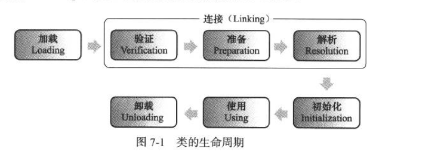
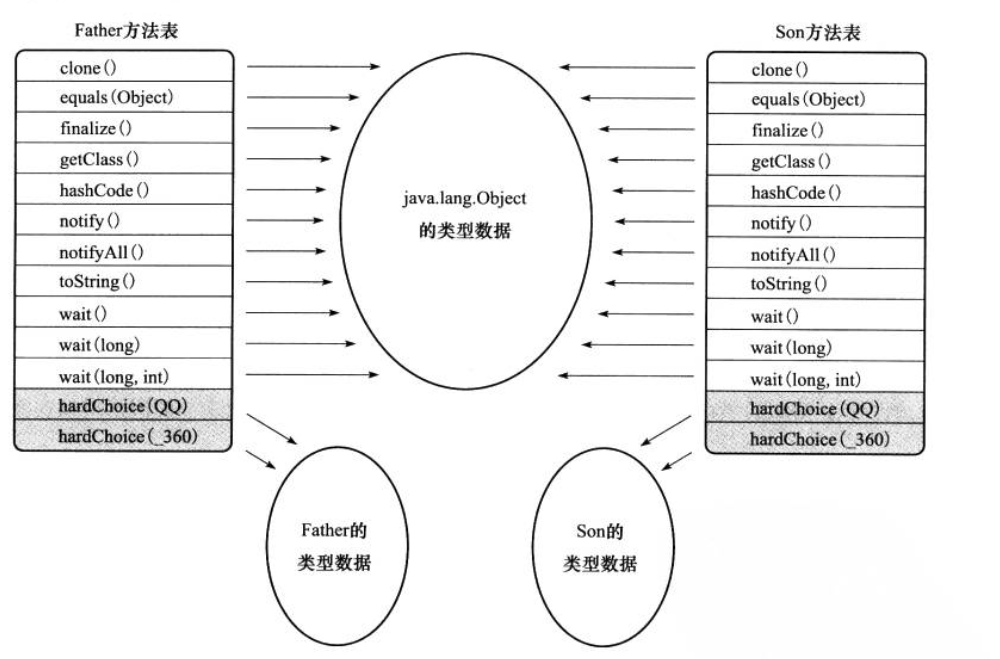
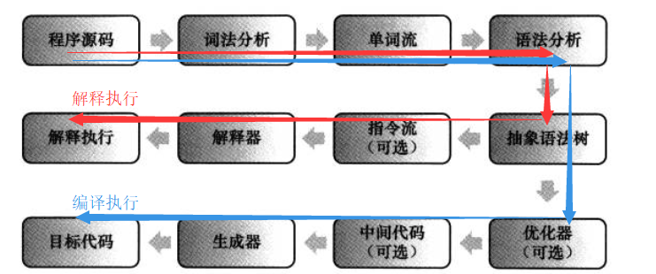
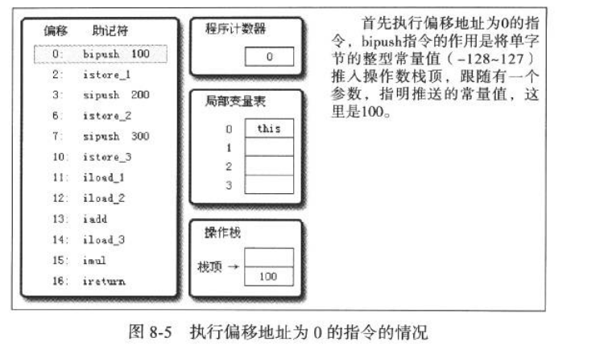
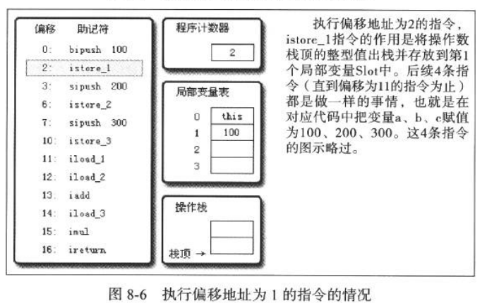
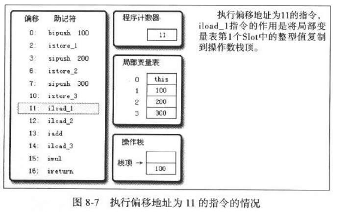
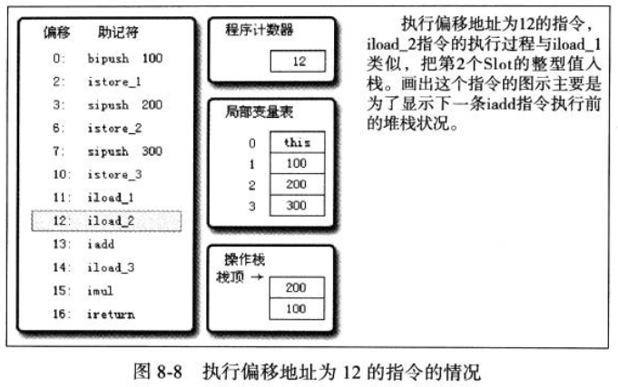
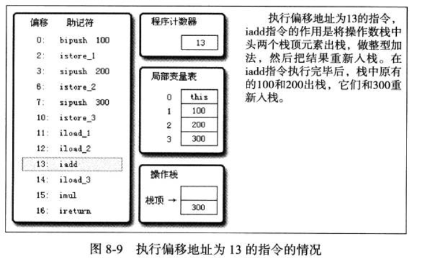
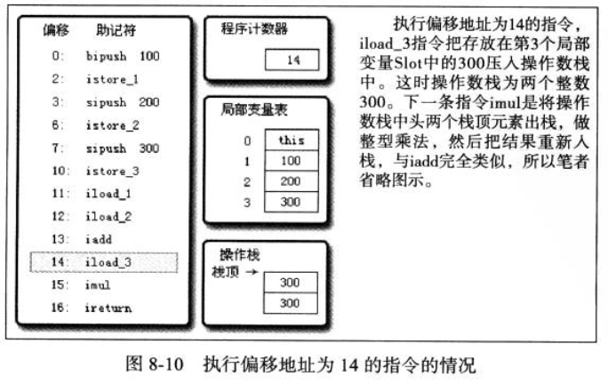
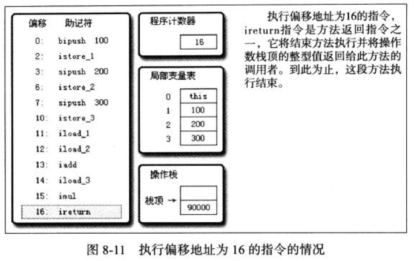

[TOC]

# 6. 类文件结构

存储**字节码**的Class文件

### 6.3 Class类文件的结构

《Java虚拟机规范（Java SE 7）》中文版  

字节流，按顺序紧凑排列，没有分隔符，超过占用8位的数据按大端存储（高位在前）

类C语言结构体的伪结构：无符号数（相当于基本类型）和表（相当于结构体）

Class文件格式：相当于一张大表

- 可用javap -verbose XXXClass解析Class文件
- 魔数与Class文件的版本
  - 魔数为头4个字节，确定该文件是否是能被虚拟机接受的Class文件
  - 之后是2个字节的次版本号和2个字节的主版本号（向下兼容）
- 常量池
  - 2个字节的常量池容量（从1开始计数，实际数量为此数值减1）
  - 常量池两大类常量：字面量（字符串、数值常量）和符号引用（类和接口的全限定名、字段的名称和描述符、方法的名称和描述符），每个常量都是一个表结构（共14中常量类型，共同点是第一个字节都是类型标志位）
- 访问标志
  - 两个字节，16位其中的8个位可标志访问信息（public、final、abstract、类或接口等信息），其它8位均为0
- 类索引、父类索引与接口索引集合
  - 记录类、接口继承关系
- 字段表集合
  - 描述接口、类中声明的变量（不包括方法内部的局部变量），包括访问标志、简单名称、描述符（变量类型、方法的参数）、额外属性表
- 方法表集合
  - 同字段表集合，方法的代码放在属性表中
  - 与java语言里不同，Class文件里方法的特征签名包括返回值，若两个方法只有返回值不同，也能共存
- 属性表集合
  - 方法表、字段表、类文件带的额外属性
  - **Code属性**。操作数栈深度最大值；局部变量表所需存储空间值；编译生成的字节码指令（虚拟机规定了200多条字节码指令）。最重要的一个属性，整个Class文件中，Code属性用于描述**代码**，所有其它数据用于描述**元数据**
  - Exceptions属性。与Code属性平级，列出可能抛出的异常（throws关键字后面的异常）
  - LineNumberTable属性。描述java源码行号与字节码偏移量的对应
  - LocalVariableTable属性。栈帧局部变量表中的变量与java源码定义的变量的对应
  - SourceFile属性。记录生成这个Class文件的源码文件名称（有时候class文件名称与源码文件名称不对应，如内部类和包级类）
  - ConstantValue属性。 只有被static关键字修饰的变量才使用，自动为静态变量赋值
  - InnerClasses属性。 记录内部类与宿主类之间的关联
  - Deprecated, Synthetic, StackMapTable, Signature, BootstrapMethods属性

### 6.4 字节码指令简介

指令由一个字节的操作码和其后的零至多个字节的操作数构成，面向操作数栈。

放弃操作数长度对齐，损失一些性能，但使得编译后的代码短小，高效率传输

```
do {
	自动计算PC寄存器的值加1；
	根据PC寄存器的指示位置，从字节码流中取出操作码；
	if(字节码存在操作数) 从字节码流中取出操作数；
	执行操作码的操作；
}while(字节码流长度 > 0);
```

- 字节码与数据类型
  - 指令大多包含了其操作所对应的数据类型信息
  - Java虚拟机指令集对于特定的操作只提供了有限的类型相关指令
- 加载和存储指令。 将数据在栈帧中的局部变量表和操作数栈之间来回传输
  - 将一个局部变量加载到操作数栈，xload
  - 将一个数值从操作数栈存储到局部变量表, xstore
  - 将一个常量加载到操作数栈
  - 扩充局部变量表访问索引，wide
- 运算指令
  - 注意浮点数运算
- 类型转换指令
- 对象创建与访问指令
  - 对类实例和数组的创建与操作使用了不同的指令
- 操作数栈管理指令
  - 操作数出栈
  - 复制栈顶并压入
  - 栈顶两个数值互换
- 控制转移指令
- 方法调用和返回指令
- 异常处理指令
  - 虚拟机中处理异常不由字节码完成，由异常表完成
- 同步指令 

### 6.5 公有设计和私有实现

**公有设计**：虚拟机规范描绘java虚拟机的共同程序存储格式：Class文件格式和字节码指令集。这些与硬件、软件及虚拟机实现是完全独立的

**私有实现**：在满足规范约束下对具体的虚拟机实现做修改和优化

虚拟机实现：将字节码翻译成另一种虚拟机指令集；将字节码翻译成宿主机CPU的本地指令集（**JIT代码生产技术**）

# 7. 虚拟机类加载机制

实际情况中，每个Class文件都可能代表java语言中的一个类或接口

### 7.2 类加载的时机

类生命周期：  

- 加载、验证、准备、解析、初始化、使用、卸载
- 其中验证、准备、解析统称为连接
- 解析阶段顺序不一定，可以在初始化之后；而加载、验证、准备一定在初始化之前



（之前未初始化）必须立即对类进行**初始化**的情况（**有且仅有**）：

- 遇到new、getstatic、putstatic、invokestatic字节码，在java语言中，一般是：使用new关键字实例化对象；读取、设置类的静态字段；调用一个类的静态方法
- java.lang.reflect包对类进行反射调用时
- 初始化时，其父类必须先经过初始化（接口只在这点与类不同，接口不要求其父接口都完成了初始化）
- 虚拟机启动时，先初始化主类（main方法所在类）
- java.lang.invoke.MethodHandle

触发初始化的引用类的方式，为主动引用；否则为被动引用：

- 通过子类引用父类的静态字段，不会导致子类初始化
- 通过数组定义来引用类，不会触发类的初始化
- 常量(final）在编译阶段会存入调用类的常量池，直接引用这种静态常量本质并没有引用到类，不会触发类的初始化

### 7.3 类加载的过程

- 加载
  - 通过类的全限定名获取定义此类的二进制字节流（可控性最强，可重写loadClass()方法）
  - 将字节流的静态存储结构转化为方法区的运行时数据结构
  - 在内存中生成代表此类的java.lang.Class对象，作为方法区访问入口
  - 数组类的加载与普通类有所不同(。。。。。。。。)
- 验证 
  - 确保字节流中包含的信息符合虚拟机的要求，因为字节流不一定由编译器产生，可以人工手动产生有害字节流
  - 文件格式验证：魔数、版本号、常量池常量类型、常量索引值等。此步验证通过后，字节流进入方法区，后面的验证步骤**基于方法区**
  - 元数据验证：语义分析，检查是否符合java语言规范
  - 字节码验证：分析数据流和控制流，对**方法体**进行验证，保证安全性
  - 符号引用验证：保证解析动作正常执行
- 准备
  - 正式为类变量（非实例变量）分配内存，

(........)

# 8. 虚拟机字节码执行引擎

### 8.2 运行时栈帧结构

每个方法从调用开始到完成，都对应着栈帧在虚拟机栈中从入栈到出栈的过程

对执行引擎来说，只有位于栈顶的栈帧才是有效的，为**当前栈帧**，其方法称为**当前方法**。执行引擎的所有字节码指令只对当前栈帧进行操作

- 局部表量表

  - 在编译时期，就确定了需要分配的局部变量表的最大容量

  - Slot为单位，long/double占两个，其它占一个

  - reference类型，虚拟机能通过这个引用找到java堆中数据存放的起始地址；并且也能通过此引用找到对象所属类在方法区中的类型信息

  - 实例（非static）方法局部变量表顺序：第0位是this参数；然后是显式参数；最后是方法体内部定义的变量，顺序均和定义的顺序相同

  - 实例方法的局部变量必须被手动初始化

  - 关于slot复用对垃圾收集的影响：

    public static void main(String[] args)() {
             byte[] placeholder = new byte[64 * 1024 * 1024];
             System.gc();
         }
    上述代码中，placeholder没有被回收。因为placeholder还在作用域中，虚拟机自然不敢回收
    	

    ```
    public static void main(String[] args)() {
           {
               byte[] placeholder = new byte[64 * 1024 * 1024];
           }
           System.gc();
       }
    ```

    而这段代码中，placeholder依然没有被回收，是因为虽然已经离开了作用域，但是局部变量表的slot中仍然存在placeholder数组的引用，且**没有被其它变量复用**，所以依然判断为不回收

    ```
    public static void main(String[] args)() {
           {
               byte[] placeholder = new byte[64 * 1024 * 1024];
           }
           int a = 0;
           System.gc();
       }
    ```

    而这段代码在离开作用域后，有一个其它变量a复用了placeholder的slot，使得其引用被解除，才得以回收。这就解释了为什么有的代码规范里，规定“作用域过期的对象应手动赋值为null”；但是，不应过多依赖于赋值null，以恰当的变量作用域来控制变量回收时间才是最优雅的解决方法

- 操作数栈（操作栈）

  - 最大深度在编译时已确定
  - 如加法指令，将栈顶两个元素出栈并相加，再将结果入栈
  - java虚拟机的基于栈的执行引擎，其中栈指的就是操作栈

- 动态连接

- 方法返回地址

  - 方法正常退出时，栈帧中保存调用者的PC计数器的值作为返回地址
  - 方法异常退出时，返回地址通过异常处理表来确定，栈帧中一般不保存

- 附加信息

### 8.3 方法调用 

Class文件编译过程中不包含传统编译的连接步骤，方法调用在Class文件中只是符号引用，不是实际内存布局中的入口地址（直接引用），直接引用需要在类加载期间甚至运行期间才能确定

- 解析

  - 解析期间，一部分符号引用转化为直接引用，此类方法称为**非虚方法**（包括静态方法、私有方法、实例构造器、父类方法四类，还有个特殊是final方法，即不可能通过继承或别的方式重写其它版本），其它则为**虚方法**

- 分派

  - 分派调用过程是多态性的最基本体现

  - 静态分派（重载）
    	
    public class StaticDispatch {

    ```
           static abstract class Human {
           }
    
           static class Man extends Human {
           }
    
           static class Woman extends Human {
           }
    
           public void sayHello(Human guy) {
               System.out.println("hello,guy!");
           }
    
           public void sayHello(Man guy) {
               System.out.println("hello,gentleman!");
           }
    
           public void sayHello(Woman guy) {
               System.out.println("hello,lady!");
           }
    
           public static void main(String[] args) {
               Human man = new Man();
               Human woman = new Woman();
               StaticDispatch sr = new StaticDispatch();
               sr.sayHello(man);
               sr.sayHello(woman);
           }
       }
    ```

    上面代码将输出:  
    hello,guy!  
    hello,guy!  

    使用哪个重载版本，完全取决于传入参数的数量和静态数据类型，这个是编译器确定的。编译器在重载时通过参数的静态类型而不是实际类型作为判断依据，静态类型是编译器可知的。称为**静态分派**

    ```
    public class Overload {
    
           public static void sayHello(Object arg) {
               System.out.println("hello Object");
           }
    
           public static void sayHello(int arg) {
               System.out.println("hello int");
           }
    
           public static void sayHello(long arg) {
               System.out.println("hello long");
           }
    
           public static void sayHello(Character arg) {
               System.out.println("hello Character");
           }
    
           public static void sayHello(char arg) {
               System.out.println("hello char");
           }
    
           public static void sayHello(char... arg) {
               System.out.println("hello char ...");
           }
    
           public static void sayHello(Serializable arg) {
               System.out.println("hello Serializable");
           }
    
           public static void main(String[] args) {
               sayHello('a');
           }
       }
    ```

    上述代码输出: hello char  
    上述例子这种字面量参数的优先级为char->int->long->Character->Serializable->Object->char ...

  - 动态分派（重写）

    public class DynamicDispatch {

    ```
           static abstract class Human {
               protected abstract void sayHello();
           }
    
           static class Man extends Human {
               @Override
               protected void sayHello() {
                   System.out.println("man say hello");
               }
           }
    
           static class Woman extends Human {
               @Override
               protected void sayHello() {
                   System.out.println("woman say hello");
               }
           }
    
           public static void main(String[] args) {
               Human man = new Man();
               Human woman = new Woman();
               man.sayHello();
               woman.sayHello();
               man = new Woman();
               man.sayHello();
           }
       }
    ```

    输出结果：  
    man say hello  
    woman say hello  
    woman say hello  

    动态分派，把常量池中的类方法符号引用解析到了不同的直接引用上，根据实际类型确定方法执行版本。invokevirtual指令的多态查找过程：一，找到操作栈顶的元素所指向的对象的实际类型C；二，在类型C中找到描述符和简单名称都相符的方法，进行权限校验，通过则返回此方法的直接引用，查找结束，否则java.lang.IllegalAccessError；三，否则，按继承关系从下至上对C的父类进行查找；四，若始终没有合适的方法，则报java.lang.AbstractMethodError异常

  - 单分派与多分派

    public class Dispatch {

    ```
           static class QQ {}
    
           static class _360 {}
    
           public static class Father {
               public void hardChoice(QQ arg) {
                   System.out.println("father choose qq");
               }
    
               public void hardChoice(_360 arg) {
                   System.out.println("father choose 360");
               }
           }
    
           public static class Son extends Father {
               public void hardChoice(QQ arg) {
                   System.out.println("son choose qq");
               }
    
               public void hardChoice(_360 arg) {
                   System.out.println("son choose 360");
               }
           }
    
           public static void main(String[] args) {
               Father father = new Father();
               Father son = new Son();
               father.hardChoice(new _360());
               son.hardChoice(new QQ());
           }
       }
    ```

    输出结果：  
    father choose 360  
    son choose qq  
    java是静态多分派，动态单分派  

  - 虚拟机动态分派实现

    一般建立一个虚方法表，提高查找性能。上节代码所对应的虚方法表如下：  
    

    Son重写了来自Father的全部方法，因此Son的方法表没有指向Father类型数据的箭头。但Son和Father都没有重写来自Object的方法，所以都指向了Object的数据类型

- 动态类型语言支持

  （..........）

### 8.4 基于栈的字节码解释执行引擎

java虚拟机执行引擎分为**解释执行**（通过解释器执行）和**编译执行**（通过即时编译器产生本地代码）。刚开始java都是解释执行（解释Class文件）的，但是后来发展出可以直接产生本地代码的编译器（或者编译Class文件）

- 解释执行

  - 编译执行和解释执行的过程如图：

    

- 基于栈的指令集和基于寄存器的指令集

  - 基于栈的指令集的优点是可移植、代码相对更紧凑。寄存器由硬件直接提供，程序不可避免地受到硬件的约束
  - 基于栈的指令集的缺点是执行速度相对稍慢，所需的指令数量较多

- 基于栈的解释器执行过程

  public int calc(){
  		int a = 100;
  		int b = 200;
  		int c = 300;
  		return (a + b) * c;
  	}

  字节码指令如下：
  	

  ```
  public int calc();
  Code:
  	Stack=2, Locals=4, Args_size=1
  	0: bipush 100
  	2: istore_1
  	3: sipush 200
  	6: istore_2
  	7: sipush 300
  	10: istore_3
  	11: iload_1
  	12: iload_2
  	13: iadd
  	14: iload_3
  	15: imul
  	16: ireturn
  ```

  执行过程如下：

    
    
    
    
    
    
  

# 9. 类加载及执行子系统的案例与实战

### 9.2 案例分析

- Tomcat：正统的类加载器架构
  - （.............）
- OSGi：灵活的类加载器架构 
  - (.............)
- 字节码生成技术与动态代理的实现

- Retrotranslator

### 9.3 实现远程执行功能

理解类加载与执行的过程，见书