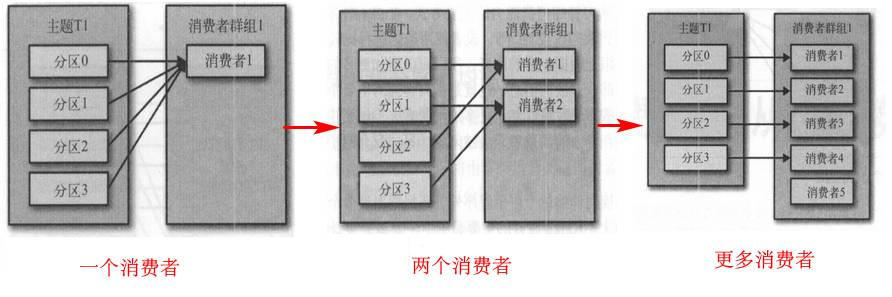
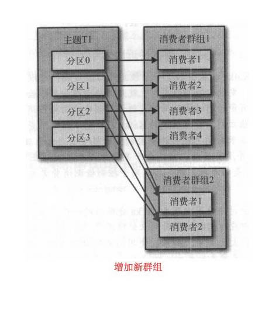
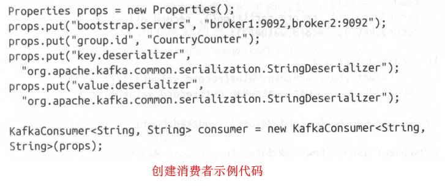
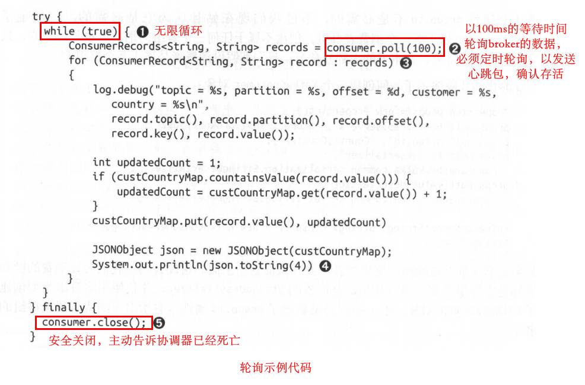
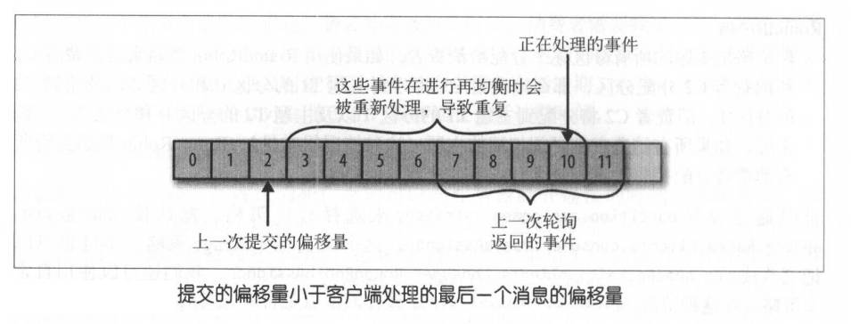
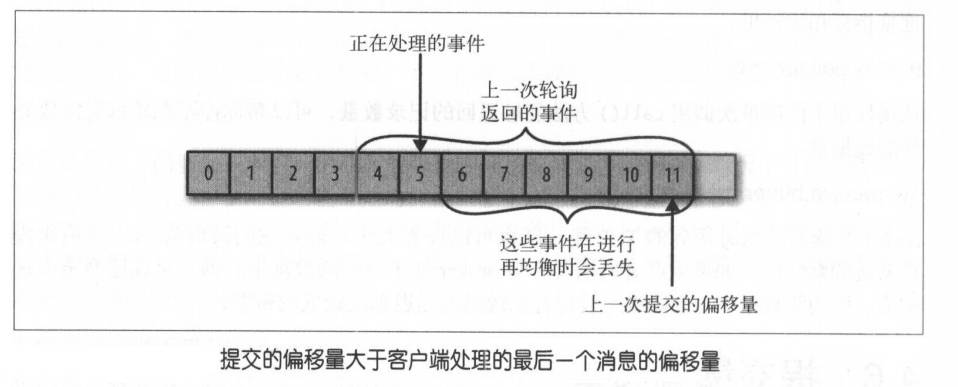
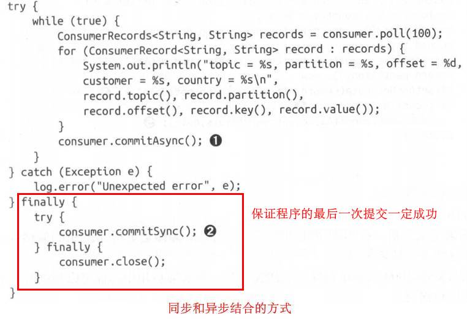
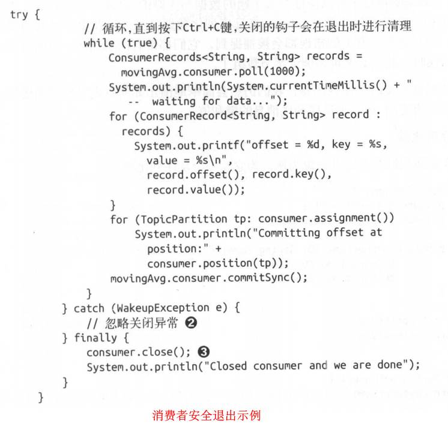
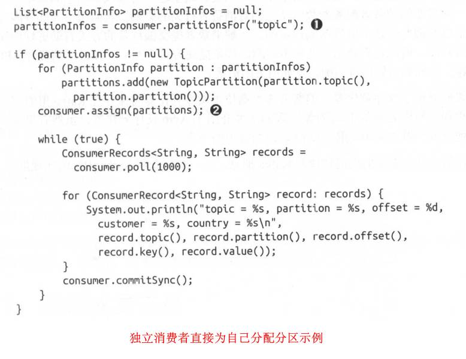

# 4. Kafka消费者

### 4.1 KafkaConsumer概念

- 消费者和消费者群组
	- 对消费者进行横向伸缩，可以使用多个消费者从同一主题读取消息（增加消费者是横向伸缩的主要手段）
	- 一个群组里的消费者订阅的是同－个主题，每个消费者接收主题一部分分区的消息			
		
	- 有必要为主题创建大量的分区，在负载增长时可以加入更多的消费者
	- 如果新增一个只包含一个消费者的群组2，那么这个消费者将从主题上接收所有的消息，与群组1之间互不影响		
		
- 消费者群组和分区再均衡
	- 分区的所有权从一个消费者转移到另一个消费者，这样的行为被称为**再均衡**
	- 再均衡期间，整个群组小段时间不可用；也可能导致消费者重新刷新缓存，影响应用程序效率
	- 消费者向**群组协调器**（特定的broker，不同群组可以有不同的协调器）发送心跳（在轮询或提交偏移量时发送），发现有死亡的消费者，就会触发再均衡
	- 第一个加入群组的消费者是“群主”，负责给每一个消费者分配分区，拥有所有消费者的分配信息；而其他消费者只有自己的分配信息

### 4.2 创建kafka消费者

创建一个KafkaConsumer对象，属性放在Properties对象里

三个必须的属性：
- bootstrap.servers、key.deserializer、value.deserializer的意义参考生产者
	

### 4.3 订阅主题

`consumer.subsribe(topiclist)`方法，参数为主题topic的名字列表，可使用正则表达式

### 4.4 轮询

示例代码如下：						
	

关于poll方法注意事项：
	
- 读取分区中的数据是通过发起一个fetch请求来执行的，但消费者的poll方法只是可能会发起fetch请求。原因：每次发起fetch请求时，读取到的数据是有限制的，通过配置项max.partition.fetch.bytes来限制的，而在执行poll方法时，会根据配置项个max.poll.records来限制一次最多poll多少个record，所以在record没有poll完之前，调用poll方法并不会发起fetch请求
- 可能出现这样的情况： 假如fetch到了100个record，放到本地缓存后，限制每次只能poll出15个record。需要执行7次poll才能将这一次fetch的数据消费完毕。前6次是每次poll15个record，最后一次是poll出10个record

**一个消费者对于一个线程，否则将造成线程不安全**

### 4.5 消费者的配置

- fetch.min.bytes
	- 每次fetch的最小字节，即等到有足够的字节才会fetch
- fetch.max.wait.ms
	- fetch过程中，在等待足够的数据时，最多等待此参数的毫秒数，否则直接返回
- max.partition.fetch.bytes
	- 一次fetch每个分区最多能给消费者返回的字节数
- session.timeout.ms
	- 多长时间消费者没有发心跳包，就认为死亡
	- heartbeat.interval.ms表示poll()方法中多久发一次心跳包，heartbeat一般是session的三分之一
- auto.offset.reset
	- latest，偏移量无效时，从上一次记录继续读数据
	- earlist，偏移量无效时，从分区的起始位置读取
- enable.auto.commit
	- 自动提交偏移量
- partition.assignment.strategy
	- 给消费者分配分区的策略
	- Range，分区连续分给同一个消费者
	- RoundRobin，分区逐个分配个各消费者 
- client.id
- max.poll.records
	- 详细见博客
- receive.buffer.bytes/send.buffer.bytes
	- TCP缓冲区大小

### 4.6 提交和偏移量

**提交：**更新分区当前的读取偏移量

若消费者不死亡，没有触发再均衡，偏移量其实也无意义。偏移量是为了再均衡时，新的消费者能继续之前的消费者读取分区的数据

两种数据错误的情况，如图：					
	
	

提交偏移量的方式：
- 自动提交
	- 每auto.commit.interval.ms的时间，poll方法会将最大偏移量提交
	- 会带来消息被重复处理的问题
- 提交当前偏移量
	- 处理完数据之后手动调用consumer.commitSync()方法，避免消息被重复处理
	- 注意该方法提交的是一次fetch的所有数据所产生的偏移量，不受当前获取的records的偏移量影响
- 异步提交
	- consumer.commitSync()会阻塞，等待Broker做出回应
	- consumer.commitAsync()为异步提交，但其在发生错误时不会自动进行重试。但支持回调，在收到响应时会调用回调函数，可用于记录错误或重试
- 同步和异步结合
	
- 提交特定偏移量
	- consumer.commitSync()和commitAsync()方法可以有参数，指定特定偏移量提交

### 4.7 再均衡监听器

subscribe()方法可有一个ConsumerRebalanceListener监听器参数，在触发再均衡时，会触发此监听器

监听器需实现两个方法：
- onPartitionRevoked()：在再均衡开始之前和消费者停止读取消息之后调用，即回收消费者的分区时
- onPartitionAssigned()：在重新分配分区后和消费者开始读取消息之前被调用，即重新分配分区后

### 4.8 从特定偏移量读取消息

结合seek()方法

### 4.9 安全退出

在另一个线程中调用comsumer.wakeup()可使该consumer退出轮询，该consumer会在自己的线程中抛出WakeupException异常并结束轮询，而且最好在最后加上finally语句块并调用consumer.close()方法，以提交最新的偏移量

### 4.10 反序列化器

kafka自带反序列化器

### 4.11 独立消费者

即不订阅主题，直接为自己分配分区进行消费

