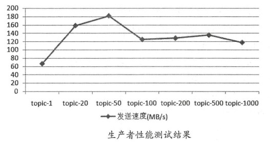
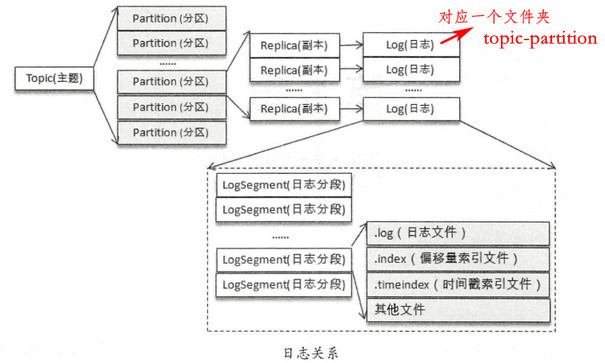
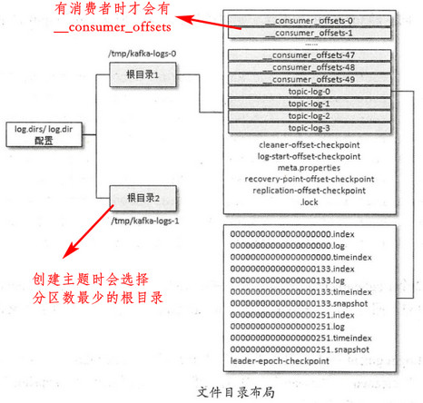
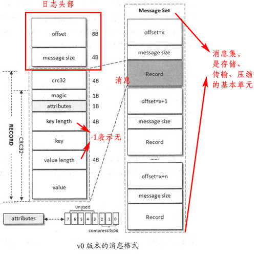
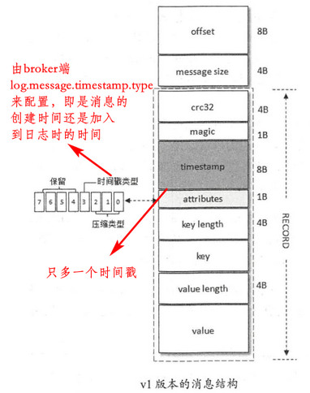
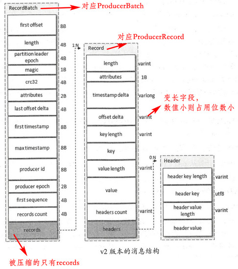

[TOC]

# 4. 主题与分区

### 4.1 主题管理

#### 创建

`auto.create.topics.enable`  为true时，根据`num.partitions`  和`default.replication.factor`  来自动创建主题和分区

可查看各机器上的日志文件或者直接看zk的`/brokers/topics/`  目录获取分区分配情况

zk的`/config/topics/`存储topic的配置

`--replica-assignment`  指定分区的副本分配到哪些broker

源码KafkaConfig.scala中可看到所有默认配置

Kafka创建主题会自动将名称中的`.`转化成`_`

kafka-topics.sh 脚本的实质就是调用`kafka.admin.TopicCommand` 类，然后在zk上相应的目录写入相关信息（**仅此而已，真正创建的实质性动作是由控制器读取zk来异步完成的，所以可以直接在zk中写入信息来完成创建**），也可以在代码中引入TopicCommand类进行主题操作，但更优的方式是使用KafkaAdminClient类。

#### 分区副本的分配

- 未配置机架信息`broker.rack`  或禁用机架`disable-rack-aware`时，采用的是未指定机架的分配策略，源码在`kafka.admin.AdminUtils.assignReplicasToBrokersRackUnaware ()`

    

- 配置了机架信息的分配，会优先将分区的不同副本分配到不同的机架上：

    

对于基于 key 计算的主题而言，建议在一开始就设置好分区数量，避免以后对其进行调整  

配置相关命令见书

#### 主题端参数

与主题相关的所有配置参数在 broker 层面都有对应参数，如果没有修改过主题的任何配置参数，那么就会使用 broker 端的对应参数作为其默认值。可以在创建主题时覆盖相应参数的默认值，也可以在创建完主题之后变更相应参数的值  

必须将 `delete.topic.enable`参数配置为 true 才能够删除主题 ，不能删除内部主题和不存在的主题

使用 `kafka-topics.sh` 脚本删除主题的行为本质上只是在 ZooKeeper 中的 `/admin/delete_topics` 路径下创建一个与待删除主题同名的节点，以此标记该主题为待删除的状态。与创建主题相同的是，真正删除主题的动作也是由 Kafka 的控制器负责完成的

### 4.2 KafkaAdminClient

主题合法性验证保证主题创建（代码方式）的规范性，`org.apache.kafka.server.policy.CreateTopicPolicy` 接口 

### 4.3 分区管理

#### 优先副本选举

只有leader副本提供读写服务，当leader宕机后，leader会转移到其它节点上，会造成负载不均衡。故引入**优先副本**，即AR中的第一个副本，通过优先副本的选举来均衡集群的负载叫分区平衡。

`auto.leader.rebalance.enable`   默认为true，kafka的控制器会启动定时任务检查分区leader是否均衡。不建议自动（性能问题），`kafka-perferred-replica-election.sh` 可手动执行分区平衡操作 

#### 分区重分配

在集群扩容、broker节点失效的场景下对分区进行迁移，即 `kafka-reassign-partitions.sh`  的工作，分区重分配对集群的性能有很大的影响  

#### 复制限流

分区重分配本质在于数据复制，先增加新的副本，然后进行数据同步，最后删除旧的副本，kafka-config.sh 脚本和 kafka-reassign-partitions.sh 脚本可进行限流。与修改分区数不同，分区副本数可以减少。

### 4.4 合适的分区数

`kafka-producer-perf-test.sh` 和 `kafka-consumer-perf-test.sh` 对集群进行性能测试。消息中间件的性能一般是指吞吐量（广义来说还包括延迟），消息写入的吞吐量会受到消息大小、消息压缩方式、消息发送方式（同步／异步）、消息确认类型( acks ）、副本因子等参数的影响，消息消费的吞吐量会受到应用逻辑处理速度的影响。

    

并不是分区数越多，吞吐量越大的。在中间会达到一个峰值（分区数对消费者的影响同理）。分区的数量也会受到操作系统的文件描述符数量的限制

# 5. 日志存储

### 5.1 文件目录布局

每个Log的最后一个 LogSegment 才是active Segment，追加消息时只能往这个segment写数据，每个segment都包含.log、.index和.timeindex文件，名称都是以baseOffset（即该LogSegment 中的第一条消息的offset）命名

### 5.2 日志格式演变

消息的存储格式极大影响性能，kafka在此上经过几次重要演变

**消息压缩**详细见书

`kafka-dump-log.sh`  可查看log日志的具体内容

### 5.3 日志索引

