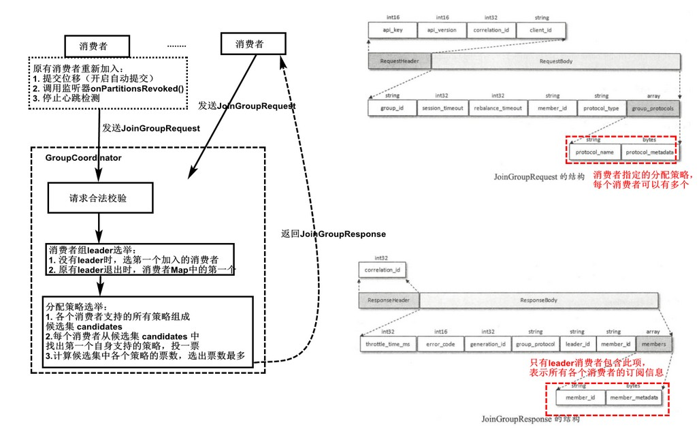

[TOC]

# 7. 客户端

### 7.1 分区分配策略

- RangeAssignor。按照消费者总数和分区总数进行整除运算来获得一个跨度，然后将分区（每个主题）按照跨度进行平均顺序分配（按消费者名称字典序）
- RoundRobinAssignor。所有主题分区排序，轮询
- StickyAssignor。
  - 分区的分配要尽可能均匀（优先）
  - 分区的分配尽可能与上次分配的保持相同
- PartitionAssignor 接口自定义策略
  - 可通过此方法将同一个分区分配给同一组内的多个消费者（**组内广播，但偏移量提交会被覆盖而失效，需另外管理偏移量。说明kafka的偏移量管理不针对单个消费者，而是针对组**），但不能实现共享（只能各自消费）

### 7.2 消费者协调器和组协调器 

#### 旧版消费者客户端

#### 再均衡

全部消费者组集合的子集对应一个GroupCoordinator

触发再均衡：

- 新的消费者加入消费组
- GroupCoordinator未收到消费者心跳包
- 消费者主动退出组
- GroupCoordinator节点变更
- 消费者组订阅的主题数量或主题分区数量变化

#### 再均衡四个阶段

新消费者加入消费组时，经历四个阶段：

1. FIND_COORDINATOR。即找到对应的组协调器GroupCoordinator所在的broker

   

2. JOIN_GROUP。加入消费组

   

3. SYNC_GROUP。leader消费者根据在第二阶段中选举出来的分区分配策略来实施具体的分区分配，然后将分配的方案同步给各个消费者

   

   __consumer_offsets主题中保存了消费者组的元数据信息：

   

4. HEARTBEAT。

   开始进入工作状态。向GroupCoordinator发送OffsetFetchRequest请求获取到上次的位移，并每隔`heartbeat.interval.ms（默认3秒）`向GroupCoordinator发送心跳，超过`session.timeout.ms`值时就触发消费组的再均衡，所以此参数必须比小（一般不超过其1/3）

### 7.3 __consumer_offsets

客户端位移提交通过OffsetCommitRequest请求实现

所以可用`kafka-console-consumer.sh` 脚本消费此主题来查看各消费组各分区的位移

### 7.4 事务

#### 消息传输保障

- 至多一次。不会重复，可能丢失
- 最少一次。不会丢失，可能重复
- 恰好一次（EOS）。不丢失不重复

Kafka生产者的语义为最少一次，因为重试机制可能导致消息重复写入。消费者的语义取决于位移提交方式，若在数据处理前提交位移，则为最多一次；若在数据处理后提交位移，则为最少一次。

引入幂等和事务机制来实现EOS

#### 幂等

为实现幂等，生产者引入producer id(PID)和sequence number(SN)，每个pid发送的每一个分区都有一个对应的sequence number，每发送一条新消息就加1（重试的消息不加1）。

broker端维护<<PID， 分区>, SN>的结构，收到消息时，若SN_new< SN_old + 1，说明重复写入，丢弃；SN_new>SN_old + 1，说明中间有数据未被写入，抛出OutOfOrderSequenceException 异常；只有SN_new=SN_old + 1时，消息才被写入

#### 事务

