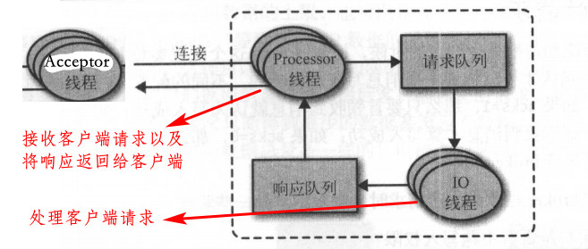
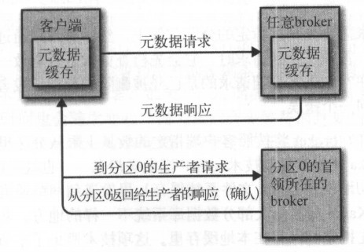

[TOC]

# 5. 深入Kafka

### 5.1 集群成员关系

broker启动会创建临时节点把ID注册到zk中，Kafka组件订阅`/brokers/ids` 路径。broker停机时，会从zk上断开连接，临时节点删除，并通知Kafka组件

### 5.2 控制器

负责分区首领选举的broker（集群中第一个启动的broker），只有一个控制器（对应zk的`/controller`临时节点）。由zk的watch对象和controller epoch来控制选举和唯一性

Kafka 使用 Zookeeper 的临时节点来选举控制器， 并在节点加入集群或退出集群时通知控制器。控制器负责在节点加入或离开集群时进行分区首领选举。控制器使用epoch 来避免“脑裂” （指两个节点同时认为自己是 当前的控制器 ）

### 5.3 复制

使得kafka在个别节点失效时仍能保证可用性和持久性。每个分区有多个副本，保存在broker上，每个broker可以保存很多不同主题和分区的副本

- 首领副本
  - 每个分区有一个首领副本，所有生产者和消费者请求都经过此副本
  - 可查看跟随者副本的偏移量，确定复制的进度，进而确定同步的副本和不同步的副本，只有同步的副本可以被选为新首领
- 跟随者副本
  - 不接受请求，唯一的任务就是从首领那复制消息。如果首领分区崩溃，则选取一个跟随者提升为新首领
- 首选首领
  - 创建主题时选定的分区首领

### 5.4 处理请求

- 生产请求

  - 生产者发送的请求，包含消息内容
  - 相关配置：acks

- 获取请求

  - 消费者和跟随者副本发送的请求

  - 通常客户端只能读取那些被写入到所有同步副本的消息；此工作由分区首领监控，在消息同步到副本前，不会发送给消费者（否则可能会破坏数据的一致性）

    

- 元数据请求

  
  
  - 元数据请求是为了得到分区首领的信息，客户端的请求必须发送给分区首领所在的broker，否则会得到“非分区首领”的错误响应

### 5.5 物理存储

基本的存储单元是分区，其大小受到单个挂载点空间的限制，`log.dirs`指定存储分区的目录清单

#### 分区分配

- 在broker之间平均地分配分区
- 确保每个分区的副本分布在不同的broker上
- 尽可能每个分区的副本在不同机架的broker上

首先使用轮询的方式确定每个首领分区所在的broker，然后分别以每个首领分区开始，同样使用轮训地方式确定每个分区的副本所在的broker。单独为每个分区分配目录：计算每个目录（配置指定的）里的分区数量，新的分区总是被添加到数量最小的那个目录里

#### 文件管理

把分区分成若干个片段，根据每个片段的最大大小或保留时间来管理文件。具体见第二章

#### 文件格式

消息和偏移量都保存在文件中，文件中的消息格式与生产者消费者发送的消息格式是一致的（若生产者发送的是压缩过的消息，则解压操作在消费者处，broker不做任何处理）

`DumpLogSegment`工具可查看片段的内容，包括每个消息的偏移量、消息大小等字段信息

索引：为了能通过偏移量来读取消息，broker必须快速根据偏移量来定位消息所在的位置，索引就把偏移量映射到片段文件和其在文件中的具体位置

#### 清理

默认情况下，kafka使用的是`delete`策略，对于过期的数据直接删除，而对于没有过期的数据则全部保留；若有场景需求是在没有过期的数据中，只考虑保留每个键的最新的值，则可以使用`compact`策略（需保证键不为Null），但同样，该策略不会对当前活跃的片段（正在写入数据的片段）进行清理

- 清理的原理

  - 每个分区的日志片段可表示为：

    

  - Kafka在配置了清理功能时，每个broker会启动一个清理管理器线程和多个清理线程，清理线程会选择污浊率较高的分区进行清理

  - 原理即每个清理线程利用自己独自的一个`<消息的键，偏移量>`的偏移量map来进行清理

    

# 6. 可靠的数据传递

