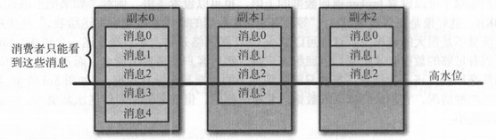

[TOC]

# 5. 深入Kafka

### 5.1 集群成员关系

broker启动会创建临时节点把ID注册到zk中，Kafka组件订阅`/brokers/ids` 路径。broker停机时，会从zk上断开连接，临时节点删除，并通知Kafka组件

### 5.2 控制器

负责分区首领选举的broker（集群中第一个启动的broker），只有一个控制器（对应zk的`/controller`临时节点）。由zk的watch对象和controller epoch来控制选举和唯一性

Kafka 使用 Zookeeper 的临时节点来选举控制器， 并在节点加入集群或退出集群时通知控制器。控制器负责在节点加入或离开集群时进行分区首领选举。控制器使用epoch 来避免“脑裂” （指两个节点同时认为自己是 当前的控制器 ）

### 5.3 复制

使得kafka在个别节点失效时仍能保证可用性和持久性。每个分区有多个副本，保存在broker上，每个broker可以保存很多不同主题和分区的副本

- 首领副本
  - 每个分区有一个首领副本，所有生产者和消费者请求都经过此副本
  - 可查看跟随者副本的偏移量，确定复制的进度，进而确定同步的副本和不同步的副本，只有同步的副本可以被选为新首领
- 跟随者副本
  - 不接受请求，唯一的任务就是从首领那复制消息。如果首领分区崩溃，则选取一个跟随者提升为新首领
- 首选首领
  - 创建主题时选定的分区首领

### 5.4 处理请求

- 生产请求

  - 生产者发送的请求，包含消息内容
  - 相关配置：acks

- 获取请求

  - 消费者和跟随者副本发送的请求

  - 通常客户端只能读取那些被写入到所有同步副本的消息；此工作由分区首领监控，在消息同步到副本前，不会发送给消费者（否则可能会破坏数据的一致性）

    

- 元数据请求

  
  - 元数据请求是为了得到分区首领的信息，客户端的请求必须发送给分区首领所在的broker，否则会得到“非分区首领”的错误响应