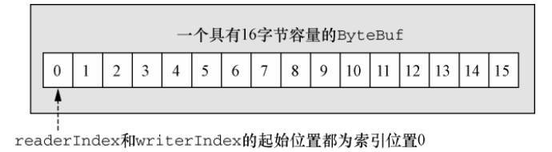
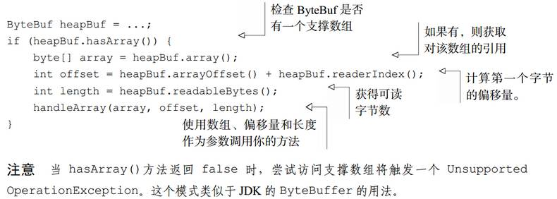
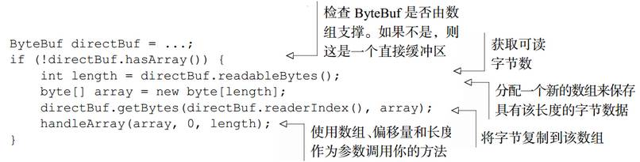
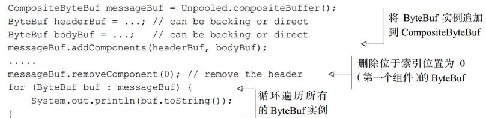
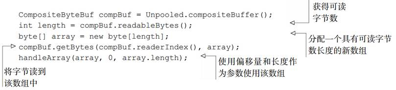
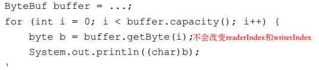
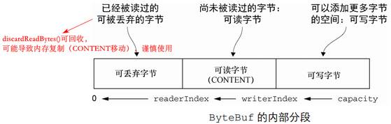

# 5. ByteBuf

JavaNIO提供的是ByteBuffer作为字节容器，Netty中则是ByteBuf

### 5.1 ByteBuf 特点

ByteBuf优点：
- 可以被用户自定义的缓冲区类型扩展
- 实现了透明的零拷贝
- 容量可以按需增长（类似于 JDK 的 StringBuilder）
- 在读和写这两种模式之间切换不需要调用 ByteBuffer 的 flip()方法
- 读和写使用了不同的索引
- 支持方法的链式调用
- 支持引用计数
- 支持池化

### 5.2 ByteBuf 详解

- 索引和基本操作
	- 两个不同的索引readerIndex和writerIndex分别管理读和写，和ByteBuffer不同
	
	- readerIndex最大达到writerIndex（即最多读已经写过的数据），否则抛出异常
	- read 和 write 方法都会更新相应的索引
	- 以 set 或者 get 开头的操作不会更新索引
	- 可以自动扩容，但是可以指定最大容量，超出时抛异常
- 堆缓冲区数组
	- 最常用的就是直接在堆上分配数组（称为支撑数组）			
	
- 直接缓冲区
	- 直接缓冲区的内容将驻留在常规的会被垃圾回收的堆之外，减少数据拷贝，但分配和释放都较为昂贵
	
- 复合缓冲区（CompositeByteBuf）
	- 为多个 ByteBuf 提供一个聚合视图，可以根据需要添加或者删除 ByteBuf 实例
	- 可能同时包含直接内存分配和非直接内存分配，如果其中只有一个实例， hasArray()方法返回该实例的值； 否则返回 false
	- 例如在发一个HTTP报文时，可复合2个缓冲区分别表示头部和实体，任何其中一个部分都可以重用，减少数据拷贝
	
	

### 5.3 字节级操作

- 随机访问索引										
	 
- 顺序访问索引								
	 