- [5. ByteBuf](#5-bytebuf)
	- [5.1 ByteBuf 特点](#51-bytebuf-特点)
	- [5.2 ByteBuf 详解](#52-bytebuf-详解)
	- [5.3 字节级操作](#53-字节级操作)
	- [5.4 ByteBufHolder 接口](#54-bytebufholder-接口)
	- [5.5 ByteBuf 分配内存](#55-bytebuf-分配内存)
	- [5.6 引用计数](#56-引用计数)
- [6. ChannelHandler和ChannelPipeline](#6-channelhandler和channelpipeline)
	- [6.1 ChannelHandler 家族](#61-channelhandler-家族)
	- [6.2 ChannelPipeline 接口](#62-channelpipeline-接口)
	- [6.3 ChannelHandlerContext 接口](#63-channelhandlercontext-接口)
	- [6.4 异常处理](#64-异常处理)
- [7. EventLoop 和线程模型](#7-eventloop-和线程模型)
	- [7.1 线程](#71-线程)
	- [7.2 EventLoop 接口](#72-eventloop-接口)
	- [7.3 任务调度](#73-任务调度)
	- [7.4 实现细节](#74-实现细节)
- [8. 引导](#8-引导)
	- [8.1 Bootstrap 类](#81-bootstrap-类)
	- [8.2 引导客户端和无连接协议](#82-引导客户端和无连接协议)
	- [8.3 引导服务器](#83-引导服务器)
	- [8.4 从 Channel 引导客户端](#84-从-channel-引导客户端)
	- [8.5 在引导过程中添加多个 ChannelHandler](#85-在引导过程中添加多个-channelhandler)
	- [8.6 Netty 的 ChannelOption 和属性](#86-netty-的-channeloption-和属性)
	- [8.7 引导 DatagramChannel](#87-引导-datagramchannel)
	- [8.8 关闭 ](#88-关闭-)

# 5. ByteBuf

JavaNIO提供的是ByteBuffer作为字节容器，Netty中则是ByteBuf

### 5.1 ByteBuf 特点

ByteBuf优点：
- 可以被用户自定义的缓冲区类型扩展
- 实现了透明的零拷贝
- 容量可以按需增长（类似于 JDK 的 StringBuilder）
- 在读和写这两种模式之间切换不需要调用 ByteBuffer 的 flip()方法
- 读和写使用了不同的索引
- 支持方法的链式调用
- 支持引用计数
- 支持池化

### 5.2 ByteBuf 详解

- 索引和基本操作
	- 两个不同的索引readerIndex和writerIndex分别管理读和写，和ByteBuffer不同
	
	- readerIndex最大达到writerIndex（即最多读已经写过的数据），否则抛出异常
	- read 和 write 方法都会更新相应的索引
	- 以 set 或者 get 开头的操作不会更新索引
	- 可以自动扩容，但是可以指定最大容量，超出时抛异常
- 堆缓冲区数组
	- 最常用的就是直接在堆上分配数组（称为支撑数组）			
	
- 直接缓冲区（没有支撑数组）
	- 直接缓冲区的内容将驻留在常规的会被垃圾回收的堆之外，减少数据拷贝，但分配和释放都较为昂贵
	
- 复合缓冲区（CompositeByteBuf）
	- 为多个 ByteBuf 提供一个聚合视图，可以根据需要添加或者删除 ByteBuf 实例
	- 可能同时包含直接内存分配和非直接内存分配，如果其中只有一个实例， hasArray()方法返回该实例的值； 否则返回 false
	- 例如在发一个HTTP报文时，可复合2个缓冲区分别表示头部和实体，任何其中一个部分都可以重用，减少数据拷贝
	
	

### 5.3 字节级操作

- 随机访问索引										
	 
- 顺序访问索引								
	 
- 索引管理
	- clear()方法将 readerIndex 和 writerIndex 都设置为 0
	-  markReaderIndex()、 markWriterIndex()、 resetWriterIndex() 和 resetReaderIndex()用法类似ByteBuffer
- 查找操作
	- indexOf()
	- ByteBufProcessor接口
- 派生缓冲区
	- 类似ByteBuffer的视图缓冲区				
	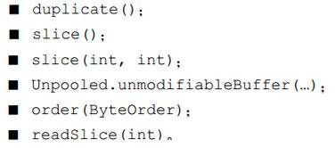
	- 上述方法都将返回一个新的 ByteBuf 实例，它具有自己的读索引、写索引和标记索引，但实际内容也是共享的
	-  copy()方法则返回一个全新的副本，内容不共享
- 读/写操作
	- get()和 set()操作，read()和 write()操作API表

### 5.4 ByteBufHolder 接口

除了实际的数据负载之外， 还可以存储各种属性值

### 5.5 ByteBuf 分配内存

- 按需分配： ByteBufAllocator 接口					
	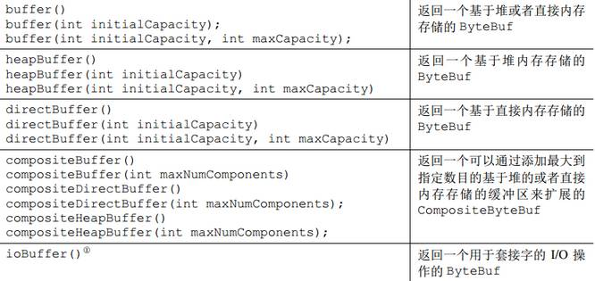
	- 每个Channel或ChannelHandlerContext都可以获取到一个ByteBufAllocator
	- 有池化PooledByteBufAllocator和非池化UnpooledByteBufAllocator两种实现，默认是池化；不池化时，每次分配都会返回一个新的 ByteBuf 实例
- Unpooled 缓冲区
	- 当获取不到ByteBufAllocator 的引用时，可以使用Unpooled工具类创建未池化的 ByteBuf实例
- ByteBufUtil 类
	- 提供了用于操作 ByteBuf 的静态的辅助方法，比如以十六进制的表示形式打印 ByteBuf 的内容；判断两个 ByteBuf 实例的相等性

### 5.6 引用计数

类似JVM的引用计数，无引用时 ByteBuf 被释放，用于池化技术，降低了内存分配的开销
（.....）

# 6. ChannelHandler和ChannelPipeline

### 6.1 ChannelHandler 家族

- Channel 的生命周期									
	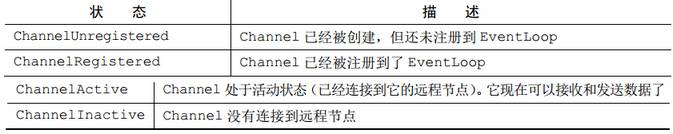 
	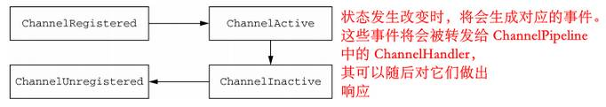
- ChannelHandler 的生命周期								
	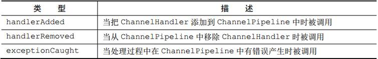 
- ChannelInboundHandler 接口					
	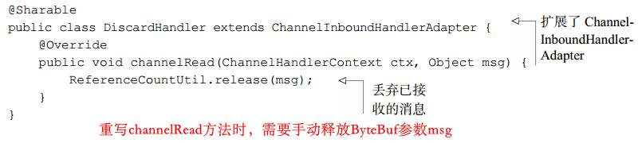 
	- API 见书
	- 而	直接继承SimpleChannelInboundHandler类不用在channelRead0()方法中手动释放资源，会自动释放 
- ChannelOutboundHandler 接口
	- API 见书
	- ChannelPromise与ChannelFuture：ChannelOutboundHandler中的大部分方法都需要一个ChannelPromise参数，以便在操作完成时得到通知。 ChannelPromise是ChannelFuture的一个子类，其定义了一些可写的方法，如setSuccess()和setFailure()
- ChannelHandler 适配器
	- ChannelInboundHandlerAdapter 和 ChannelOutboundHandlerAdapter 提供了 ChannelInboundHandler和 ChannelOutboundHandler 的基本实现，类似HTTPServlet
- 资源管理					
	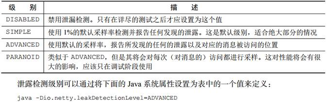
	- 若有内存泄露，则会在日志中体现出来
	- 在ChannelInboundHandler.channelRead()和 ChannelOutboundHandler.write()需要手动释放资源避免内存泄漏

### 6.2 ChannelPipeline 接口
Channel 和ChannelPipeline的对应是一对一的，这种对应关系是永久性的，不可变的

在 ChannelPipeline 传播事件时，它会测试 ChannelPipeline 中的下一个 ChannelHandler 的类型是否和事件的运动方向相匹配。如果不匹配， ChannelPipeline 将跳过该ChannelHandler 并前进到下一个，直到它找到和该事件所期望的方向相匹配的为止

- 修改 ChannelPipeline					
	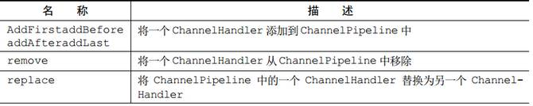
	- 以及一些访问ChannelHandler的操作
- 触发事件
	- 调用ChannelPipeline中相关API时，就会触发链上的下一个ChannelHandler的相应方法被调用

### 6.3 ChannelHandlerContext 接口
代表了 ChannelHandler 和 ChannelPipeline 之间的关联，每当有 ChannelHandler 添加到 ChannelPipeline 中时，都会创建 ChannelHandlerContext；管理它所关联的 ChannelHandler 和在同一个 ChannelPipeline 中的其他 ChannelHandler 之间的交互

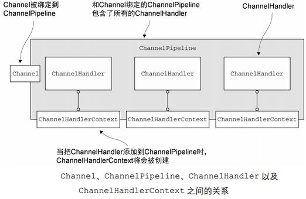

- ChannelHandlerContext中方法与 Channel 、 ChannelPipeline中该方法的不同：
	- 调用 Channel 或者 ChannelPipeline 上的这些方法，将沿着整个 ChannelPipeline 进行传播；调用ChannelHandlerContext上的相同方法，则将从当前所关联的 ChannelHandler 开始，并且只会传播给位于该ChannelPipeline 中的下一个能够处理该事件的 ChannelHandler
-  ChannelHandlerContext API 见书
-  ChannelHandlerContext 和 ChannelHandler 之间的关联是永远不会改变的，所以缓存对它的引用是安全的
-  ChannelHandlerContext的方法产生更短的事件流，性能更高

事件的传播：							
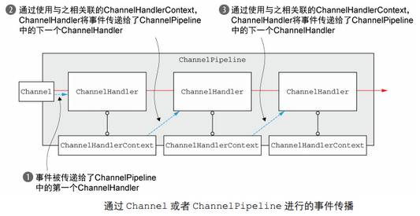

想调用从某个特定的 ChannelHandler 开始的处理过程，必须获取到在该 ChannelHandler 之前的 ChannelHandler 所关联的 ChannelHandlerContext。这个 ChannelHandlerContext 将调用和它所关联的 ChannelHandler 之后的 ChannelHandler,如：
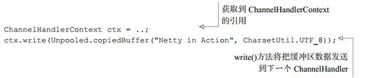
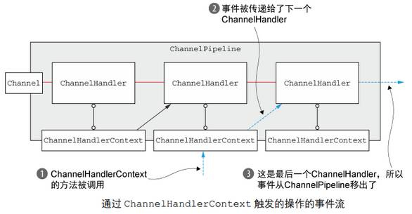

- ChannelHandler 和 ChannelHandlerContext 的高级用法
	- 将 ChannelHandler 添加到 ChannelPipeline 中来实现动态的协议切换
	- 存储ChannelHandlerContext 的引用以供稍后使用：
		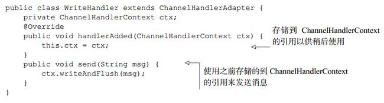
		- ChannelHandler 可能从属于多个ChannelPipeline，所以也可能与多个ChannelHandlerContext关联，这种ChannelHandlerContext的用法必须指定ChannelHandler为@Sharable，但是不能拥有状态，即不能（否则线程不安全，除非手动同步）：
		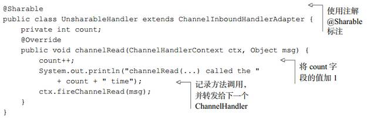

### 6.4 异常处理

- 处理入站异常
	- 如果在处理入站事件的过程中有异常被抛出，那么它将从它在 ChannelInboundHandler 里被触发的那一点开始流经 ChannelPipeline（ChannelHandler.exceptionCaught()的默认实现是简单地将当前异常转发给ChannelPipeline 中的下一个 ChannelHandler），重写exceptionCaught方法来捕获（通常放在pipe链的最后来实现，确保所有异常都能捕获到）
	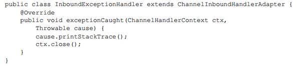
- 处理出站异常
	- 直接将监听器加到出站操作返回的ChannelFuture上：
	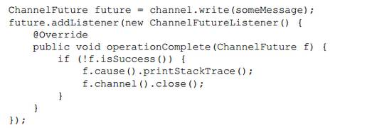
	- 将监听器加到ChannelOutboundHandler的ChannelPromise参数上：
	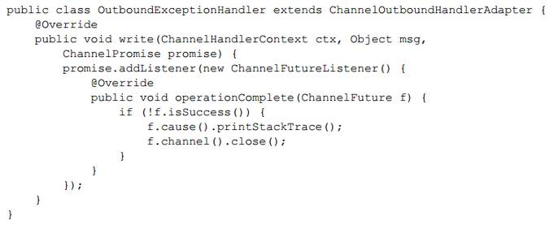

# 7. EventLoop 和线程模型

### 7.1 线程

池化和重用线程相对于简单地为每个任务都创建和销毁线程是一种进步，但是它并不能消除由上下文切换所带来的开销

### 7.2 EventLoop 接口

- EventLoop即事件循环，基本思想为：		
	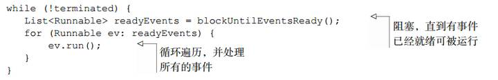
- EventLoop类层次结构
	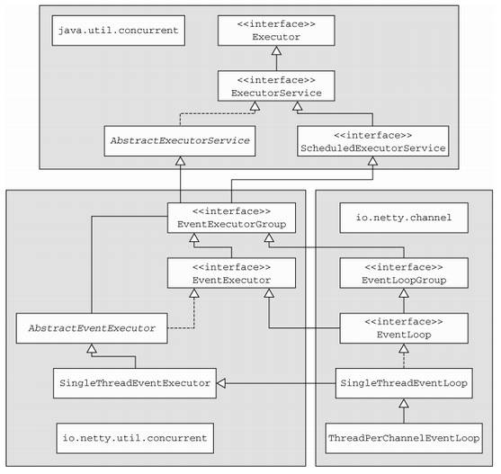
	- 一个 EventLoop 将由一个永远都不会改变的 Thread 驱动
	- 单个 EventLoop 可能会被指派用于服务多个 Channel
- 在Netty 4 中， 所有的I/O操作和事件都由已经被分配给了 EventLoop的那个Thread来处理（Netty 3中并没有这种保证，所以有在多个 ChannelHandler 中进行同步的需要）

### 7.3 任务调度

- Netty之外，定时任务可用Timer类和ScheduledExecutorService（见《JAVANIO》）来实现
	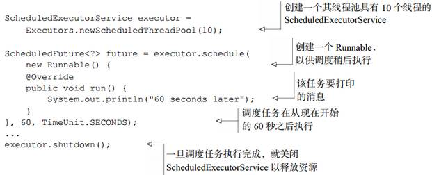
- EventLoop 调度任务
	- EventLoop同样有schedule()和scheduleAtFixedRate()方法，用于调度任务

### 7.4 实现细节

- 线程管理	
	- EventLoop执行逻辑：						
	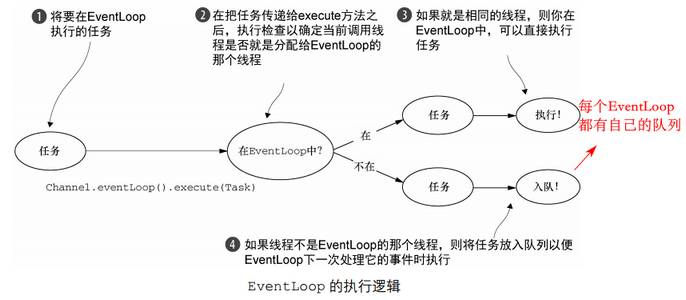
- EventLoop/线程的分配
	- 异步传输					
	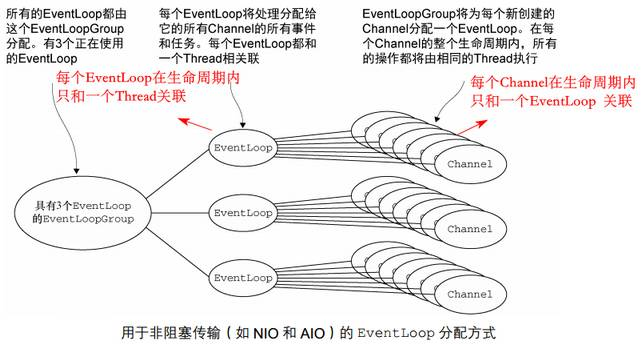
	- 阻塞传输				
		- BIO中，每个Channel都有一个独自的EventLoop:
			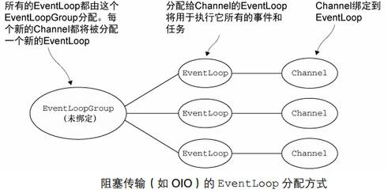

# 8. 引导

### 8.1 Bootstrap 类
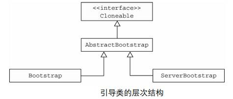
- Clonable接口允许在一个已经配置完成的引导类实例上调用clone()方法将返回另一个可以立即使用的引导类实例（浅拷贝）

完整声明：				
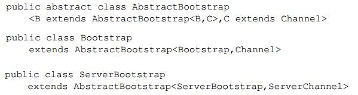

### 8.2 引导客户端和无连接协议

Bootstrap 类 API 见书

- 引导客户端								
	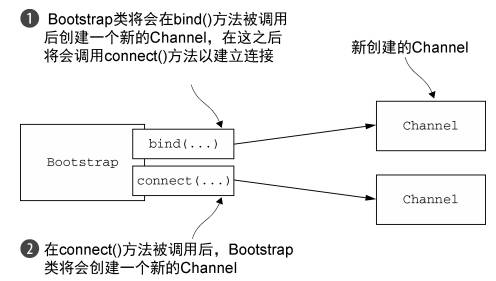 
	- Channel 和 EventLoopGroup 的兼容性（不能混用具有不同前缀的组件，如 NioEventLoopGroup 和 OioSocketChannel）
	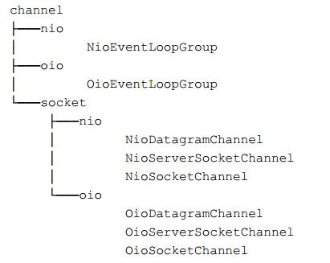 
	- 在引导的过程中，在调用 bind()或者 connect()方法之前，必须先调用group()、channel()/channelFactory()、handler()，三者缺一不可，否则抛异常

### 8.3 引导服务器
ServerBootstrap 类 API 见书

- 引导服务器							
	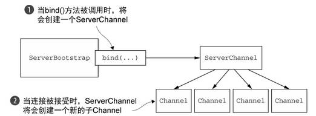 

### 8.4 从 Channel 引导客户端

如代理服务器，就需要在一个连接中再发起一个客户端连接：
通过将已被接受的子 Channel 的 EventLoop 传递给 Bootstrap 的 group()方法来共享该 EventLoop。因为分配给 EventLoop 的所有 Channel 都使用同一个线程，所以这避免了额外的线程创建
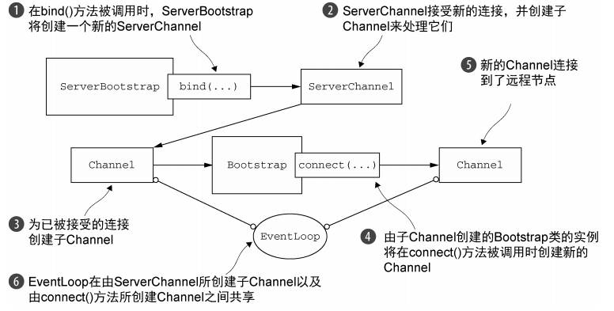

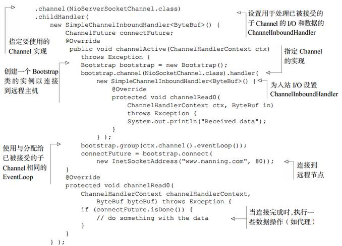

- 上述解决方案都反映了编写 Netty 应用程序的一个一般准则：尽可能地重用 EventLoop，以减少线程创建所带来的开销

### 8.5 在引导过程中添加多个 ChannelHandler

ChannelInitializer 类，实现initChannel方法，获取Pipeline，加入handler；在该方法返回之后， ChannelInitializer 的实例将会从 ChannelPipeline 中移除它自己

### 8.6 Netty 的 ChannelOption 和属性
(....)略

### 8.7 引导 DatagramChannel
(....)略

### 8.8 关闭 

EventLoopGroup.shutdownGracefully()方法安全关闭
