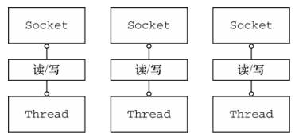
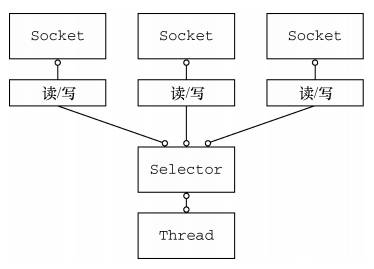
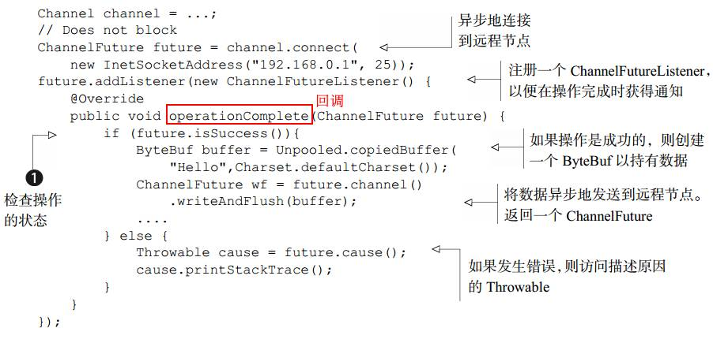
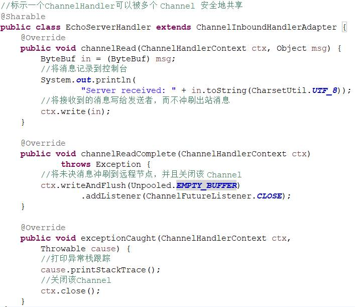
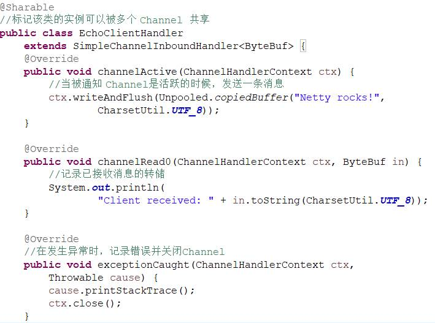
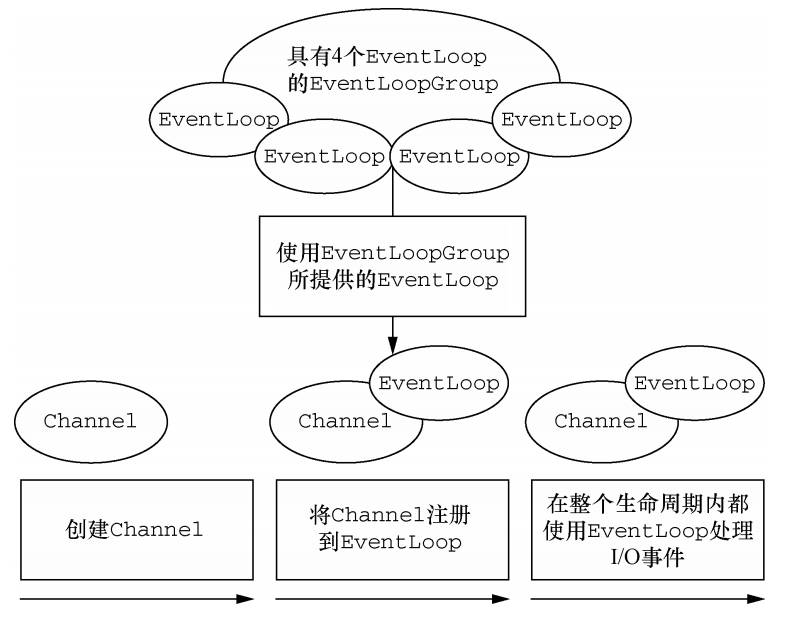

# 1. Netty 异步和事件驱动

### 1.1 Java 网络编程
		

传统的阻塞函数接口只能同时处理一个连接，要管理多个并发客户端，需要为每个新的客户端Socket创建一个新的 Thread，缺点：
- 大量线程处于休眠状态，资源浪费
- 每个线程都需要栈内存，内存浪费
- 上下文切换开销

非阻塞函数，即java.nio类库，搭配选择器selector 		

- 使用较少的线程就可以处理许多连接
- 没有IO时，线程也可以处理其他任务

### 1.2 Netty 简介
设计核心思想：
- 非阻塞网络调用使得我们可以不必等待一个操作的完成。完全异步的 I/O正是基于这个特性构建的，并且更进一步：异步方法会立即返回，并且在它完成时，会直接或者在稍后的某个时间点通知用户
- 选择器使得我们能够通过较少的线程便可监视许多连接上的事件

Netty 完全是异步和事件驱动的

### 1.3 Netty 核心组件

- Channel
- 回调
	- 一个方法，传给调用者，在一定时刻会被调用
- Future
	- 另一种在操作完成时通知应用程序的方式
	- Netty自己实现了ChannelFuture
	- 每个 Netty 的出站 I/O 操作都将返回一个 ChannelFuture，是异步的
	
- 事件和 ChannelHandler
	- 可以认为每个 ChannelHandler 的实例都类似于一种为了响应特定事件而被执行的回调

# 2. 使用Netty

### 2.3 Echo 服务器
- 至少两部分：
	- ChannelHandler：业务处理
	- 引导：服务器的启动代码
- ChannelHandler 实现业务逻辑
	- 实现 ChannelInboundHandler 接口响应入站事件（有点类似jetty），简单的响应继承ChannelInboundHandlerAdapter 类即可
	- 重要方法：
		- channelRead()，对于每个传入的消息都要调用
		- channelReadComplete()，通知ChannelInboundHandler最后一次对channelRead()的调用是当前批量读取中的最后一条消息
		- exceptionCaught()，在读取操作期间，有异常抛出时会调用
		
	- ChannelHandler的实现类很多，主要思想：
		- 针对不同类型的事件来调用 ChannelHandler
		- 实现或者扩展 ChannelHandler 来挂钩到事件的生命周期，并且提供自定义的应用程序逻辑
		- ChannelHandler 有助于保持业务逻辑与网络处理代码的分离
- 引导
	- 绑定到服务器将在其上监听并接受传入连接请求的端口
	- 配置 Channel，以将有关的入站消息通知给 EchoServerHandler 实例
	- 具体步骤：
		- 创建一个 ServerBootstrap 的实例以引导和绑定服务器
		- 创建并分配一个 NioEventLoopGroup 实例以进行事件的处理，如接受新连接以及读/写数据
		- 指定服务器绑定的本地的 InetSocketAddress
		- 使用一个 EchoServerHandler 的实例初始化每一个新的 Channel
		- 调用 ServerBootstrap.bind()方法以绑定服务器

### 2.4 Echo 客户端

- ChannelHandler 实现业务逻辑
	- 继承SimpleChannelInboundHandler类
		- channelActive()——在到服务器的连接已经建立之后将被调用
		- channelRead0()——当从服务器接收到一条消息时被调用
		- exceptionCaught()——在处理过程中引发异常时被调用
		
- 引导
	- 类似服务端：
		- 为初始化客户端， 创建了一个 Bootstrap 实例
		- 为进行事件处理分配了一个 NioEventLoopGroup 实例， 其中事件处理包括创建新的连接以及处理入站和出站数据
		- 为服务器连接创建了一个 InetSocketAddress 实例
		- 当连接被建立时，一个 EchoClientHandler 实例会被安装到（该 Channel 的）ChannelPipeline 中
		- 在一切都设置完成后，调用 Bootstrap.connect()方法连接到远程节点

# 3. Netty 的组件和设计

### 3.1 Channel EventLoop 和 ChannelFuture

Channel—Socket；EventLoop—控制流、多线程处理、并发；ChannelFuture—异步通知

- Channel 接口
	- EmbeddedChannel
	- LocalServerChannel
	- NioDatagramChannel
	- NioSctpChannel
	- NioSocketChannel
- EventLoop 接口
	
	- 一个 EventLoopGroup 包含一个或者多个 EventLoop
	- 一个 EventLoop 在它的生命周期内只和一个 Thread 绑定
	- 所有由 EventLoop 处理的 I/O 事件都将在它专有的 Thread 上被处理
	- 一个 Channel 在它的生命周期内只注册于一个 EventLoop
	- 一个 EventLoop 可能会被分配给一个或多个 Channel
- ChannelFuture 接口
	- addListener()添加回调函数通知操作完成 

### 3.2 ChannelHandler 和 ChannelPipeline

- ChannelHandler充当了所有处理入站和出站数据的应用程序逻辑的容器,业务逻辑基本写在其中
- ChannelPipeline 接口
	- 提供了 ChannelHandler 链的容器，并定义了用于在该链上传播入站和出站事件流的 API。当 Channel 被创建时，它会被自动地分配到它专属的 ChannelPipeline
	- ChannelHandler处理业务，将数据传递给链中的下一个 ChannelHandler。执行顺序是由被添加的顺序所决定的
	- 对入站事件来说，数据从链的头部开始流动；出站则相反
	- 数据只会在具有相同定向类型的两个 ChannelHandler 之间传递
	- 出站数据两种方式：
		- 直接写到 Channel 中，从链的尾部开始流动
		- 写到和 ChannelHandler相关联的ChannelHandlerContext对象中，数据从下一个 ChannelHandler 开始流动
- 编码器和解码器
	- 是	ChannelHandler的子类，用于接发数据前后加解码
	- 对入站数据来说，channelRead已经被重写了，其中调用了decode()进行解码，并将已解码的字节转发给下一个ChannelInboundHandler；出站则相反
- SimpleChannelInboundHandler
	-  