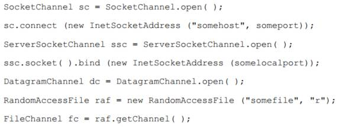

[TOC]

# 3. 通道
### 3.1 通道基础

- Channel接口
	- isOpen()方法和close()方法
- 打开通道
	- File I/O和Stream I/O分别对应一个 FileChannel 类和三个 socket 通道类： SocketChannel、 ServerSocketChannel 和 DatagramChannel
	- Socket通道可以直接创建，File通道只能通过打开的文件流对象调用 getChannel( )方法来创建	
		
- 使用通道
	- 一个 channel 类可能实现定义read( )方法的 ReadableByteChannel 接口，或者实现 WritableByteChannel 接口以提供 write( )方法。实现这两种接口其中之一的类都是单向的
	- ByteChannel 接口的通道会同时实现 ReadableByteChannel 和 WritableByteChannel 两个接口，所以此类通道是双向的
	- read() 和 write()方法使用 ByteBuffer 对象作为参数。返回已传输的字节数，可能比缓冲区的字节数少甚至可能为零。缓冲区的“位置”也会发生与已传输字节相同数量的前移。如果只进行了部分传输，缓冲区可以被重新提交给通道并从上次中断的地方继续传输。该过程重复进行直到缓冲区的 hasRemaining()方法返回false值
- 关闭通道
	- 第一次调用close()，会导致在通道关闭底层I/O服务的过程中线程暂时阻塞（同步关闭）
	- 可以在一个已关闭的通道上调用close()方法，会立即返回
	- InterruptibleChannel 接口
		- 一个线程在一个通道上被阻塞并且同时被中断，通道将被关闭，产生一个 ClosedByInterruptException 异常
		- 可异步关闭（通道被另外一个线程关闭，该线程产生一个AsynchronousCloseException 异常)

### 3.2 Scatter Gather
也称矢量IO

- 通道的Gather：
	- 对于write操作而言，数据是从几个缓冲区按顺序抽取（称为 gather）并沿着通道发送的
- 通道的Scatter：
	- 对于read操作而言，从通道读取的数据会按顺序被散布（称为 scatter）到多个缓冲区

当在一个通道上请求一个Scatter/Gather 操作时，该请求会被翻译为适当的本地调用来直接填充或抽取缓冲区，减少或避免了缓冲区拷贝和系统调用（系统调用不是本地调用，一般的java程序IO翻译成的是系统调用）

- Scatter操作按顺序填每个缓冲区的position-limit区域（若是一个刚创建的Buffer，则相当于从0开始努力填满缓冲区）		
	 
	
- Gather按顺序将每个缓冲区的position-limit区域拼起来，发送给通道		
	
- 将读取到的数据分开存放到多个存储区块或者将不同的数据区块合并成一个整体。操作系统已经被高度优化来完成此类工作了，减少代码编写量

### 3.3 文件通道

- 访问文件				
	
	- 当字节被 read( )或 write( )方法传输时，文件 position 会自动更新。如果 position 值达到了文件大小的值（文件大小的值可以通过 size( )方法返回）， read( )方法会返回一个文件尾条件值（-1）。可是，不同于缓冲区的是，如果实现 write( )方法时position前进到超过文件大小的值，该文件会扩展以容纳新写入的字节（容易造成“文件空洞”）
	- force方法要求文件的所有待定修改立即同步到磁盘（现代文件系统都会缓存数据和延迟磁盘文件更新以提高性能）
- 文件锁定						
	
	- 锁的对象是文件而不是通道或线程，锁最终是由操作系统或文件系统来判优的并且几乎总是在进程级而非线程级上。所以不同线程请求同一文件独占锁会被允许，而不同jvm的进程请求同一文件独占锁才会被阻塞
	- 用返回的FileLock对象进行release，程序模式同ReentrantLock（lock写在try外，release写在finally内）

### 3.4 内存映射文件

由 map( )方法返回的 MappedByteBuffer 对象的行为在多数方面类似一个基于内存的缓冲区，只不过该对象的数据元素存储在磁盘上的一个文件中。对文件的修改会反应到该缓冲区上，比使用常规方法读写高效得多，甚至比使用通道的效率都高。因为不需要做明确的系统调用

如，映射整个文件并返回一个MappedByteBuffer缓冲区：
`buffer = fileChannel.map(FileChannel.MapMode.READ_ONLY, 0, fileChannel.size());`
- 三种模式
	- MapMode.READ_ONLY，只读
	- MapMode.READ_WRITE，读写
	- MapMode.PRIVATE，写时复制。（通过 put( )方法所做的任何修改都会导致产生一个私有的数据拷贝并且该拷贝中的数据只有MappedByteBuffer 实例可以看到；当在一个写时拷贝的缓冲区上调用 put( )方法时，受影响的页会被拷贝，然后更改就会应用到该拷贝中；如果缓冲区还没对某个页做出修改，那么这个页就会反映被映射文件的相应位置上的内容。一旦某个页因为写操作而被拷贝，之后就将使用该拷贝页，并且不能被其他缓冲区或文件更新所修改）
- 关闭相关联的 FileChannel 不会破坏映射，只有丢弃缓冲区对象本身才会破坏该映射
- MappedByteBuffer缓冲区是直接缓冲区，位于JVM堆内存外（直接内存）
	
	
- 其它API											
	
	- 对于映射缓冲区，虚拟内存系统将根据需要把文件中相应区块的数据读进来，而不是读整个文件
	- load(). 将整个文件加载至内存，代价高的操作，会导致大量的页调入。小心使用
	- isLoaded()方法来判断一个被映射的文件是否完全常驻内存了
	- MappedByteBuffer.force()强制将修改更新到磁盘上（MapMode.READ_ONLY 或 **MAP_MODE.PRIVATE模式下均无效**）
- Channel-to-channel 传输
	- 通道直接传输至通道，不需要中间缓冲区
	- 直接的通道传输不会更新与某个 FileChannel 关联的 position 值

### 3.5 Socket 通道

没有为每个 socket 连接使用一个线程的必要了，也避免了管理大量线程所需的上下文交换总开销。借助新的 NIO 类，一个或几个线程就可以管理成百上千的活动 socket 连接了并且只有很少甚至可能没有性能损失

每个 socket 通道（在 java.nio.channels 包中）都有一个关联的 java.net.socket 对象，却并非所有的 socket 都有一个关联的通道

DatagramChannel、 SocketChannel 和ServerSocketChannel都是SelectableChannel的子类

- SelectableChannel的非阻塞模式
	- 通道的configureBlocking()方法指定阻塞还是非阻塞
	- 通道的isBlocking()查看是哪种模式
	- blockingLock()防止模式被修改
- ServerSocketChannel
	- 与java.net.ServerSocket执行相同的基本任务，不过它增加了通道语义，因此能够在非阻塞模式下运行
	
- SocketChannel（流Socket，面向流）
	- 每个 SocketChannel 对象创建时都是同一个对等的 java.net.Socket 对象串联的
	- 静态的 open( )方法可以创建一个新的 SocketChannel 对象
	- 新创建的 SocketChannel 虽已打开却是未连接的。在一个未连接的 SocketChannel 对象上尝试一个 I/O 操作会导致 NotYetConnectedException 异常
	
	- 同ServerSocketChannel，SocketChannel也能在非阻塞模式下调用connect()。而在传统的Socket下只能阻塞地调用connect
	- 异步连接示例：								
		
- DatagramChannel（数据报Socket，面向数据报）
	- 面向UDP，无连接，所以可以随时发送给任意地址，并接受任意地址的数据
	- 接受函数receive()返回接受到的字节数，若提供的接收字节缓冲区不够，则多余的字节会被悄悄丢弃
	- 发送函数send()函数返回的字节数要么是将要发送的数据报长度，要么是0；即要么一次性将整个数据报都发送出去（只是加入了本地传输队列，UDP没有可靠性），要么是传输队列空间不够了，不能发送该数据报
	- 数据报可能在IP层被分组（受MTU限制），数据报越大，分组越多，丢包概率越高；一旦某个分组丢失，整个数据报都会被丢弃
	- DatagramChannel的connect()方法只是在代码层面上限制源目地址，并不代表UDP的连接；此时发送接收数据报可以使用read()和write()方法
- 使用DatagramChannel场景：
	- 可以承受数据丢失或无序的数据
	- 数据吞吐量比可靠性更重要
	- 需要同时发送数据给多个接受者（多播或者广播）
	- 数据更面向数据报

### 3.6 管道

在jvm线程之间传递数据

### 3.7 通道工具类

略

# 4. 选择器

### 4.1 选择器基础

1. 注册通道到选择器中，选择键会和通道对应起来
2. 选择器的select()方法会更新选择键的状态，检查所有被注册的通道
3. 获取键的集合，遍历，选择已经就绪（有更多字节可以读取；有新的可以接受的连接等）的键进行处理

- 选择器的意义：
	- 与非阻塞轮询不同，利用非阻塞轮询来检查是否就绪是昂贵的：
		- 非阻塞轮询会在检查的同时进行任务处理
		- 每次轮询都会进行系统调用
		- 不是原子性的
		- 需要不断遍历
	- 所以为了降低性能消耗，传统的socket都是阻塞的； 这事实上将每个被阻塞的线程当作了 socket 监控器，并将 Java 虚拟机的线程调度当作了通知机制
- Selector，SelectableChannel和SelectionKey
	- FileChannel不是SelectableChannel，所有的socket通道都是SelectableChannel
	- 一个通道可以被注册到多个选择器上，但对每个选择器而言只能被注册一次
	- 非阻塞特性与多路执行特性的关系是十分密切的，以至于 java.nio 的架构将两者的 API都放到了SelectableChannel类中
	- 通道在被注册到一个选择器上之前，必须先设置为非阻塞模式
	- 通道和选择器的注册关系都被封装在一个 SelectionKey 对象中
- 建立Selector
	
	- 当不再使用它时，需要调用 close()方法来释放它可能占用的资源并将所有相关的选择键设置为无效

### 4.2 使用选择键

### 4.3 使用选择器

- 选择过程
	- keys(). 返回所有已注册的键，但返回的键并不一定都是有效的
	- selectedKeys(). 已经就绪好的键的集合
	- cancelledKeys(). 已经取消的键的集合，包含了 cancel( )方法被调用过的键（但还未被注销）
	- select()方法被调用时：
		1. cancelledKeys集合将会被检查。 将这些键从selector中移除，进行注销，并将cancelledKeys集合清空
		2. 注册的键的 interest 集合被检查，确定是否就绪，更新键的ready集合
		3. 步骤2完成后，步骤1会被重新执行一次
		4. select方法返回值不是已准备好的通道的总数，而是从上一个 select( )调用之后进入就绪状态的通道的数量（即返回的是增量不是全量）
	- select方法三种模式对应阻塞、超时阻塞和非阻塞，阻塞模式等待直到至少有一个通道就绪（即使通道是非阻塞的）
- 停止选择过程
	- wakeup()方法，唤醒最近一次在 select()方法中等待的线程。如果当前没有在进行中的选择，那么下一次对 select( )方法的调用将立即返回
	- close()方法。任何一个在选择操作中阻塞的线程都将被唤醒；与选择器相关的通道将被注销， 而键将被取消
	- 线程被中断
- 管理选择键
	- 一旦一个键处于已选择的键的集合中，这个键的 ready 集合将只会被设置（即只增不减），而不会被清理；但是，当键不在已选择的键的集合中并且有操作就绪时，键的 ready 集合就会被清空重新被设置，所以，清理一个 SelectKey 的 ready 集合的方式是将这个键从已选择的键的集合中移除（键不会被自动从已选择的键的集合中移除）
	- 所以，通常的使用步骤是：
		- 在选择器上调用一次 select 操作
		- 遍历 selectKeys( )方法返回的键的集合
		- 按顺序进行检查每个键，对关联的通道进行处理
		- 将已经处理的键从已选择的键的集合中移除
		- 循环上述步骤
		
- 并发性
	- 选择器类是线程安全的，但是键集合类(Set类)不是，需要手动加锁

### 4.4 异步关闭能力
- 一个特定的键的集合中的一个键的存在并不保证键仍然是有效的，也不保证它相关的通道仍然是打开的
- 使用失效的键会抛出异常

### 4.5 选择过程的可扩展性

- 想要使用更多的线程来处理业务，避免使用多个选择器来处理就绪选择；执行就绪选择开销不大，一个线程足够
- 更好的策略是对所有的可选择通道使用同一个选择器，并将对就绪通道的服务委托给其他线程，使用一个协调好的工作线程池来处理数据业务
	- 这种方法需要注意一点：由于数据处理在另一个线程中，所以在就绪选择线程中，执行选择过程的线程将重新循环并几乎立即再次调用 select()，所以就要求在开辟新的线程处理数据之前，将 interest（感兴趣的操作）从interest状态中移除，防止选择器重复地调用。当工作线程结束为通道提供的服务时，将 interest 重新放到状态中，并在选择器上显式地调用 wakeup( )
- 当某些通道要求比其他通道更高的响应速度，可以通过使用两个选择器来解决：一个为命令连接服务，另一个为普通连接服务；而数据业务依然使用线程池来处理
