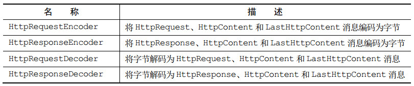

[TOC]

# 10. 编解码器框架

### 10.2 解码器

#### 抽象类 ByteToMessageDecoder 

会对入站数据进行缓冲直到准备好处理

举例，将字节流数据转换成int型数据：

消息被编解码后会被自动释放，用ReferenceCountUtil.retain 来保持引用

#### 抽象类 ReplayingDecoder 

继承自ByteToMessageDecoder ，实现了自定义的ReplayingDecoderByteBuf ，会在其内部自动调用readableBytes ()方法

如果使用 ByteToMessageDecoder 不会引入太多的编码复杂性，那么请使用它（效率更高）；否则，请使用 ReplayingDecoder 

#### 抽象类 MessageToMessageDecoder 

对象到对象的转换

#### TooLongFrameException 类 

对缓冲区的最大字节数进行限制

### 10.3 编码器

解码器在decode方法内将 `ByteBuf` 转换成 `List<Object>`

同理，MessageToByteEncoder 编码器在encode方法内将 `Object` 转换成 `ByteBuf`

MessageToMessageEncoder 类似

### 10.4 抽象的编解码器类 

编解码器在同一个类中，如抽象类 ByteToMessageCodec 和 MessageToMessageCodec。但这会造成一定程序的重用性影响，通过CombinedChannelDuplexHandler 类 将单独的编码器和解码器结合，可以解决此问题 

# 11. 预置的ChannelHandler和编解码器

### 11.1 SSL/TLS

### 11.2 HTTP/HTTPS

以上的编解码器（包括HttpClientCodec或者HttpServerCodec）都不会自动将内容进行聚合，需要手动合并。利用HttpObjectAggregator类可以进行自动聚合

HttpContentDecompressor 和HttpContentCompressor 对HTTP内容进行压缩

HTTPS 即在HTTP编解码器前加入SslHandler

### 11.3 空闲的连接和超时

IdleStateHandler 测试节点存活举例：

- IdleStateHandler 将会使用一个IdleStateEvent 事件来调用 fireUserEventTriggered()方法 
- HeartbeatHandler 实现了 userEventTriggered()方法，如果这个方法检测到 IdleStateEvent 事件 ，将会发送心跳消息，并且添加一个将在发送操作失败时关闭该连接的 ChannelFutureListener 

### 11.4 基于分隔符和长度的解码

分割之后，每次传入ChannelInboundHandler 的消息就只是一帧，而不是未处理过的字节流

基于长度的解码类似，按照字节长度来进行划分，同理

### 11.5 写大型数据

### 11.6 序列化数据

