- [6. ICMP Internet控制报文协议](#6-icmp-internet控制报文协议)
	- [6.2 ICMP报文的类型](#62-icmp报文的类型)
	- [6.3 ICMP地址掩码请求与应答](#63-icmp地址掩码请求与应答)
	- [6.4 ICMP时间戳请求与应答](#64-icmp时间戳请求与应答)
	- [6.5 ICMP端口不可达差错](#65-icmp端口不可达差错)
	- [6.6 ICMP报文的BSD处理](#66-icmp报文的bsd处理)
- [7. Ping程序](#7-ping程序)
	- [7.2 Ping程序](#72-ping程序)
	- [7.3 IP记录路由选项](#73-ip记录路由选项)
	- [7.4 IP时间戳选项](#74-ip时间戳选项)
	- [习题](#习题)
- [8. Traceroute程序 ](#8-traceroute程序-)
	- [8.2 Traceroute程序的操作](#82-traceroute程序的操作)
	- [8.3 局域网输出](#83-局域网输出)
	- [8.4 广域网输出](#84-广域网输出)
	- [8.5 IP源站选路选项](#85-ip源站选路选项)
	- [习题](#习题)
- [9. IP选路](#9-ip选路)
	- [9.2 选路的原理](#92-选路的原理)
	- [9.3 ICMP主机与网络不可达差错](#93-icmp主机与网络不可达差错)
	- [9.4 主机配置成路由器](#94-主机配置成路由器)
	- [9.5 ICMP重定向差错](#95-icmp重定向差错)
	- [9.6 ICMP路由器发现报文](#96-icmp路由器发现报文)
	- [习题](#习题)
- [10. 动态选路协议](#10-动态选路协议)
	- [10.2 动态选路](#102-动态选路)
	- [10.3 Unix选路守护程序](#103-unix选路守护程序)
	- [10.4 RIP选路信息协议](#104-rip选路信息协议)
	- [10.5 RIP版本2](#105-rip版本2)
	- [10.6 OSPF开放最短路径优先](#106-ospf开放最短路径优先)
	- [10.7 BGP边界网关协议](#107-bgp边界网关协议)
	- [10.8 CIDR无类型域间选路](#108-cidr无类型域间选路)
	- [习题](#习题)

# 6. ICMP Internet控制报文协议

- ICMP报文是在IP数据报内部传输的，如图：			
	
- ICMP报文的格式如图：					
	

### 6.2 ICMP报文的类型

- 不同类型的ICMP报文由类型字段和代码字段共同决定，分为查询和差错报文
- ICMP差错报文始终包含IP首部和产生ICMP差错报文的IP数据报的前8个字节
- 不会产生ICMP差错报文的情况：
	- ICMP差错报文（ICMP查询报文是可能产生差错报文的）
	- 目的地址是广播或多播地址的IP数据报
	- 链路层广播的数据报
	- 不是IP分片的第一片
	- 源地址不是单个主机的数据报（零地址、环回地址、广播多播地址）

### 6.3 ICMP地址掩码请求与应答

ICMP地址掩码请求用于**无盘系统**在引导过程中获取自己的子网掩码。与RARP类似，系统会广播ICMP地址掩码请求，收到的应答正常情况下是单播的

- ICMP地址掩码请求与应答报文格式如图：				
	
- 广播ICMP请求的发送主机也会发送一份拷贝到本机的环回接口，这就是广播的定义
- 向本机地址和环回地址发送地址掩码请求时，返回的地址掩码对应的都是环回地址(127.0.0.1)

### 6.4 ICMP时间戳请求与应答

向另一个系统查询当前的时间，时间精度是毫秒级别。报文格式类似地址掩码报文：
	

- 用途举例：
	- 用于同步主机的时间戳。可以根据请求报文RTT（往返时间）、请求报文发送时间戳和接收时间戳来确定主机间的时间差距
- 还可以通过telnet登录其它主机，运行daytime服务程序获取其它主机的时间

### 6.5 ICMP端口不可达差错

- 用tftp生成一个端口不可达报文：			
	
	- tcpdump查看报文的交换过程：				
		
	- ICMP报文是在主机之间交换（体现IP层），UDP报文是在端口之间交换

- 端口不可达报文格式如图：				
	
	
	- ICMP端口不可达报文中，UDP首部包含了原UDP报文目的端口和源端口。目的端口用于告知哪个端口不可达，源端口用于源主机由内核确定将此ICMP报文交给哪个用户进程处理（因为ICMP只在IP层，具体到用户进程需要端口信息）
	- 可观察到tftp程序在25秒后才提示传输失败，其间重传了5次UDP数据报，因为内核在收到ICMP后没有通知tftp用户进程

### 6.6 ICMP报文的BSD处理

不同系统对ICMP报文的处理是不同的，反应到的是在用户进程层面上的处理不同

###习题

1. 在可能产生ICMP差错报文的条件下，若在局域网上向不存在的端口发送一份广播的UDP数据报，会发生什么

	局域网上所有的主机都可能在同一时刻响应一个ICMP端口不可达的差错报文。这些报文的传输可能发生冲突，可能会造成网络短暂的阻塞、网络不可用

2. 生成一个ICMP端口不可达差错的级别是“必须”、“应该”还是“可能”
	
	应该

3. 略

4. `netstat -s`用于查看每个协议的统计数据

# 7. Ping程序

为了测试另一台主机是否可达。 该程序发送和接收ICMP回显请求和应答

如果Ping不同某台主机，那就不能Telnet或FTP到此主机；若不能Telnet或FTP到某主机，就可以通过Ping程序确定问题出在哪里

Ping服务器一般在内核中实现ICMP的功能

### 7.2 Ping程序

- ICMP回显请求和应答报文格式：			
	
- LAN（局域网）输出：				
	
	
- WAN（广域网）
	- 在广域网上的Ping程序就有可能发生丢失、重复、失序的情况
- SLIP线路
	- 略
- 拨号SLIP链路
	- 略

### 7.3 IP记录路由选项

- Ping程序的-R选项提供记录路由的功能，会在ICMP回显请求中设置IP路由选项（指的是**IP首部中的选项**）。每个处理该数据报的路由器都会把自己的IP放入选项字段中，达到目的端时，将请求中的IP清单复制到应答中，然后在返回的路径中再添加剩余的IP
	- 此方法的主要缺陷：IP首部最长60个字节，固定长度加上路由选项用去23个字节，只剩37个字节，只能存放9个IP地址，远远不足
	- IP路由记录路由器的出口IP地址

- 举例（svr4主机ping至slip主机）：						
	
	- 网络结构及数据报流向如图：			
		
	- `tcpdump -v`可查看带路由选项的输出：
		
- 异常的输出（slip主机ping至aix主机）：
	
	
	- 此例还将引出ICMP重定向的问题

### 7.4 IP时间戳选项

即带有时间戳的IP路由记录，只能记录4对时间戳和IP

### 习题

1. 画以上ping输出的时间线
	
	略

2. 关于SLIP链路报文计算的问题

3. 关于SLIP链路报文计算的问题2

4. 关于压缩SLIP的问题

5. 2.7节中，ping环回地址和本身主机的以太网地址会出现什么不同

	ping环回地址的RTT要比ping本身主机以太网地址的RTT要小（极小差别），因为以太网驱动程序需要时间来判定这个数据报的目的地址是一个本地的主机。 但是他们的数据报都不会经过以太网（见2.7）

# 8. Traceroute程序 

看到IP数据报从一台主机传到另一台主机所经过的路由

为什么不用Ping程序的-R功能：
- 并不是所有的路由器都支持IP路由选项，Traceroute程序对所有的路由器都适用
- 记录路由是单向的选项，发送端设置了之后，接收端不得不返回
- 最主要的，IP首部的空间有限，记录的数目有限

### 8.2 Traceroute程序的操作

- Traceroute程序使用ICMP报文和IP首部中的TTL字段，每个处理数据报的路由器都会将TTL减1
- TTL字段是为了防止数据报在选路时无休止地在网络中流动
- 当路由器收到TTL为0或1的数据报时，路由器（目的主机可以将其交给应用程序）将数据报丢弃，并**返回ICMP超时报文**

所以，Traceroute程序的原理如下：
- 发送一份TTL为1的数据报给目的主机，将被第一个路由器丢弃并返回ICMP报文，ICMP报文包含了路由器的地址信息
- 发送一份TTL为2的数据报给目的主机，获得第二个路由器的信息
- 直至数据报达到目的主机（**程序发送的数据报是UDP数据报，其目的端口号是不可能存在的，所以，只要区分返回的ICMP报文是超时报文还是端口不可达报文，就能判断是否到达目的主机**）

### 8.3 局域网输出

- 在主机svr4上traceroute到主机slip的输出：
	
- tcpdump监测的输出如下：			
	

traceroute程序注意事项：
- 不能保证UDP数据报每次的路由是一致的，如果路由发生变化，traceroute程序会打印新的IP地址
- 不能保证返回的ICMP报文和发送的UDP数据报的路由是一致的（可能导致计算出来的RTT不可靠）
- 记录的是到达路由器的那个接口IP。从A到B运行traceroute和从B到A的结果是不同的

### 8.4 广域网输出

类似局域网

### 8.5 IP源站选路选项

同样，是在IP首部内的选项

源站选路就是由发送者指定路由，有两种形式：
- 严格的源站选路（SSRR）
	- 发送端指明数据报确切的路由，若有路由器在转发时发现指定的下一站不在直连的网络上，就返回ICMP差错报文
- 宽松的源站选路（LSRR）
	- 发送端只指明一个经过的IP地址清单，其任意两个地址之间可以插入其他路由器

源站路由选项格式如图：				
	

运行过程如下：
	

源站选路traceroute程序示例：
- 宽松的源站选路
	- `traceroute -g`可为宽松的源站选路指定一些中间路由器（最多8个路由器，最后一项是目的主机）
		
- 严格的源站选路
	- traceroute -G`可为严格的源站选路指定一些路由器
		
- 利用宽松选路查看往返路由
	- traceroute至本身主机，但是指定必须经过远程的目的主机，就能看到往返的路由路径
		

### 习题

1. 当路由器接收到TTL为0的IP时，又打算将其减1（正常不会出现这种情况），会发生什么

	TTL会被减为255，将继续转发至下一站

2. traceroute程序和Ping程序计算RTT方法的比较

	- tracerroute程序只能在程序内存储发送数据时的时间，因为在ICMP超时差错报文内只有UDP首部，没有时间数据。只能在ICMP数据返回时在程序层面计算下大概的RTT
	- Ping程序在ICMP回显应答内存储了发送回显请求时的时间。在分组失序的情况下，Ping程序的RTT也是正确的
	- Traceroute程序等待上一个请求的应答或超时，才发送下一个请求
	- Ping程序固定每秒发送一个数据报

3. 在traceroute程序中，假设源主机和目的主机中有三个路由器（R1/R2/R3），R2收到一个TTL为1的数据报，将其减1，但错误地将其转发了，会发生什么

	- 程序的第一行输出是正确的，即R1
	- 第二行将会是R3，因为TTL为2的数据报被R2减为0并转发给了R3，由R3返回ICMP超时报文
	- 第三行也是R3，且正确

4. 条件同题3，但是是目的主机发生了错误。错误地将进入的TTL值作为返回的ICMP报文的TTL值，会发生什么

	TTL为4的UDP数据报会以TTL值1到达目的主机，且目的主机会生成ICMP端口不可达报文。但是返回的ICMP报文的TTL值为错误地为1，在返回到达R3时会被丢弃。 所以，traceroute程序不会停止，继续发送TTL为5的UDP数据报，直到发送了TTL为7的报文，才会收到目的主机返回的ICMP报文。 所以，前三行是正确的，中间三行都是超时的，最后一行标识了目的主机

5. 8.5节中，宽松的源站选路的例子中，显示出部分路由器被丢失。若在主机sun和netb之间使用`tcpdump -v`查看返回的各ICMP报文的TTL值，发现netb/butch/Gabby/enss142返回的ICMP超时报文的TTL值分别为255,253,252,249，说明什么

	- 说明路由器默认的将ICMP报文的TTL初始化为255
	- netb和butch之间有一个未察觉的路由器
	- 类似的，其他地方也能看出有一些路由器未被察觉

6. Ping程序`-l`选项（宽松源选路）和`-R`选项（记录路由）

7. Ping程序和Traceroute程序处理同一台主机上的多个实例的不同

	- Ping程序把ICMP回显请求报文的**标识符**字段设为进程ID，并包含在回显应答报文中，每个实例都需要检测此字段，只处理属于自己的那些报文
	- Traceroute程序将UDP首部的**源端口号**设为进程ID，而返回的ICMP报文中包含了UDP首部，以端口号来区分不同进程

# 9. IP选路

IP层处理的简单过程：				
	

### 9.2 选路的原理

搜索路由表优先级：主机地址、网络地址、默认表项。 路由表是选路策略，而路由守护程序提供选路策略

- 简单路由表
	- 命令`netstat -rn`以IP地址形式打印出简单路由表，如图：
		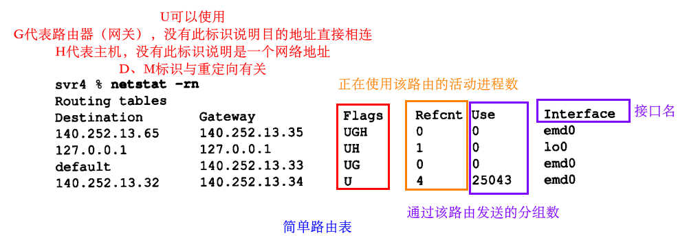
	- 路由器的每个接口都在不同的子网，路由表内能看出各接口的子网掩码
	- 用上图中的路由表举一些分组的例子：
		- 目的地址为140.252.13.33(sun)：主机地址无匹配->网络地址匹配到140.252.13.32项（**是一个直接路由，直接发送至目的端**）
		- 目的地址为140.252.13.65(slip)：匹配到主机地址140.252.13.65项->数据报的目的IP地址为140.252.13.65，目的mac地址为140.252.13.35的mac地址
		- 目的地址为192.207.117.2：均无匹配，使用默认路由
		- 给本机发送数据报：1. `ftp svr4`或`ftp 140.252.13.34`，将匹配到网络地址项140.252.13.32，数据报会先送往以太网驱动程序，而如**2.7节**那样，以太网驱动程序将送回至环回驱动程序；2. `ftp localhost`或`ftp 127.0.0.1`，直接匹配到主机项127.0.0.1，数据报会被直接送到环回驱动程序
- 初始化路由表
	- 关于`route`命令
- 复杂路由表				
	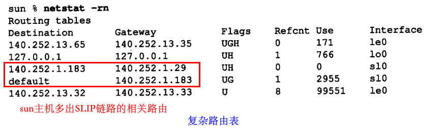

### 9.3 ICMP主机与网络不可达差错

- 路由表无匹配时
	- 若数据报是本机产生的，就给应用程序返回一个不可达差错
	- 若数据报是准备转发的，就给**原发送端**返回ICMP主机或网络不可达差错报文

### 9.4 主机配置成路由器

略

### 9.5 ICMP重定向差错

ICMP重定向用来让选路能力弱的主机逐渐建立更完善的路由表，原理如下：
	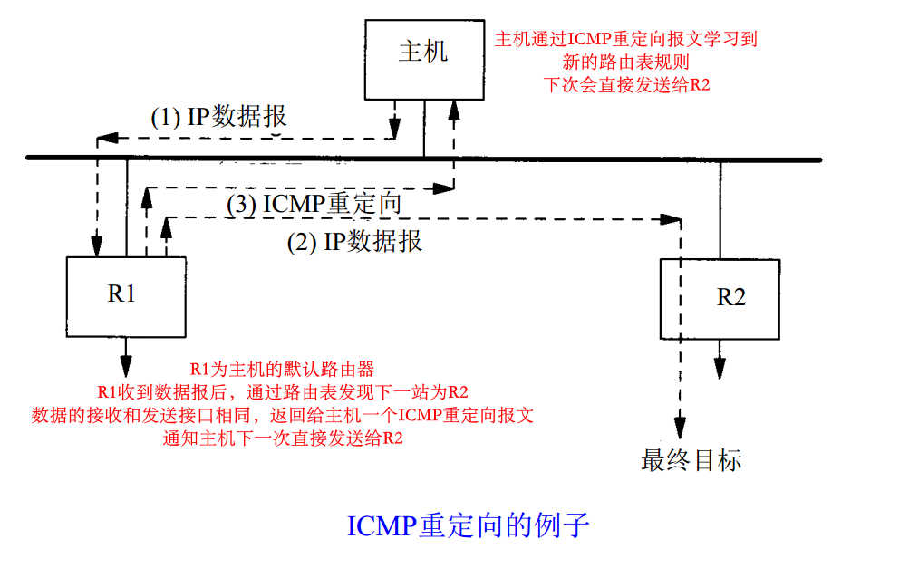

- 举例
	- 主机solaris发送报文之前的路由表：
		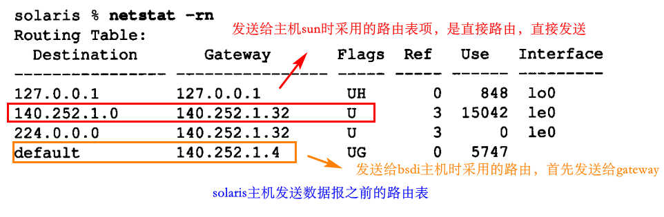
	- 网络结构图：				
		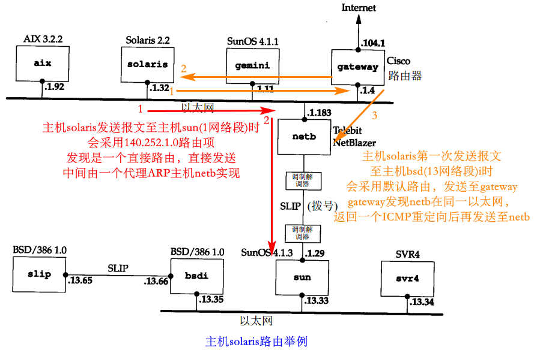
	- 发送数据报：				
		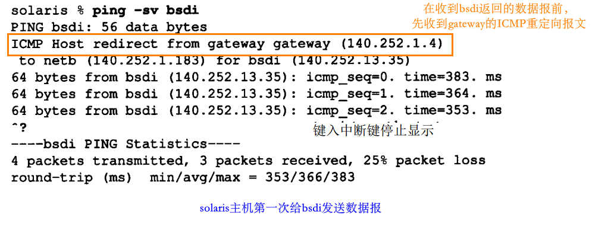
	- 主机solaris发送报文之后的路由表：
		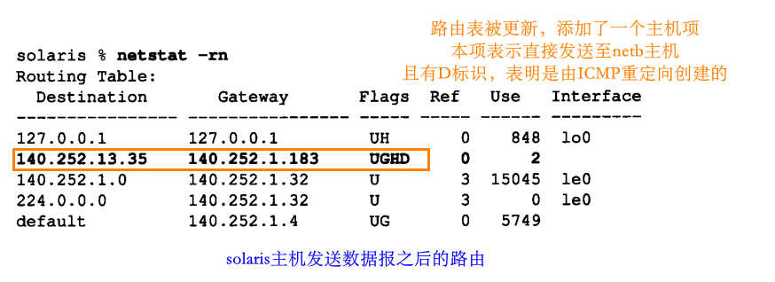
- 重定向报文格式
	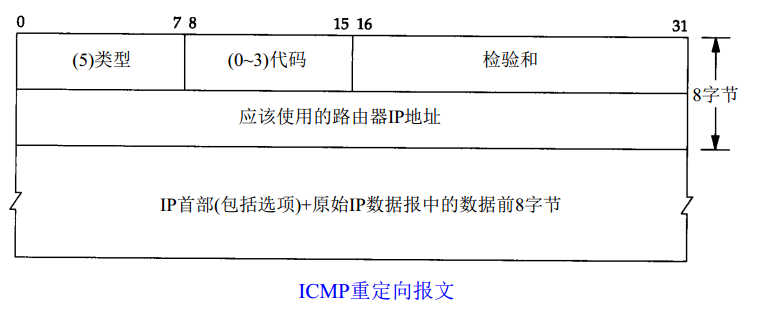
- 重定向报文的一些规则
	- 只能由路由器生成，且是给主机使用的
	- 路由器在生成重定向报文前需满足：
		- 出接口等于入接口
		- 用于向外传送数据报的路由不能被ICMP重定向报文创建或修改过，而且不能是路由器的默认路由
		- 数据报不能用源站选路来转发
		- 内核需允许发送重定向
	- 主机收到重定向报文后，修改路由表前需保证：
		- 新的路由器必须直接相连
		- 重定向报文必须来自之前选择的路由器
		- 重定向报文不能让本机作为路由器
		- 被修改的路由必须是间接路由 

### 9.6 ICMP路由器发现报文

可在配置文件内配置静态路由，用于初始化路由表；另一种初始化的方法是用ICMP路由器通告和请求报文，主机在引导后会广播请求报文，各路由器能响应通告报文；路由器也能定期广播通告报文，使各主机能更新路由表

### 习题

1. 为什么有两类ICMP重定向报文（网络和主机）

	使用网络重定向而不是N个主机重定向能节省路由表空间

2. 在9.2节中，观察svr4主机和sun主机的路由表，如果在svr4路由表中删除140.252.13.65这一项，会发生什么

	删除后，发往140.252.13.65的数据报会选择默认路由，即会发送给sun主机，sun主机又会将数据报转发给140.252.13.35。且此时入接口和出接口相同，会给svr4主机返回一个ICMP重定向报文，故在svr4中删除的那一项会被ICMP重新创建

3. 4.3BSD的主机用140.1.255.255来代表广播地址，4.2BSD的主机用140.1.0.0来代表广播地址，当4.2的主机接收到目的地址为140.1.255.255的数据报时，发生什么

	140.1.255.255的数据报可能是其它主机作为广播数据报发送的，但是4.2BSD主机无法识别该广播地址（故不会把自己当成该数据报的接收方），会试图转发此数据报。故会发送一个ARP请求查询140.1.255.255主机的mac地址，而以太网中并不存在此主机，故收不到ARP应答，数据报会被4.2主机丢弃

4. 接题3，？？？？没看懂

	ARP缓存中有对应条目，就能返回出一个ARP响应？？
	与免费ARP对立？？？(...............)

# 10. 动态选路协议

前面都是静态选路（配置路由表、手动增加路由表、ICMP重定向更新路由表）

### 10.2 动态选路

路由器上的**路由守护程序**会采用选路协议在路由器之间进行通信，在收到其他路由器的信息后对路由表进行动态地更新

自治网络系统的选路协议叫做**内部网关协议IGP**，最常用的是**选路信息协议RIP**

### 10.3 Unix选路守护程序

routed路由守护程序：只使用RIP进行通信
gated路由守护程序：除了RIP外，还支持一些其他通信协议

### 10.4 RIP选路信息协议

- 报文格式 
	- RIP数据报包含在UDP数据报中，如图：		
		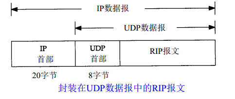
	- IP地址系列的RIP报文格式：				
		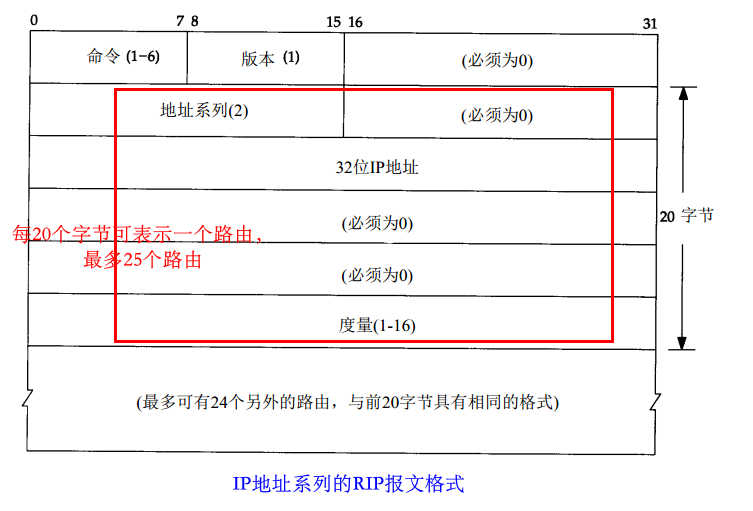
- routed程序运行流程（程序常用UDP 520端口）
	- 初始化：在主机的所有启动的接口上发送请求报文，请求其他路由器的完整路由表，目的UDP端口520
	- 接收到请求：若是完整路由表的特殊请求（度量字段为16），就发送完整路由表；否则，处理请求的表项，然后响应
	- 接收到响应：根据响应报文对路由表进行更新
	- 定期更新：每过30秒，会将完整路由表发送给相邻路由器
	- 触发更新：当一条路由的度量变化时，就发送此条路由的更新，不需要发送整个路由表
	- 某条路由3分钟未更新，度量会被设为16（会触发更新），并标记为删除
- 度量(metric)
	- 代表了路由器与网络之间的跳数，最大为15。（16表示无穷大）
		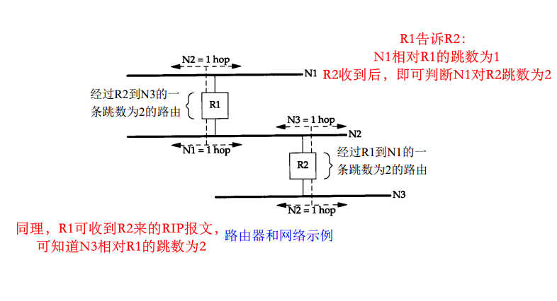
- 缺陷：
	- RIP没有子网概念
	- 路由器故障后，重新建立时可能发生路由环路
	- 路由度量限制了网络大小
- 举例：
	- 主机查询路由表举例（看路由表项的metric值）
	- RIP非主动请求，广播报文举例：
		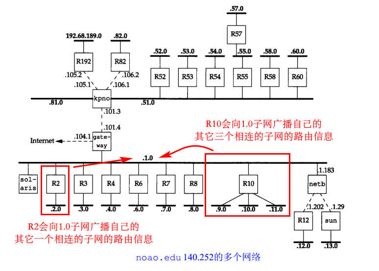
		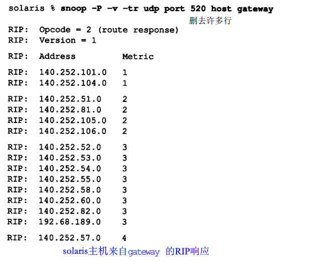

### 10.5 RIP版本2

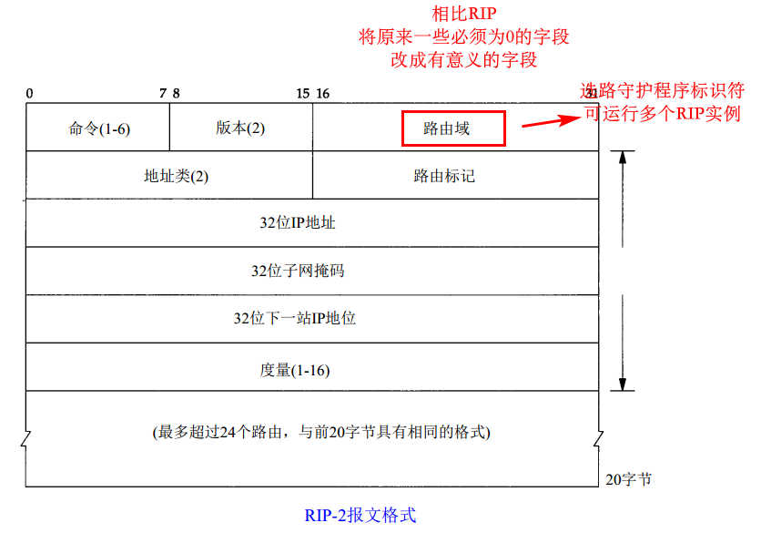

### 10.6 OSPF开放最短路径优先

略

### 10.7 BGP边界网关协议

略

### 10.8 CIDR无类型域间选路

略

### 习题

1. 10.4节最后的图中，哪些路由是路由器kpno进入gateway的

	除metric为1的所有其它路由

2. 假设一个路由器要rip通告30个路由，需要拆分成25个路由和5个路由的数据报（每个rip数据报最多25个路由）。若包含25路由的数据报每过一小时丢失一次，结果如何?

	不会有太大影响。rip数据报每半分钟发送一次，若仅丢失一次，则只不过需要一分钟（第二次）才能将数据报正确送达，而路由项是在连续3分钟没有更新时才会失效，所以问题不大

3. OSPF有校验和，而RIP没有，为什么

	OSPF在基于IP数据报，IP校验和只覆盖首部，故OSPF需要自己有一个。而RIP基于UDP数据报，UDP数据报的校验和覆盖整个数据报，故RIP不需要自己的校验和
4. 关于OSPF
5. 略
6. 见10.4节的网络结构图，140.252.1子网上除这些路由器外，还有大量直接相连的主机（如solaris），这些主机如何处理每30秒接收的rip广播报文？

	参考图12-1：主机都会通过设备驱动、IP层、UDP层来处理，当发现UDP520端口未启动时，数据报才被丢弃
	
