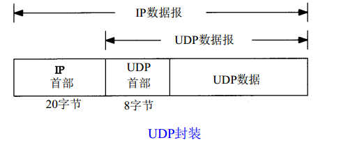
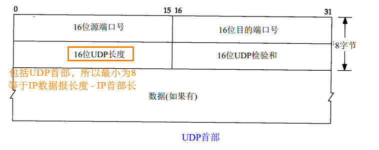
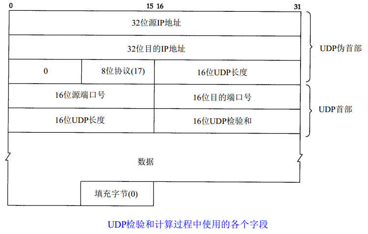

# 11. UDP用户数据报协议

UDP面向数据报：每次输出正好产生一个UDP数据报
TCP面向流字符：应用产生的全部数据和单个数据报没关系，可能被切分后多次发送

UDP格式：			
	

### 11.2 UDP首部

TCP和UDP端口号是相互独立的，可重复。所以同一服务，TCP和UDP一般端口使用同一个，不会冲突

### 11.3 UDP检验和

- IP首部校验和只针对IP首部，而UDP和TCP针对整个数据报（UDP可选,TCP必须）
- 计算方式与IP相同，但IP是每16bit相加（首部长度为偶数字节），UDP则需把数据填充至偶数字节再进行计算（添加的字节不被传送）
- 计算校验和过程还会假想一个伪首部参与计算，用于检验是否是本机数据报：
	
- 同IP层，当校验和有差错时，被悄悄丢弃（无差错报文）

tcpdump查看：