# 11. UDP用户数据报协议

UDP面向数据报：每次输出正好产生一个UDP数据报
TCP面向流字符：应用产生的全部数据和单个数据报没关系，可能被切分后多次发送

UDP格式：			
	

### 11.2 UDP首部

TCP和UDP端口号是相互独立的，可重复。所以同一服务，TCP和UDP一般端口使用同一个，不会冲突

### 11.3 UDP检验和

- IP首部校验和只针对IP首部，而UDP和TCP针对整个数据报（UDP可选,TCP必须）
- 计算方式与IP相同，但IP是每16bit相加（首部长度为偶数字节），UDP则需把数据填充至偶数字节再进行计算（添加的字节不被传送）
- 计算校验和过程还会假想一个伪首部参与计算，用于检验是否是本机数据报：
	
- 同IP层，当校验和有差错时，被悄悄丢弃（无差错报文）

tcpdump可查看UDP数据报的校验和，以此判断数据报的发送方是否开启了UDP校验和功能

### 11.4 一个简单的例子

在主机bsdi上向svr4发送udp数据报的tcpdump输出：
	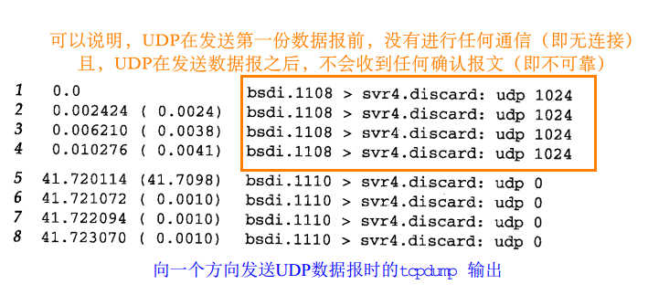

### 11.5 IP分片

IP层在发送IP数据报时，都要查询接口以获得MTU，若大于，则必须进行分片；所以分片可以发生在源主机上，也可以发生在中间路由器上；每经过一站，都会进行组装（不是在最终目的地，在内核中完成，应用程序不知情）

- IP首部已经为分片和组装提供了足够信息，观察IP首部各字段：
	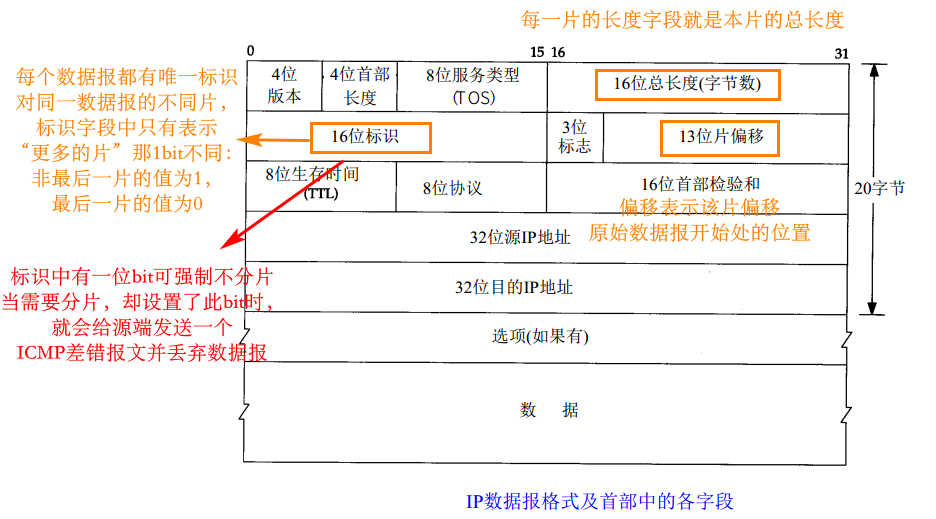
- IP层是不可靠的，本身没有超时重传机制，此部分由tcp负责。而tcp数据报的某一片丢失后，会重传整个tcp数据报，这就导致IP层也必须重传整个数据报

UDP数据报很容易被分片，如图：
	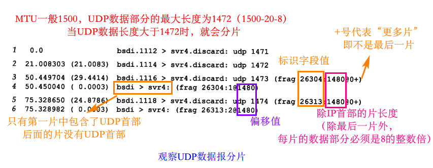
上图中第三份数据报的分片情况可表示为：
	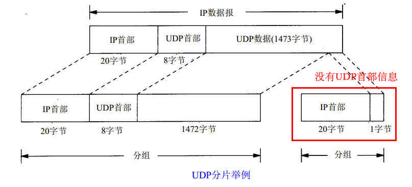

- 术语：IP分组可以是一个完整的IP数据报，也可以只是一个IP数据报的分片

### 11.6 ICMP不可达差错-需要分片

ICMP不可达差错的另一个情况：IP数据报需要分片，但是在首部标识字段中设置了“不分片”的bit（该差错报文可以利用在路径MTU的发现机制）

格式如下：								
	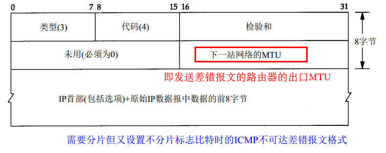

例子（设置了‘不分片’标志）：			
	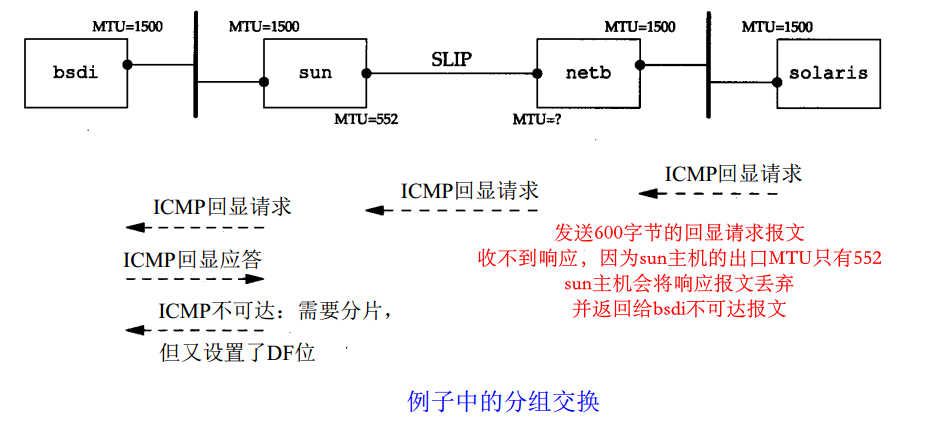
	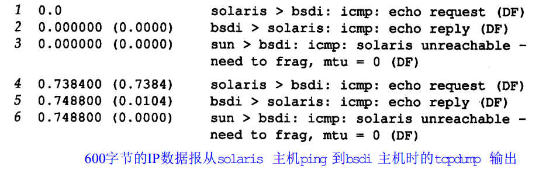

### 11.7 用Traceroute程序确定路径MTU

需修改traceroute程序：要做的是发送分组，并设置“不分片”标志比特。发送的第一个分组的长度正好与出口MTU相等，每次收到ICMP“不能分片”差错时就减小分组的长度。如果路由器发送的ICMP差错报文是新格式（包含出口的MTU），那么就用该MTU值来发送，否则就用MTU-1的值来发送

### 11.8 采用UDP的路径MTU发现

举例：						
	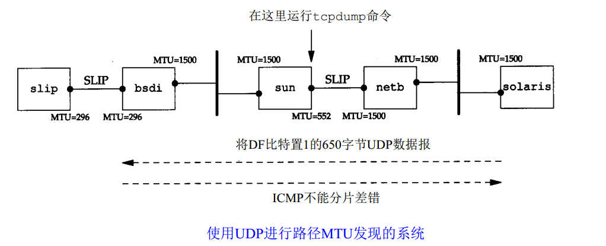

在sun主机的tcpdump信息如下：		
（略......没看懂）

### 11.9 UDP和ARP之间的交互作用

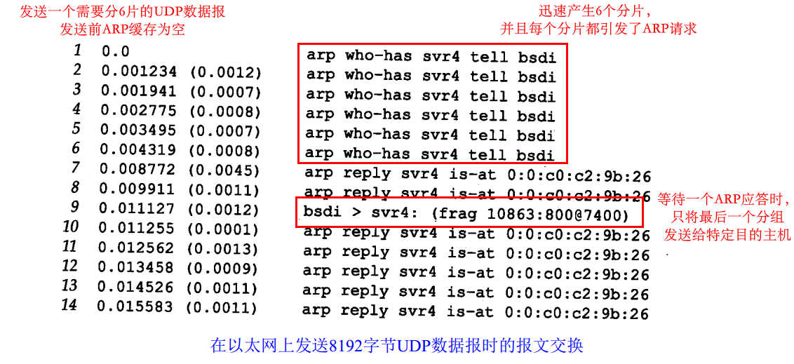

### 11.10 最大UDP数据报长度

**本节中说的是总的数据报长度，不是指受MTU限制的分组长度**

IP数据报最长65535字节（长度字段16bit），UDP理论则为65507字节，但是一般都比这个值小：
- 受应用程序socket API的接收和发送缓存长度限制
- 受内核限制
- 许多UDP的应用程序设计中，都将UDP数据限制成512字节或更小。例如RIP协议、DNS、TFTP、BOOTP、SNMP等

数据报截断：（没看懂.......）

### 11.11 ICMP源站抑制差错

可以使用UDP报文产生ICMP源站抑制差错(source quench)，当一个系统接收数据报的速度比其处理速度快时，**可能**（即使一个系统已经没有缓存并丢弃数据报，也不要求它一定要发送源站抑制报文）产生这个差错。用来告诉源发送主机降低数据产生速度

### 11.12 UDP服务器的设计

- 客户IP和端口号
	- 报文中含有客户IP和端口号，这样就允许一个交互UDP服务器对多个客户进行处理
- UDP输入队列
	- 每个UDP端口都与一个有限大小的输入队列相联系，排队溢出造成内核中的UDP模块丢弃数据报的可能性是存在的；应用程序并不知道其输入队列何时溢出，也没有发回任何信息告诉客户其数据报被丢弃（与内核缓存不同，内核缓存满有可能产生ICMP抑制差错）
- **限制本地IP地址**
	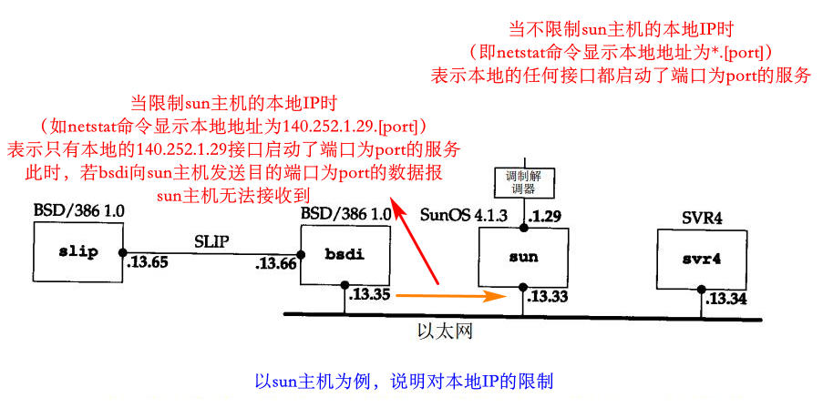
	- 可在同一端口启动N个不同的服务，如：
		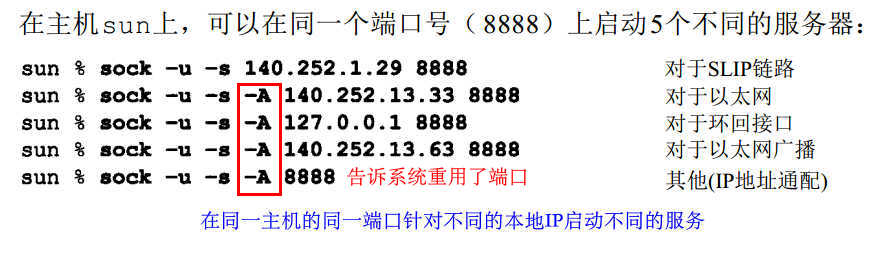
	- 如果指定了特定IP地址，那么在匹配目的地址时始终优先匹配该 IP地址。只有在匹配不成功时才使用含星号的IP
- **限制远端IP地址**
	- 同本地IP地址，`*.*`为远端IP地址时，表示接收远端所有的UDP数据报，为`ip.port`时表示只接收来自地址为ip并且端口port的UDP数据报
	- 地址组合可能有：
		 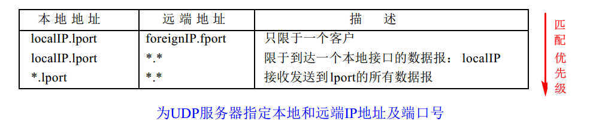
- 当本地IP指定为`*.[port]`时，若接收到的数据报是广播或多播，就会给每一个可能的本地IP地址接口都复制一份数据报；若是单播数据报，就只传送给其中一个接口，具体是哪个取决于系统实现

### 习题

1. 11.5节中，UDP数据长度1473字节时导致分片。若采用IEEE 802封装格式，则导致分片的长度应为多少？

	使用IEEE 802封装时，相比以太网，存在8个额外的首部字节（IP分组数据报最大长度为1492字节），所以为1465个字节

2. 略

3. 假设为以太网，有一份8192字节的UDP数据报，那么需要分成多少片，每片的偏移和长度分别是多少？

	（8192+8）/1480 = 5 余 800， 需要6片，前5片长度均为1500(包括IP首部)，最后一片长度800+20 = 820字节，偏移分别为`0,1480,1480*2，..., 1480*5`

4. **（除最后一片外，每片的数据部分必须是8字节的整数倍）**。那若题3中的数据报需要经过MTU为552的SLIP链路，又需要多少片，每片的长度和偏移？

	因为必须是8的整数倍，所以每片数据最大长度为552-20的最大的8整倍数528，（8192+8）/528 = 15 余 280，需要16片，前面每片长528+20=548字节，最后一片280+20=300字节，偏移分别为`0,528,528*2,...,528*15`

5. 假设UDP数据报分片传送，一部分A到达目的端而另一部分B丢失了。之后程序进行了重传，若之前的A部分仍然未丢弃，那之前的A部分能否和现在的B部分进行组装？

	不能。**每个数据报都有自己唯一的标识字段**，两次传送的分片的标识字段不相同，只有相同的标识字段的分片才能进行组装

6. 略

7. 略

8. 不严格的和严格的源站选路选项被复制到每一个数据报片中。时间戳选项和记录路由选项没有被复制到每一个数据报片中，它们只出现在第1个数据报片中

9. 略

# 12. 广播和多播

TCP中没有广播多播地址，TCP的连接是确定的两端。UDP中有多播和广播

系统对数据报过滤过程：					
	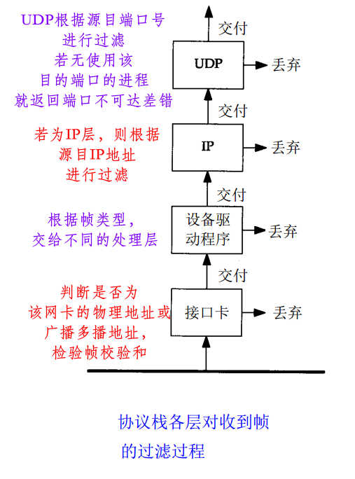

多播的出现是为了解决广播所带来的负荷问题。比如UDP广播报文，网络上的一台主机发送广播报文，该网络上的一些对该数据报不感兴趣的主机也必须处理该报文，直到UDP层发现没有匹配的目的端口，才将报文丢弃；而多播则可以指定将报文发送给某些主机，减少负荷

### 12.2 广播

四种IP广播地址：
- 受限的广播（255.255.255.255）
	- 任何情况下，路由器不转发目的地址为受限的广播地址的数据报，只在本地网络中出现
- 指向网络的广播
	- 有网络号，但主机号全1
	- 路由器必须转发
- 指向子网的广播（主机号全1）
	- 有子网号，但主机号全1
	- 判断是否是某一子网的广播地址，必须知道子网掩码
- 指向所有子网的广播
	- 子网号和主机号全1
	- 需要子网掩码来和指向网络的广播地址区分

### 12.3 广播的例子

受限的广播地址一般会被丢弃或不被识别，不推荐使用

一般使用的是指向子网的广播：			
	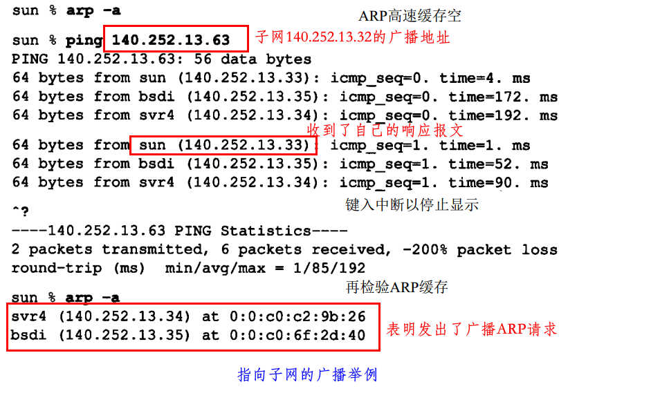

可设置路由器为转发广播数据报，若此路由器收到一个来自外网的自己所在网络的广播数据报，就把此广播数据报转发给子网所有的主机；这种情况下，对外网来说，此广播数据报都是一个普通的主机地址（外网不知道具体的子网情况），直到传送到此路由器时，路由器才能判断出此地址为广播地址，并转发给所有子网主机

### 12.4 多播

- 两类多播服务：
	- 向多个目的地址传送数据
	- 客户对服务器的请求
- 多播组地址（D类地址）
	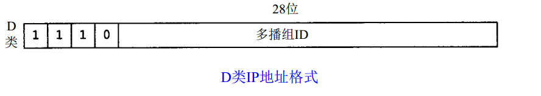
	- 一些知名的多播组地址：
		- 例如，224.0.0.1代表“该子网内的所有系统组”，224.0.0.2代表“该子网内的所有路由器组”
- 多播组地址到以太网地址的转换
	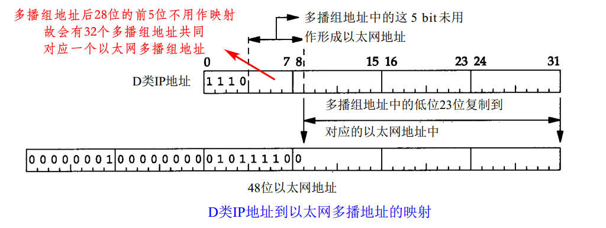
	- 单个网络的多播过程：将目的IP地址指明为多播地址，设备驱动程序会将其转换为相应的以太网多播地址，然后发送出去（不是ARP请求）
	- 一个主机可能存在多个属于同一多播组的进程，主机会向属于那个多播组的每个进程均传送一个复制
	- 多播扩展到单个网络以外需要通过路由器转发多播数据时，就需要用**Internet组管理协议**

### 习题

# 13. IGMP Internet组管理协议

涉及多播，略

(.................)

# 14. DNS域名系统

